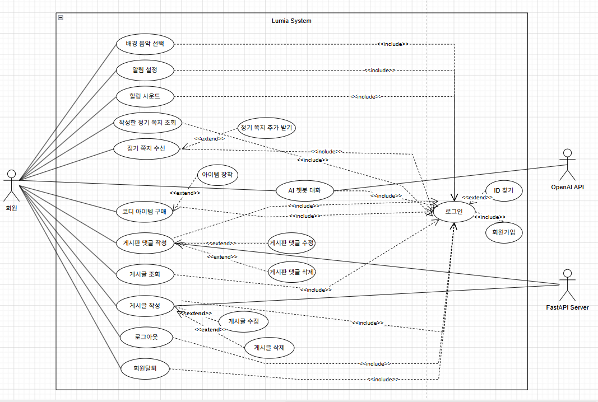

# 2. Use Case Analysis

[⬅️ Back to Contents](./Introduction.md)

---

Conceptualization 단계에서 정의된 **System Context Diagram**과 **Use Case List**를 바탕으로 설계된 **Use Case Diagram**을 제시합니다.

### 2.1 Use Case Diagram 개요

본 다이어그램은 **draw.io**를 사용하여 모델링되었으며, 시스템을 이용하는 **Actor**와 시스템이 제공하는 핵심 기능인 **Use Case** 간의 상호작용을 시각화하였습니다.

- **Association (연관 관계):** Actor와 상호작용하는 Use Case를 연결하여 시스템의 경계를 명확히 설정하였습니다.
- **Include (포함 관계):** 특정 기능을 수행하기 위해 선행되어야 하거나 반드시 포함되어야 하는 기능들 간의 논리적 흐름을 표현하였습니다.

이를 통해 **'Lumia'** 플랫폼이 사용자에게 제공하는 **정서적 회복** 및 **사회적 연결 기능**의 전체적인 구조를 한눈에 파악할 수 있도록 설계하였습니다.

---

### 2.2 Use Case Diagram

---

### 2.3 Use Case Diagram Description

# Use Case #1 : Login

## 1. GENERAL CHARACTERISTICS

| 항목                       | 내용                                                                         |
| :------------------------- | :--------------------------------------------------------------------------- |
| **Summary**                | 사용자가 시스템에 접속하기 위해 등록된 계정 정보를 입력하고 인증을 받는 과정 |
| **Scope / Level**          | Lumia System / User Level                                                    |
| **Author**                 | 장형준                                                                       |
| **Last Update**            | 2026-04-28                                                                   |
| **Status**                 | Analysis                                                                     |
| **Primary Actor**          | 회원                                                                         |
| **Preconditions**          | 사용자가 앱을 실행한 상태이며, 회원가입(Sign up)이 완료되어 있어야 한다.     |
| **Trigger**                | 사용자가 메인 화면에서 '로그인' 버튼을 클릭한다.                             |
| **Success Post Condition** | 사용자가 시스템 인증에 성공하여 메인 대시보드로 이동한다.                    |
| **Failed Post Condition**  | 인증 실패 메시지가 출력되며, 로그인되지 않은 상태로 로그인 화면에 머무른다.  |

## 2. MAIN SUCCESS SCENARIO

| Step | Action                                                          |
| :--- | :-------------------------------------------------------------- |
| 1    | 사용자가 아이디(이메일)와 비밀번호를 입력한다.                  |
| 2    | 사용자가 '로그인 확인' 버튼을 누른다.                           |
| 3    | 시스템은 데이터베이스에 저장된 사용자 정보와 입력값을 비교한다. |
| 4    | 시스템은 사용자 인증 세션을 생성한다.                           |
| 5    | 시스템은 사용자를 로그인 후 첫 화면(메인 화면)으로 이동시킨다.  |

## 3. EXTENSION SCENARIOS

- **3a. 로그인 정보 불일치**: 시스템은 오류 메시지를 출력하고 다시 입력하게 한다.
- **3b. 비밀번호 분실**: 사용자가 '비밀번호 찾기'를 누르면 관련 프로세스로 유도한다.

## 4. RELATED INFORMATION

| 항목                   | 내용                                 |
| :--------------------- | :----------------------------------- |
| **Priority**           | High                                 |
| **Frequency**          | 앱 접속 시마다 발생                  |
| **Issues**             | 자동 로그인 기능 포함 여부 검토 필요 |
| **Performance Target** | 인증 요청 후 2초 이내 결과 응답      |

**[Next Step: 3. Domain analysis](./Domain_analysis.md)**
