# 4.User Interface prototype

[⬅️ Back to Contents](./images/Domain_analysis.md)

---

## Authentication & Onboarding (인증 및 온보딩)

<table align="center">
  <tr align="center">
    <td><b>로그인 화면</b></td>
    <td><b>ID 찾기 화면</b></td>
    <td><b>회원가입 화면</b></td>

  </tr>
  <tr align="center">
    <td>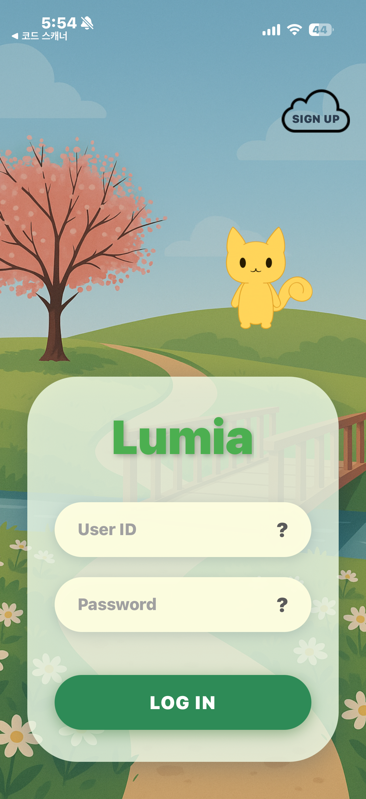</td>
    <td>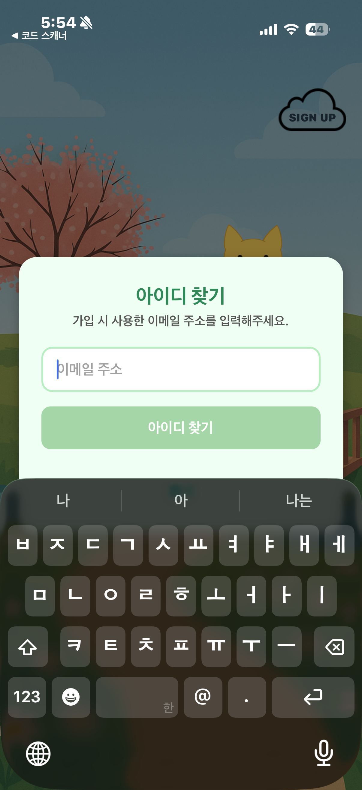</td>
    <td>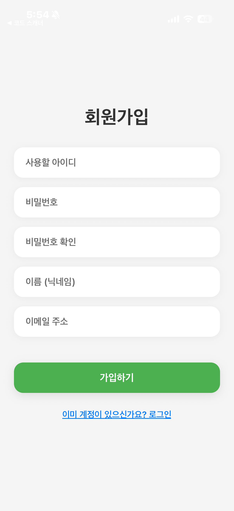</td>

  </tr>
</table>

사용자가 서비스에 진입하기 위한 첫 관문인 인증 및 계정 관리 인터페이스입니다. 루미아의 따뜻한 감성을 유지하면서도, 보안과 사용성을 동시에 고려하여 설계되었습니다.

- **직관적인 로그인 인터페이스:**
  사용자의 ID와 비밀번호 입력을 위한 필드를 중앙에 배치하였습니다. 상단 우측의 'SIGN UP' 구름 아이콘을 통해 신규 사용자가 즉시 회원가입 페이지로 이동할 수 있으며, 미가입 ID로 로그인 시도 시 에러 문구를 띄워 비정상적인 접근을 방지합니다.

- **회원가입 폼:**
  가입 시 아이디, 이메일, 닉네임에 대해 실시간 중복 검사를 실시합니다. 이미 DB에 존재하는 정보일 경우 경고 메시지를 출력하여 데이터 중복을 차단합니다.

- **계정 복구 시스템 :**
  아이디를 잊은 사용자를 위해 이메일 기반의 아이디 찾기 모달을 제공합니다. 이때 입력한 이메일이 DB에 없으면 "존재하지 않는 회원"이라는 예외 알림을 띄워 사용자에게 명확한 상태를 안내합니다.

 

## 4.2 Main Background & Home Interface (메인 화면)

<table align="center">
  <tr align="center">
    <td><b>새벽 배경 사진</b></td>
    <td><b>주간 배경 사진</b></td>
    <td><b>오후 배경 사진</b></td>
    <td><b>야간 배경 사진</b></td>
  </tr>
  <tr align="center">
    <td>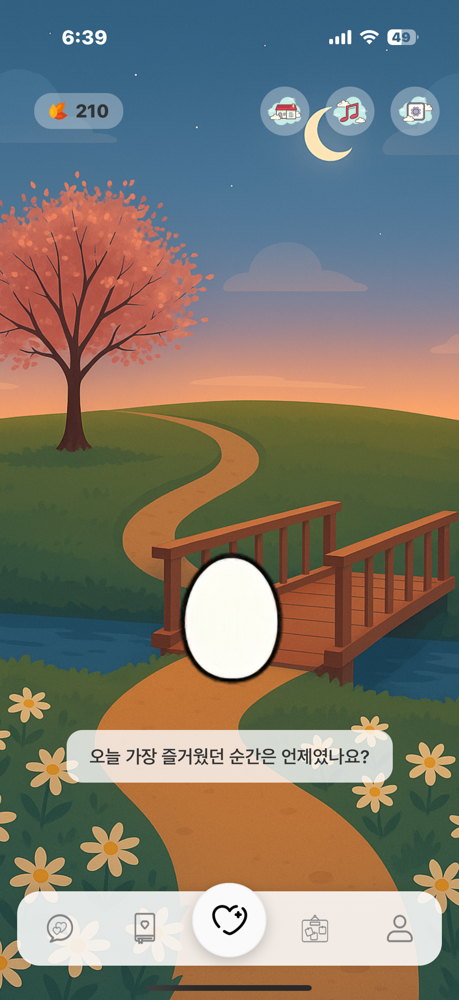</td>
    <td>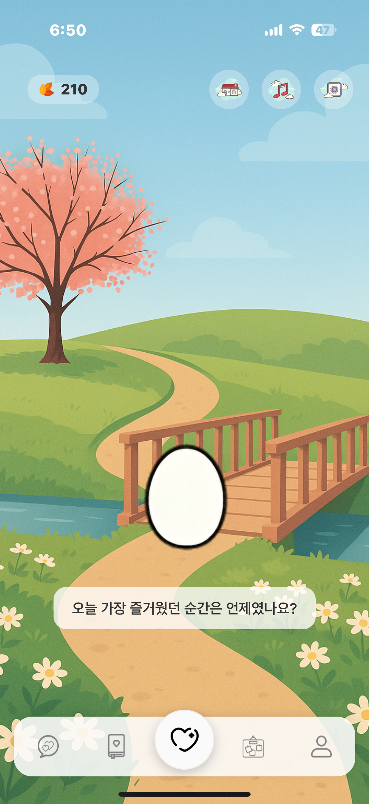</td>
    <td>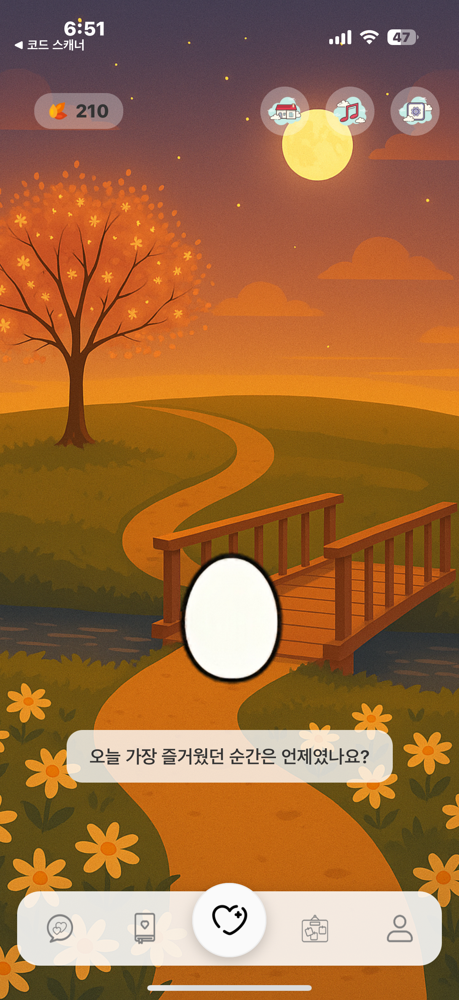</td>
    <td>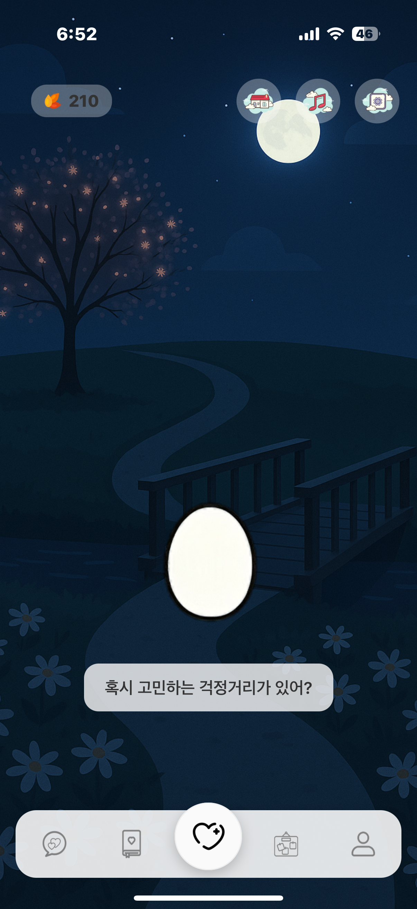</td>
  </tr>
</table>

사용자가 서비스에 접속했을 때 가장 먼저 접하게 되는 메인 홈 화면의 인터페이스 설계입니다. 사용자의 정서적 몰입감을 높이기 위해 시간대에 따라 변화하는 인터페이스를 구조로 설계 하였습니다.

- **배경 자동 전환 시스템**: 사용자의 현재 시간을 기준으로 6시간 주기로 배경이 자동 변경됩니다. (새벽 → 주간 → 오후 → 야간 순) 이는 사용자가 앱 내에서 시간의 흐름을 시각적으로 체감하게 하여 안정감을 제공하는 역할을 합니다.
- **상단 헤더 구성**:
  - **좌측 영역**: 사용자의 활동 보상으로 획득한 현재 보유 새싹(Point)이 실시간으로 표시됩니다.
  - **우측 영역**: 아이템 구매를 위한 '상점', 심리적 안정을 위한 '힐링 사운드', 그리고 시스템 제어를 위한 '설정' 아이콘이 배치되어 있습니다.
- **중앙 메인 영역**: 서비스의 핵심 기능인 '정기/추가 쪽지'를 즉시 확인할 수 있도록 중앙에 직관적인 컴포넌트를 배치하여 접근성을 높였습니다.

- **하단 네비게이션 바**: 서비스 내 주요 메뉴 간의 신속한 이동을 위해 좌측부터 **[AI 채팅 - 쪽지 리스트 - 홈(Main) - 익명 게시판 - 마이페이지]** 순으로 배치하여 사용자의 조작 편의성을 최적화하였습니다.

 

## 4.3 Shop Interface (상점 화면)

  <video src="https://github.com/user-attachments/assets/126863de-0339-4fe3-b55b-5e40f2946247" width="202px" controls></video>

- **실시간 미리보기**: 아이템 클릭 시 아바타의 외형 변화를 즉시 확인 가능합니다.
- **포인트 동기화**: 구매 완료 시 실시간으로 보유 재화가 차감되어 UI에 반영됩니다.
- **예외 처리 안내**: 잔여 포인트가 부족한 상태에서 구매 시도 시, 경고 메시지를 출력하여 비정상적인 접근 및 오류를 방지합니다.

 

## 4.4 Healing Sound (힐링 사운드 화면)

  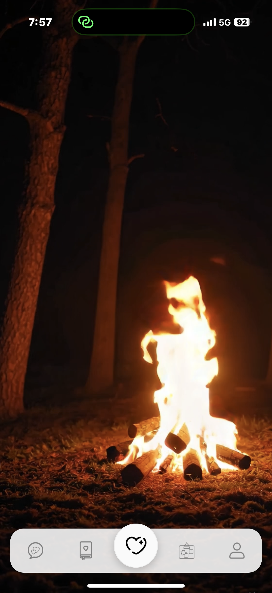

사용자의 심리적 안정과 휴식을 돕기 위한 시청각 콘텐츠 제공 인터페이스입니다.

- **다양한 사운드 제공**: 사용자는 자신의 취향이나 현재 상태에 맞춰 '불멍(모닥불)', '비 오는 소리' 등 다양한 자연의 소리와 고화질 영상을 선택하여 감상할 수 있습니다.
- **간단한 조작**: 복잡한 설정 없이 버튼 클릭 한 번으로 영상과 사운드가 즉시 재생되며 심리적으로 지친 사용자가 좌우 슬라이드 최소한의 조작으로 휴식을 취할 수 있도록 설계되었습니다.
- **시청각적 힐링**: 고품질의 화이트 노이즈(ASMR) 사운드와 루프 애니메이션 영상을 결합하여 명상 및 수면 유도 효과를 극대화하였습니다.

 

## 4.5 Settings Interface (설정 화면)

  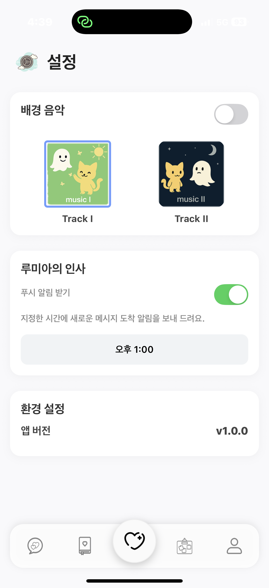

사용자의 서비스 이용 환경을 최적화하고 개인의 선호에 맞춘 감정 케어 환경을 조성하기 위한 설정 인터페이스입니다.

- **배경 음악(BGM) 선택 기능**:
  앱 서비스 전반에서 재생되는 배경 사운드를 사용자가 직접 선택할 수 있습니다. 서로 다른 심리적 안정감이 드는 음악으로 사용자가 현재 자신의 기분이나 상태에 가장 적합한 청각적 환경을 커스터마이징할 수 있도록 설계하였습니다.

- **맞춤형 알림 스케줄링**:
  정기 쪽지 수신이나 감정 기록 알림을 받고 싶은 특정 시간대를 직접 설정할 수 있습니다. 이를 통해 사용자의 라이프사이클에 방해되지 않는 최적의 시점에 서비스를 제공받을 수 있도록 지원합니다.

 

## 4.6 AI Chat Interface (AI 채팅 화면)

  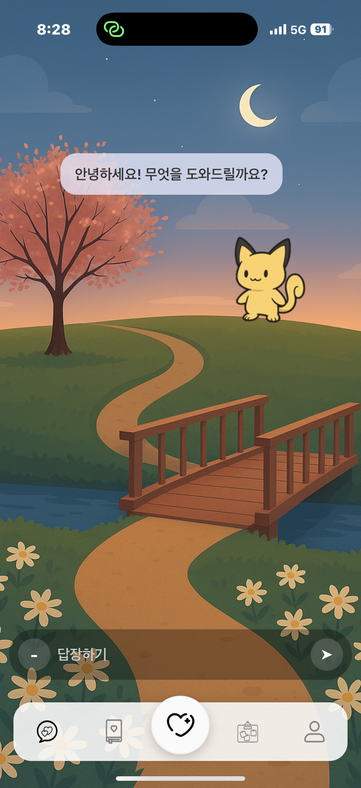

사용자의 현재 감정 상태를 분석하고 맞춤형 정서적 지지를 제공하는 OpenAI 연동 AI 챗봇 인터페이스입니다.

- **프롬프트 엔지니어링 적용**:
  단순 답변을 넘어 정서적 케어에 특화된 답변을 제공하기 위해 다음과 같은 프롬프트 전략을 적용하였습니다.
  - **공감 및 위로**: 사용자의 우울함이나 불안감을 수용하고 비판 없이 경청하는 전문적인 상담가 페르소나를 부여하여 정서적 유대감을 형성합니다.
  - **활동적 추천**: 감정 수용에 그치지 않고, 사용자의 상태를 개선할 수 있는 구체적인 활동(예: 산책, 명상, 간단한 기록 등)을 제안하여 실질적인 회복을 돕습니다.

- **실시간 상호작용**:
  백엔드 서버를 거쳐 최적화된 프롬프트가 적용된 AI의 응답을 수신하며, 채팅창 내 말풍선 UI를 통해 직관적인 대화 환경을 제공합니다.

   

  ## 4.7 Note & Sent Note List Interface (쪽지 및 발송 목록 화면)

<table align="center">
  <tr align="center">
    <td><b>첫 쪽지 사진</b></td>
    <td><b>쪽지 작성 사진</b></td>
    <td><b>쪽지 리스트 사진</b></td>
  </tr>
  <tr align="center">
    <td>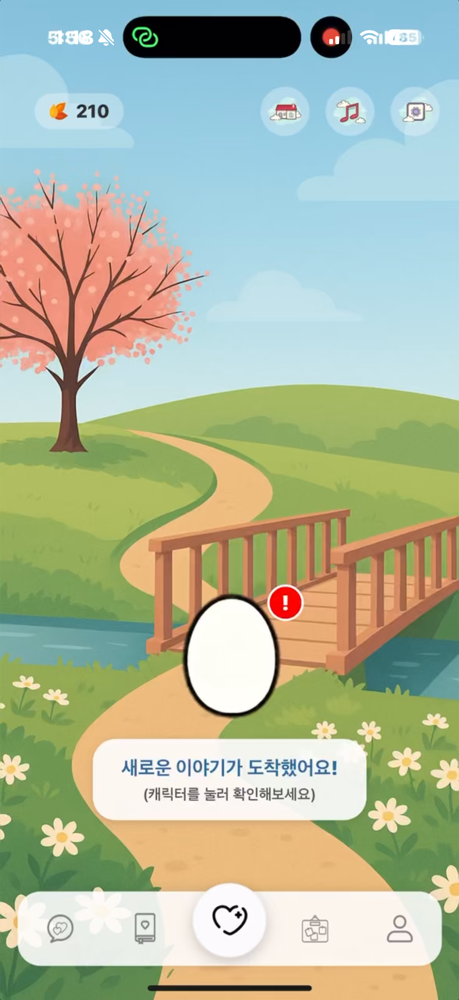</td>
    <td>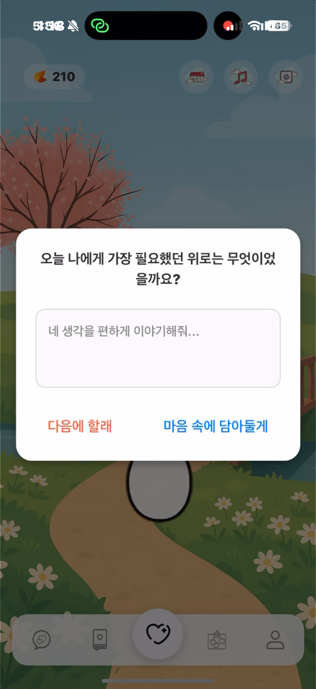</td>
    <td>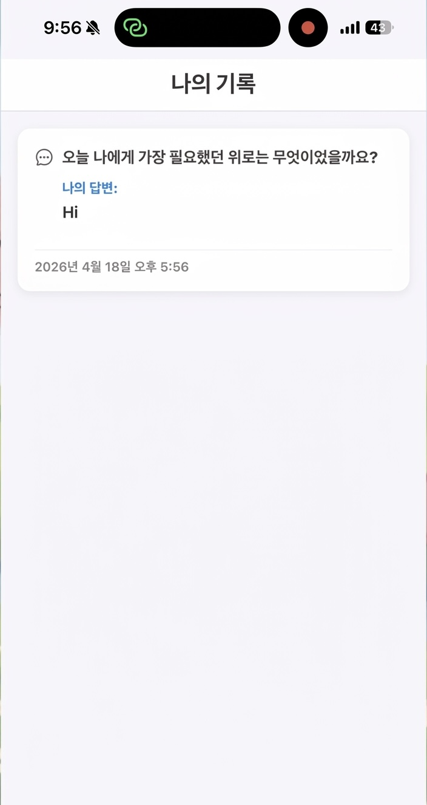</td>
  </tr>
</table>

사용자가 수신한 정기/추가 쪽지를 확인하고 다음에 작성할지 or 작성할지 선택, 본인이 과거에 작성했던 기록들을 열람할 수 있는 인터페이스입니다.

- **수신 쪽지 열람**:
  시스템으로부터 도착한 정기/추가 심리 상담 쪽지를 선택할 수 있습니다. 쪽지 클릭 시 입력 모달이 활성화되며, 사용자는 자신의 감정 상태에 따라 '지금 작성하기' 또는 '다음에 작성하기'를 자유롭게 선택할 수 있어 심리적 부담 없는 기록 환경을 제공합니다.

- **쪽지 작성 기록 조회**:
  사용자가 과거에 작성했던 답변을 시간 순으로 나열하여 제공합니다. 이를 통해 사용자는 자신의 감정 변화 추이를 복기하거나, 이전에 받았던 위로의 문구들을 언제든 다시 확인하며 정서적 안정감을 얻을 수 있습니다.

## 4.8 Community (게시판)

<table align="center">
  <tr align="center">
    <td><b>게시글 리스트 스크린샷</b></td>
      <td><b>게시글 내용 확인</b></td>
    <td><b>게시글 작성 및 검증 시연</b></td>
  </tr>
  <tr align="center">
    <td>
      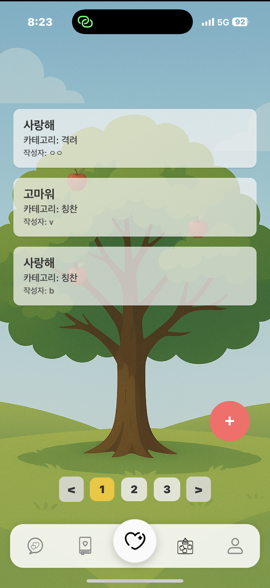
    </td>

<td>
      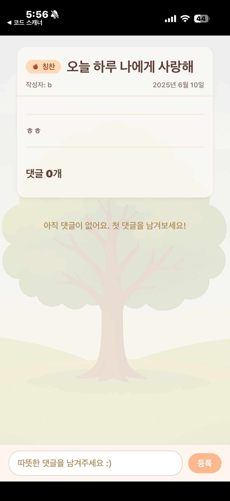
    </td>

  <td>
<video src="https://github.com/user-attachments/assets/207f0068-a140-485c-86e4-95be4c49166b" width="202px" controls></video>
    </td>

  </tr>
</table>

익명성을 기반으로 한 커뮤니티 인터페이스로, 건강한 소통을 위한 공간 또한 시각적 즐거움을 넣어 구성하였습니다.

- **FastAPI 기반 비속어 필터링**:
  게시글 작성 시 백엔드 서버(FastAPI)가 실시간으로 텍스트를 분석합니다. 부적절한 욕설이나 비하 표현이 감지될 경우 작성을 즉시 차단하는 안내 경고창을 띄워 건강한 커뮤니티 환경을 유지합니다.

- **카테고리별 세부 작성 모드**:
  **'격려', '칭찬', '기타'** 등 구체적인 작성 카테고리를 선택할 수 있게 하여 사용자가 타인에게 긍정적인 메시지를 전달하도록 유도합니다.

- **시각적 보상 체계**:
  게시글 작성이 완료되면 메인 배경의 나무에 **'사과'** 오브젝트가 추가됩니다. 나무 한 그루당 최대 5개의 사과가 열리며, 초과 시 새로운 페이지(나무)로 전환되는 페이징 처리를 구현하여 지속적인 활동 동기를 부여합니다.

  ## 4.9 Profile Interface (프로필)

  

    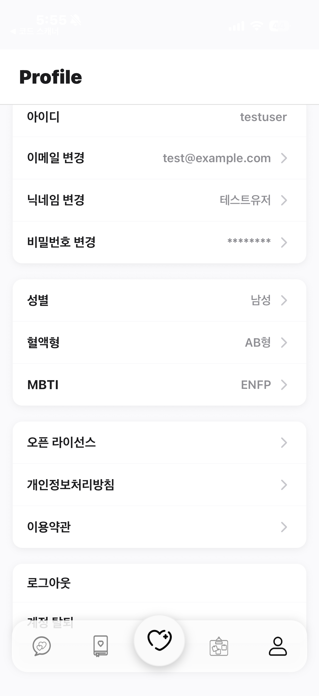
  

  아이디 확인, 정보 수정(이메일, 닉네임, 비번), MBTI 등의 개인 특성 정보를 관리하는 화면입니다.

* **계정 및 보안 관리**: 현재 로그인된 아이디를 확인할 수 있으며, 이메일 주소, 닉네임, 비밀번호를 개별 메뉴를 통해 안전하게 변경할 수 있습니다.
* **사용자 특성 정보**: 성별, 혈액형, MBTI 등 사용자의 고유한 특성 정보를 표시하여, 향후 AI 상담이나 콘텐츠 추천 시 더욱 개인화된 경험을 제공할 수 있는 기초 데이터를 관리합니다.
* **고객 지원 및 정책 확인**: 오픈 라이선스 정보, 개인정보 처리방침, 이용약관 등 서비스 이용에 필요한 법적·기술적 고지 사항을 간편하게 열람할 수 있습니다.
* **세션 관리**: 로그아웃 및 계정 탈퇴 기능을 하단에 배치하여 사용자의 계정 권한 관리를 명확하게 지원합니다.

---

**[Next Step: 5. Glossary](./Glossary.md)**
