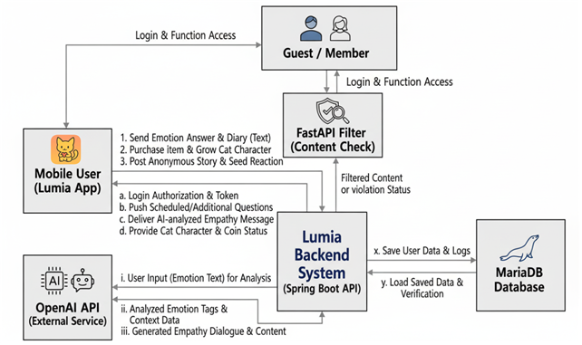

# 2. System context diagram

[⬅️ Back to Contents](./Conceptualization.md)

---

## System context diagram
 

시스템과 외부 엔터티(사용자, AI 엔진, 데이터베이스 등) 간의 상호작용 및 데이터 흐름 상세 내역입니다.

### 인증 및 권한 (Authentication)
* **Login & Function Access:** 접속 및 서비스 기능 접근 권한 확인
* **Login Authorization & Token:** 로그인 승인 및 인증 토큰(JWT) 발급

### 감정 기록 및 질문 (Emotion & Diary)
* **Send Emotion Answer & Diary:** 사용자의 감정 답변 및 일기 텍스트 송신
* **Push Scheduled Questions:** 설정된 시간에 따른 정기 질문 푸시 알림
* **Push Additional Questions:** 사용자 요청에 따른 추가 질문 제공

### AI 상호작용 (AI Interaction - OpenAI API 등)
* **User Input for Analysis:** 감정 분석을 위한 사용자 입력 데이터 전송
* **Analyzed Emotion Tags:** AI에 의해 분석된 감정 키워드(태그) 수신
* **Generated Empathy Dialogue:** AI가 생성한 맞춤형 위로 대화문 수신

### 게이미피케이션 및 성장 (Gamification)
* **Purchase Item:** 상점 아이템 구매 및 재화 소모 요청
* **Grow Cat Character:** 활동 보상에 따른 캐릭터 성장 데이터 갱신
* **Provide Cat & Coin Status:** 캐릭터 레벨 및 보유 코인 잔액 상태 확인

### 커뮤니티 및 필터링 (Community)
* **Post Anonymous Story:** 익명 게시판에 긍정 게시글 등록
* **Seed Reaction:** 게시글에 대한 공감(씨앗 버튼) 상호작용
* **Filtered Content:** 비속어 및 부적절한 콘텐츠 필터링 결과 확인

### 데이터 관리 (Data Management)
* **Save User Data & Logs:** 사용자 활동 및 감정 기록 데이터 저장
* **Load Saved Data & Verification:** 저장된 데이터 불러오기 및 유효성 검증

---

**[Next Step: 3. Use case list](./Use_Case_List.md)**
