# 3. Sequence Diagram

[Back to Contents](./Design.md)

> [!NOTE]
> 본 문서에서 사용하는 **U.C**는 **Use Case(유스케이스)**의 약자이며, 시스템이 제공하는 개별 기능적 단위를 의미합니다.

---

이 문서는 Conceptualization 단계에서 정의된 21가지 유스케이스(U.C)를 바탕으로, 클라이언트(React Native App)부터 백엔드 컨트롤러, 서비스, 데이터베이스 레포지토리, 그리고 외부 시스템(FastAPI 필터 서버, OpenAI API) 간의 동적 흐름과 메시지 전달 순서를 설계한 시퀀스 다이어그램 문서입니다.

각 다이어그램 하단에는 객체 간 통신 순서와 세부 비즈니스 로직 및 예외 처리 흐름을 학술 보고서 스타일(12pt, 160% 기준)로 상세히 기술하였습니다.

---

## 목차
1. [Module 1. 회원 및 인증 관리 (U.C 1 ~ 5)](#module-1-회원-및-인증-관리-uc-1--5)
2. [Module 2. 프로필 및 환경 설정 (U.C 6 ~ 9)](#module-2-프로필-및-환경-설정-uc-6--9)
3. [Module 3. 질문 발급 및 답변 기록 (U.C 10 ~ 13)](#module-3-질문-발급-및-답변-기록-uc-10--13)
4. [Module 4. 상점 및 아바타 장착 (U.C 14 ~ 15)](#module-4-상점-및-아바타-장착-uc-14--15)
5. [Module 5. 익명 커뮤니티 및 댓글 (U.C 16 ~ 20)](#module-5-익명-커뮤니티-및-댓글-uc-16--20)
6. [Module 6. AI 공감 대화 (U.C 21)](#module-6-ai-공감-대화-uc-21)

---

## Module 1. 회원 및 인증 관리 (U.C 1 ~ 5)

### 3-1. U.C 1 - Sign Up (회원가입)
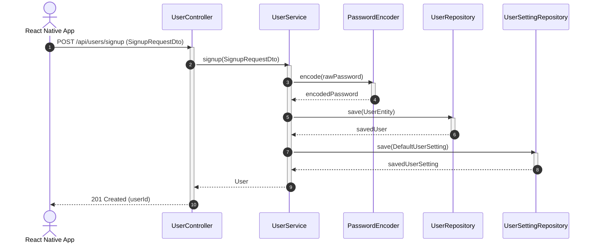
* **설명**: 회원가입 흐름은 사용자가 게스트 상태에서 계정 정보를 등록할 때 시작됩니다. `UserController`는 전달받은 DTO 정보를 바탕으로 `UserService`의 `signup` 로직을 호출합니다. 보안을 위해 `PasswordEncoder(BCrypt)`를 사용하여 패스워드를 단방향 해시 암호화한 뒤, `UserRepository`를 통해 유저 정보를 저장합니다. 회원 등록 완료와 동시에 해당 유저의 푸시 알림 및 질문 스케줄링을 위한 기본 설정을 생성하기 위해 `UserSettingRepository`에 기본 환경설정 레코드를 추가하고 성공 응답을 전송합니다.

---

### 3-2. U.C 2 - Login (로그인)
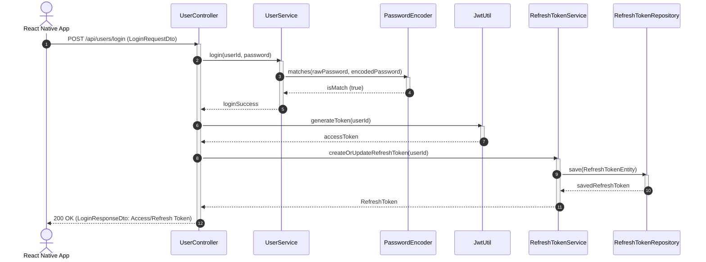
* **설명**: 로그인 절차는 패스워드 대조 및 듀얼 토큰(Access/Refresh Token) 발급을 골자로 합니다. 컨트롤러는 `UserService`에 비밀번호 일치 조회를 요청하고, 서비스는 암호화 패스워드 검증기(`PasswordEncoder.matches()`)를 호출합니다. 검증이 통과되면 `JwtUtil`을 이용해 단기 만료일의 `AccessToken`을 발행하고, `RefreshTokenService`를 통해 사용자 세션을 유지할 장기 토큰을 생성 혹은 DB에 갱신 기록합니다. 최종 발급된 두 개의 토큰 문자열을 DTO에 실어 사용자에게 반환합니다.

---

### 3-3. U.C 3 - Refresh Token (토큰 갱신)
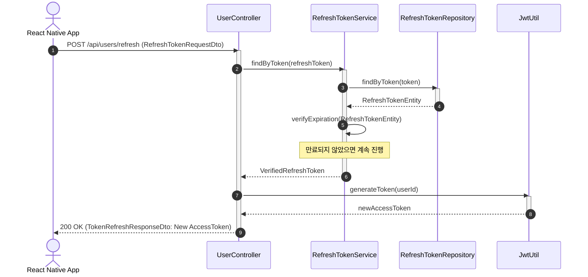
* **설명**: 클라이언트에서 사용 중인 Access Token이 만료되면 API 요청 시 `401 Unauthorized`를 받게 되며, 이때 갱신 시퀀스가 구동됩니다. 클라이언트는 로컬 보안 저장소에 보관하고 있던 Refresh Token을 DTO에 실어 재발급 경로로 전송합니다. `RefreshTokenService`는 DB 레코드의 존재 유무 및 만료일자(`expiryDate`) 통과 여부를 대조하여 검증합니다. 정상 토큰임이 판명되면 `JwtUtil`이 사용자 고유 계정명을 주체로 삼아 새 Access Token을 생성해 반환합니다.

---

### 3-4. U.C 4 - Logout (로그아웃)
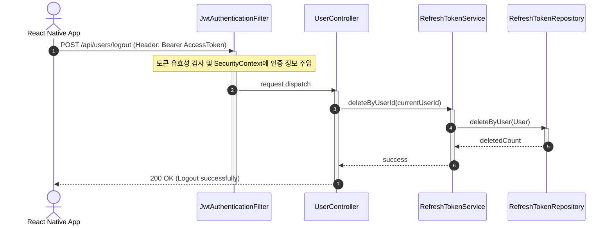
* **설명**: 로그아웃 시 사용자는 보안 토큰을 동반하여 요청을 전송하며, 이는 WAS 진입단에 구현된 `JwtAuthenticationFilter`에서 가로채어져 인증 검증을 받습니다. 유효한 토큰일 경우 `SecurityContextHolder`에 세션 정보가 빌드된 채로 `UserController.logoutUser()`로 라우팅됩니다. 컨트롤러는 컨텍스트에서 추출한 사용자 고유 아이디 정보를 인자로 `RefreshTokenService`를 호출하고, 서비스는 레포지토리를 사용해 대상 사용자의 DB 토큰 레코드를 완전 파기 처리하여 재사용이 불가능하게 만듭니다.

---

### 3-5. U.C 5 - Find Login ID (아이디 찾기)
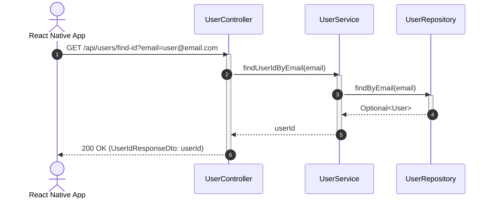
* **설명**: 가입 시 입력했던 고유 이메일을 기반으로 분실한 아이디 정보를 획득하는 흐름입니다. 사용자가 입력한 이메일 매개변수를 기반으로 `UserService`에서 비즈니스 조회를 조회하고, `UserRepository`에서 일치하는 레코드를 쿼리합니다. 일치하는 유저 데이터가 존재할 경우 그 사용자의 로그인 ID를 DTO에 감싸 반환하고, 존재하지 않는 이메일일 경우 `404 Not Found` 예외 응답을 발생시킵니다.

---

## Module 2. 프로필 및 환경 설정 (U.C 6 ~ 9)

### 3-6. U.C 6 - View Profile (프로필 조회)
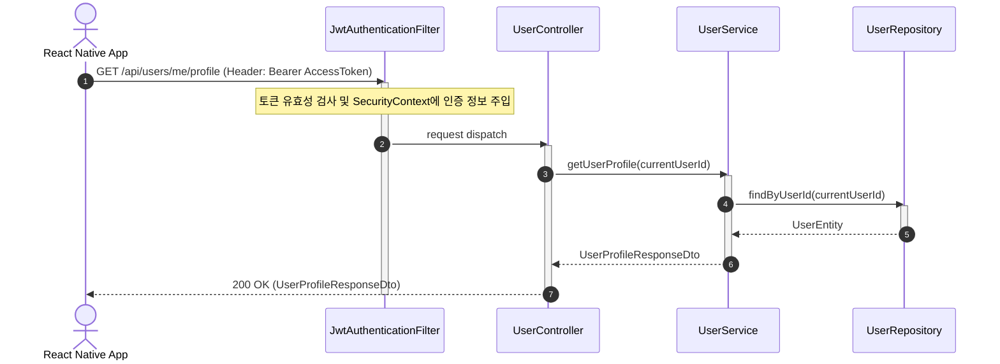
* **설명**: 사용자의 아바타 성장 현황(레벨, 획득 코인, 보유 중인 스킨 리스트 및 현재 장착 장식)과 인적 인프라 데이터(닉네임, MBTI 등)를 로드하는 프로필 뷰 조회 시퀀스입니다. 로그인 세션 필터를 통과한 후 세션의 유저 식별자를 활용해 `UserService`를 실행합니다. 서비스는 DB에서 회원 엔티티를 찾은 뒤, 게이머 리워드 정보와 장착 아이템 배열이 정리된 `UserProfileResponseDto` 객체로 변환 및 바인딩하여 클라이언트에 송신합니다.

---

### 3-7. U.C 7 - Update Profile (프로필 수정)
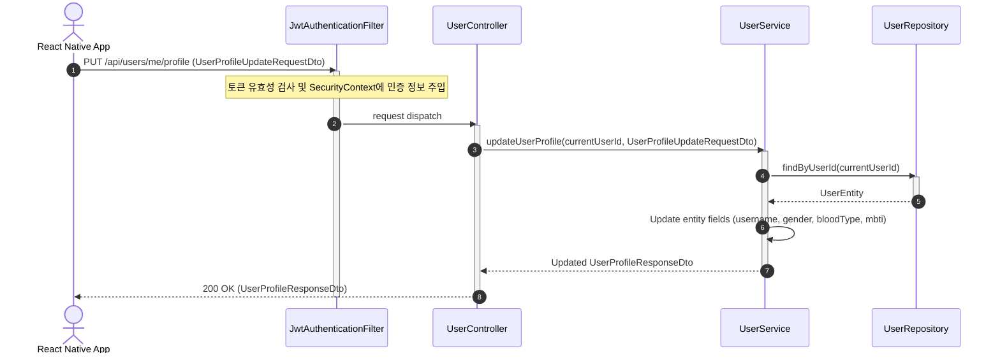
* **설명**: 회원의 프로필 중 닉네임, 성별, 혈액형, MBTI의 편집 요청을 수행합니다. 전송된 수정 데이터 패키지(`UserProfileUpdateRequestDto`)가 컨트롤러로 전달되면, 해당 로그인 ID에 대입되는 `User` 엔티티를 레포지토리에서 가져옵니다. 영속성 컨텍스트 관리 하에 서비스 단에서 필드를 갱신(Dirty Checking 동작)하고 변경된 최종 상태를 응답 DTO로 포장해 클라이언트로 회신함으로써 앱 화면에 즉시 수정 내역이 적용되게 만듭니다.

---

### 3-8. U.C 8 - Update Security (보안 정보 수정 - 이메일, 비밀번호 변경)
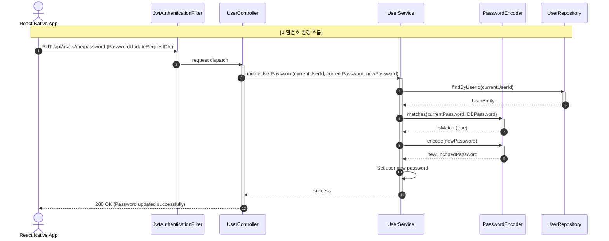
* **설명**: 이메일 주소 및 비밀번호 변경과 같은 민감한 회원 정보 수정 흐름을 도식화한 예시입니다. 비밀번호 변경 시, `UserService`는 입력한 현재 비밀번호가 해시되어 저장된 DB 내 패스워드와 매칭하는지 `PasswordEncoder`를 호출해 교차 검증합니다. 일치할 경우에만 사용자가 작성한 새 비밀번호 문자열을 다시 안전하게 인코딩하여 유저 엔티티에 세팅하고 커밋합니다.

---

### 3-9. U.C 9 - Manage Settings (환경설정 변경)
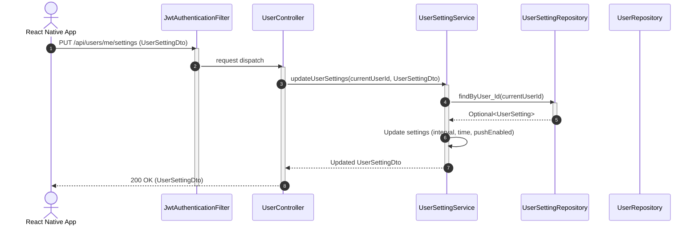
* **설명**: 질문 수신 알림 설정(알림 주기, 푸시 On/Off 및 발령 희망 시각)을 수정하는 절차입니다. `UserSettingService`는 요청자의 로그인 고유 아이디 번호를 대조하여 해당 유저 설정 엔티티(`UserSetting`)를 데이터 레이어에서 확보합니다. 이후 전달받은 알림 시간 주기, 알림 발령 기준 시간대, 푸시 수신 허가 플래그 값을 갱신하여 커밋 및 변경 정보 DTO를 리턴합니다.

---

## Module 3. 질문 발급 및 답변 기록 (U.C 10 ~ 13)

### 3-10. U.C 10 - Scheduled Question (정기 질문 발송 및 조회)
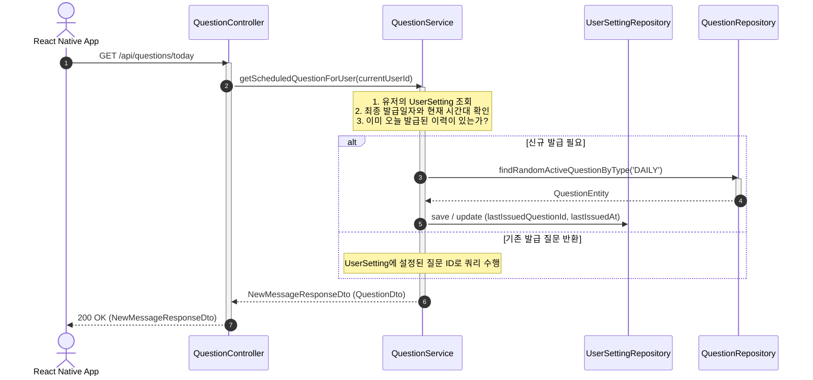
* **설명**: Lumia의 핵심 감정 일기 작성 주기 스케줄에 따른 정기 질문 조회 프로세스입니다. 클라이언트가 오늘의 질문 정보 요청을 전달하면 `QuestionService`가 사용자의 설정 테이블(`UserSetting`)을 분석합니다. 마지막 발급 일시가 오늘 날짜 이전인 경우 신규 질문을 배정해야 하므로, `QuestionRepository`에 선언된 Native Random Query를 이용하여 활성 DAILY 질문 중 임의의 질문 1건을 조회하여 매칭하고 설정 정보를 갱신합니다. 발급 이력이 유효할 경우에는 그 이력의 질문을 불러와 사용자에게 전송합니다.

---

### 3-11. U.C 11 - On-Demand Question (온디맨드 추가 질문 발급)
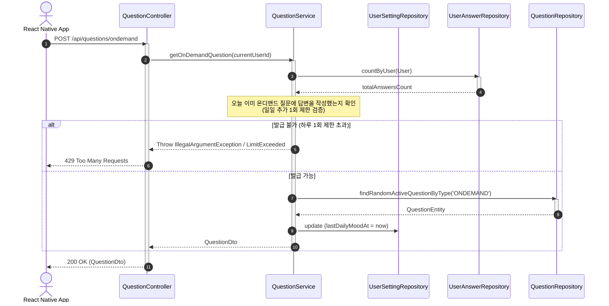
* **설명**: 정기 질문 이외에 사용자가 스스로 감정을 조금 더 회고하고 기록하고 싶을 때 즉석에서 실시간 질문 생성을 호출하는 과정입니다. 하루 1회 초과 발급을 방지하기 위해 `UserAnswerRepository`의 당일 답변 작성 건수 및 `UserSetting.lastDailyMoodAt` 타임스탬프를 체크하여 검증합니다. 제한을 넘지 않은 경우에만 ONDEMAND 타입 질문을 DB에서 무작위 선택하여 발급하고 최종 발령 시각을 갱신 기록합니다.

---

### 3-12. U.C 12 - Submit Answer (답변 등록 및 게이머 보상 처리)
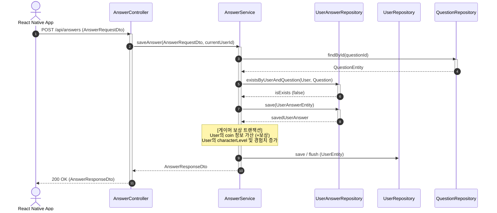
* **설명**: 사용자가 성찰 질문 답변 입력을 제출하는 매우 핵심적인 프로세스이며, 데이터 무결성과 보상 지급이 단일 트랜잭션으로 보장되어야 합니다. 서비스는 해당 질문에 대해 유저가 이전에 이미 제출한 답변이 있는지 `existsByUserAndQuestion` 쿼리로 확인합니다. 존재하지 않는 청정 답변일 경우 `UserAnswer`를 등록합니다. 그 후 사용자의 경험치와 레벨, 그리고 마음 코인 재화의 누적값을 일정한 공식에 맞춰 합산 업데이트를 시도하고 데이터베이스에 최종 플러시(Flush) 처리합니다.

---

### 3-13. U.C 13 - View Answer History (답변 이력 조회)
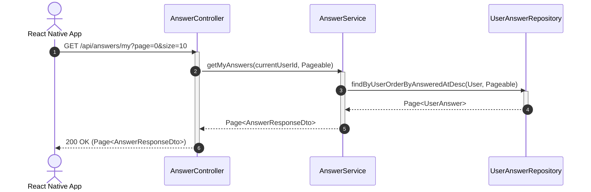
* **설명**: 사용자가 과거에 기록해 놓았던 마음 감정 답변들의 누적 히스토리를 모바일 앱 타임라인에 그려내기 위한 페이징 조회 서비스 흐름입니다. `AnswerService`는 수신한 페이징 설정 객체(`Pageable`) 및 인증 회원의 ID를 사용하여 최근 작성 역순 정렬 조건에 해당하는 답변 결과 배열을 받아와 전송해줍니다.

---

## Module 4. 상점 및 아바타 장착 (U.C 14 ~ 15)

### 3-14. U.C 14 - Purchase Item (아이템 구매)
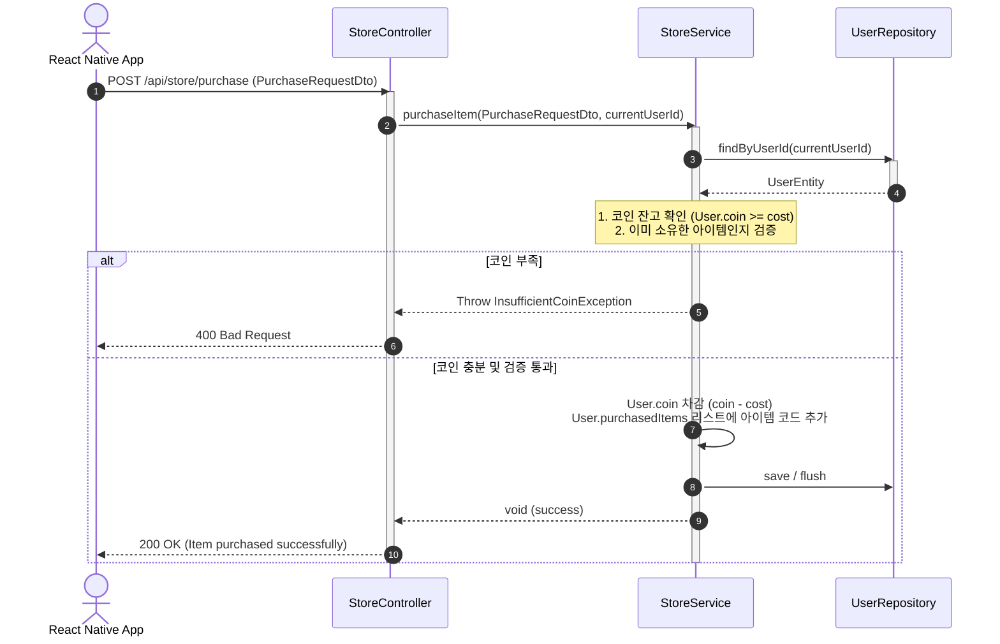
* **설명**: 감정 성찰 리워드로 축적한 가상 재화 코인을 지불하고 아바타 캐릭터 꾸미기용 스킨 아이템을 구매하는 로직입니다. `StoreService`는 `UserRepository`로부터 구매를 시도한 회원 객체를 가져옵니다. 아이템의 가격 정보(`cost`)와 유저의 보유 코인 수량을 비교 대조하여 잔고 부족 시 예외(`400 Bad Request`)를 던집니다. 정상 잔고를 보유한 경우, 코인을 차감하고 획득 목록(`purchasedItems` 직렬화 텍스트)에 구매한 아이템 아이디를 어펜드한 후 영속화합니다.

---

### 3-15. U.C 15 - Equip Items (아이템 장착)
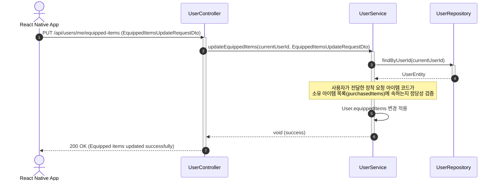
* **설명**: 인벤토리에 소유하고 있는 장식품 코드를 로드하여 동반자 캐릭터 아바타에 실시간으로 입혀 표시하기 위한 시퀀스입니다. `UserService`는 요청 정보로 들어온 아이템 코드가 실제 해당 유저의 소유 리스트(`purchasedItems`)에 속해있는 상태인지 안전성 검증을 거친 후, `equippedItems`를 최종 수정한 후 트랜잭션을 플러시 처리합니다.

---

## Module 5. 익명 커뮤니티 및 댓글 (U.C 16 ~ 20)

### 3-16. U.C 16 - View Posts (게시글 목록 및 상세 조회)
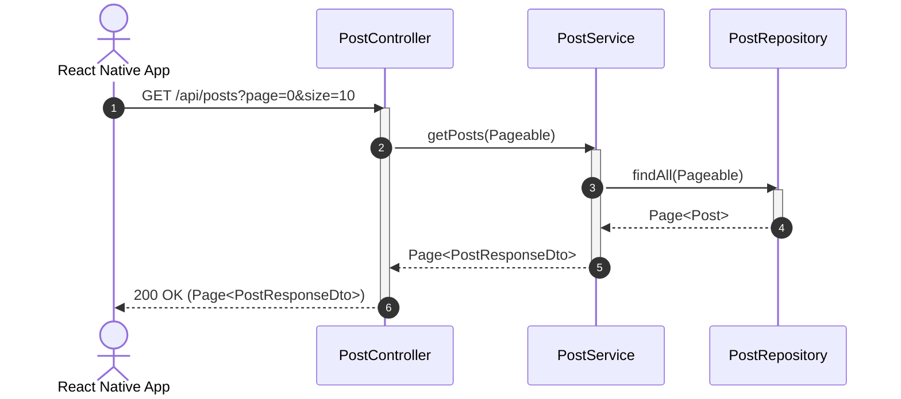
* **설명**: 자유 익명 게시판의 글을 목록 조회하는 쿼리 시퀀스입니다. 모바일 클라이언트에서 페이징 매개변수를 담아 요청하면, 컨트롤러는 `PostService`에 이를 전달합니다. 서비스 단에서 특별한 정렬 기준을 얹은 리포지토리 메서드를 기동하고 결과를 가공 및 익명 필터링한 DTO 데이터 구조로 리프레시하여 전달합니다.

---

### 3-17. U.C 17 - Create Post (게시글 작성 - FastAPI 검증 연동 포함)
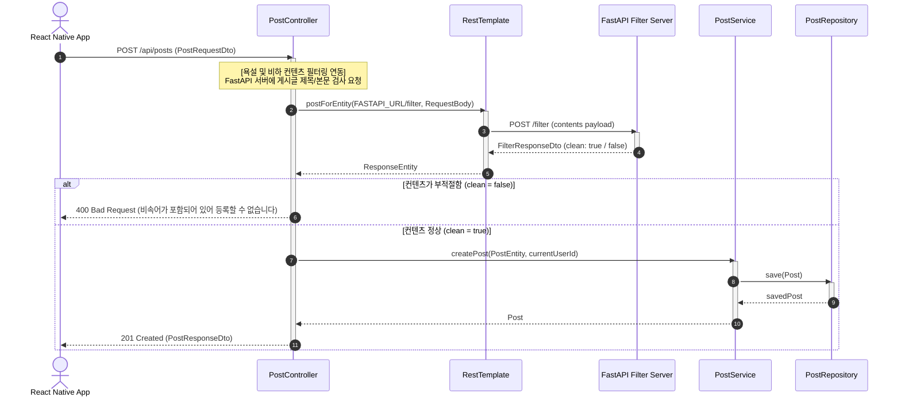
* **설명**: Lumia의 안전하고 따뜻한 익명 대화방 조성을 위한 실시간 컨텐츠 정화 필터링 기능이 접목된 시퀀스입니다. 사용자가 게시글 내용을 전달하면 `PostController`는 이를 DB에 넣기 전, `RestTemplate`을 사용해 외부 FastAPI 필터 서버에 검증 전문을 보냅니다. FastAPI에서 문장을 검출해 `clean = false` 값을 주면 본문에 비속어나 비하 성향이 포함된 것이므로 DB 저장을 즉시 중단하고 차단 응답을 전송합니다. 정상 텍스트인 경우에만 `PostService`에 영속화 저장을 지시합니다.

---

### 3-18. U.C 18 - Edit/Delete Post (게시글 수정/삭제)
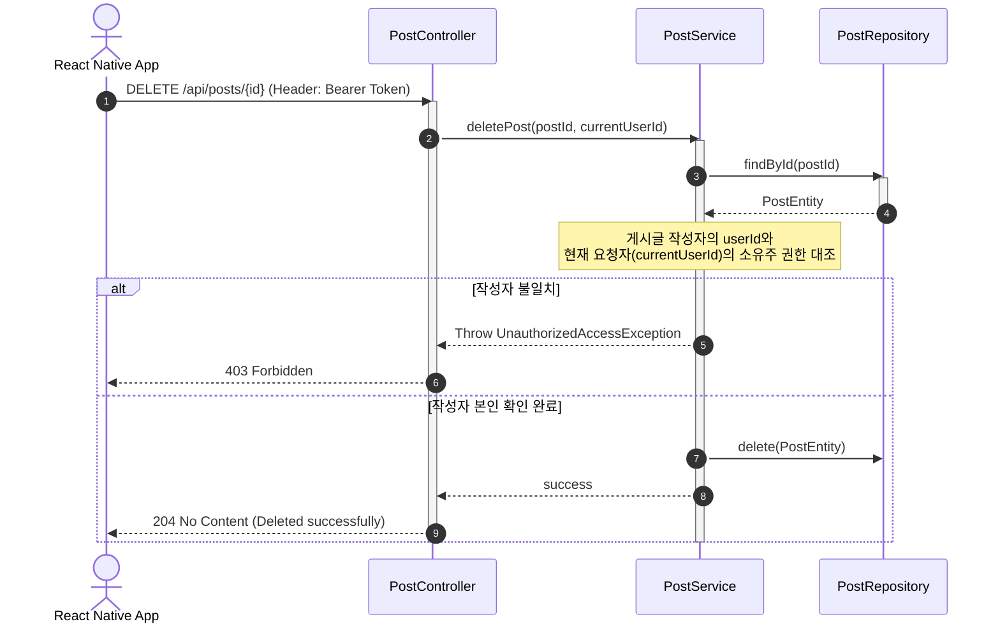
* **설명**: 이미 기재된 게시글의 원천 삭제 처리 절차입니다. `PostService`는 DB에서 대상 게시글 데이터를 불러와 게시글에 연결되어 있는 `author`의 ID 값과 시큐리티 세션 상의 호출자 ID가 동일한지 일치성 검증을 거칩니다. 작성자가 일치하지 않는 경우 타인의 권한 침해로 취급하여 `403 Forbidden` 처리하고, 본인이 맞음이 확인되면 리포지토리 레벨에서 삭제 처리 및 성공 응답을 내려보냅니다.

---

### 3-19. U.C 19 - View Comments (댓글 조회)
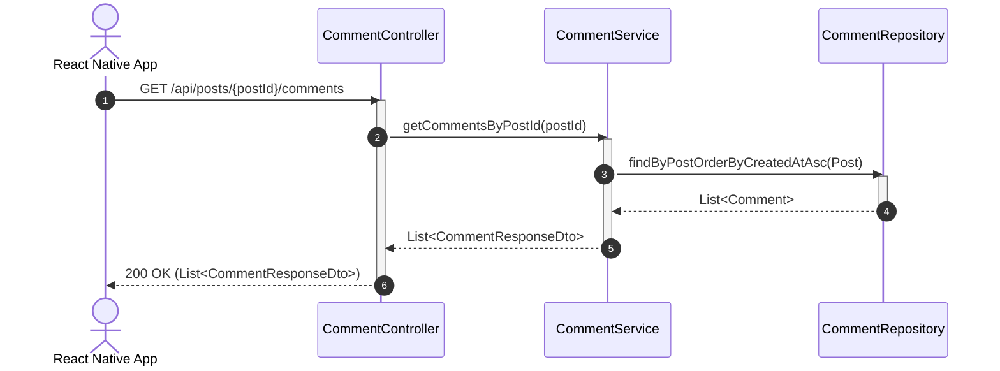
* **설명**: 특정 게시글 하부에 달린 댓글들을 시간 오름차순 순서로 정렬하여 조회하는 절차입니다. `CommentService`는 전달받은 게시글 상위 ID를 타깃으로 설정하여 데이터 레이어에서 해당 쿼리를 수행하고 그 리스트를 리턴해줍니다.

---

### 3-20. U.C 20 - Manage Comment (댓글 작성/수정/삭제 - FastAPI 검증 연동 포함)
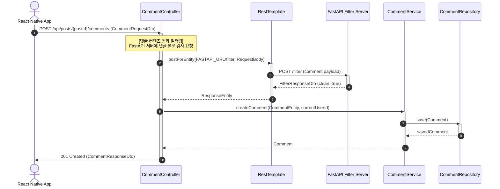
* **설명**: 사용자가 게시판 글에 댓글 입력을 시도할 때 동작하는 시퀀스입니다. 게시글 작성 절차와 통일되게, `CommentController` 단계에서 `RestTemplate`로 외부 FastAPI 필터 서버에 검증 요청을 날려 욕설 필터 여부를 대조한 뒤 검사 결과가 Clean일 경우에만 영속 서비스 클래스로 라우팅하여 댓글을 정상 등록시킵니다.

---

## Module 6. AI 공감 대화 (U.C 21)

### 3-21. U.C 21 - AI Empathy Chat (AI 공감 대화)
```mermaid
sequenceDiagram
    autonumber
    actor Client as React Native App
    participant CC as ChatController
    participant CS as ChatService
    participant RT as RestTemplate
    participant OpenAI as OpenAI Chat API

    Client->>CC: POST /api/chat/completions (ChatCompletionRequestDto)
    activate CC
    CC->>CS: createCompletion(ChatCompletionRequestDto, currentUserId)
    activate CS
    
    Note over CS: 1. 시스템 프롬프트(비판단적 위로, 힐링 페르소나) 주입<br>2. 요청 메시지 구조화<br>3. OpenAiProperties에서 API Key 로드
    
    CS->>RT: postForEntity(OPENAI_RESPONSES_URL, HttpEntity, String.class)
    activate RT
    
    alt OpenAI API 정상 응답
        RT->>OpenAI: POST /v1/chat/completions (Header: Bearer API_KEY)
        activate OpenAI
        OpenAI-->>RT: OpenAI Response Payload (JSON)
        deactivate OpenAI
        RT-->>CS: ResponseEntity
        Note over CS: OpenAI JSON 응답 파싱 및 답변 텍스트 추출
        CS-->>CC: ChatCompletionResponseDto (reply)
        CC-->>Client: 200 OK (ChatCompletionResponseDto)
    else OpenAI API 타임아웃 / 장애 발생
        Note over CS: isTimeoutException 감지 또는 HTTP 에러 가공
        CS-->>CC: Throw ChatCompletionException(status, errorMsg)
        deactivate RT
        CC-->>Client: 504 Gateway Timeout / 502 Bad Gateway
    end
    deactivate CS
    deactivate CC
```
* **설명**: 챗봇 상담 기능을 구현하기 위해 백엔드가 OpenAI 엔드포인트와 중간 프록시 연동을 수행하는 동적 시퀀스입니다. `ChatController`에서 요청이 주입되면 `ChatService`는 시스템 가이드 프롬프트 규칙(상대방을 비난하거나 판단하지 않고 따뜻한 경청과 힐링 위주로 답할 것)을 주입한 뒤, 설정값 객체(`OpenAiProperties`)의 보안 토큰을 헤더에 탑재하여 `RestTemplate` 통신을 기동합니다. 원천 API 결과가 원활하게 올 경우 본문만 파싱하여 사용자에게 전달하고, 만약 API 서버 측에서 타임아웃이나 호출한도 초과 에러가 발생한 경우 `ChatCompletionException`을 던져 클라이언트 단에 오류 상태 코드(502/504)를 전송하게 처리합니다.
