# 3. Sequence Diagram

[Back to Contents](./Design.md)

> [!NOTE]
> 본 문서에서 사용하는 **U.C**는 **Use Case(유스케이스)**의 약자이며, 시스템이 제공하는 개별 기능적 단위를 의미합니다.

---

이 문서는 Conceptualization 단계에서 정의된 21가지 유스케이스(U.C)를 바탕으로, 클라이언트(React Native App)부터 백엔드 컨트롤러, 서비스, 데이터베이스 레포지토리, 그리고 외부 시스템(FastAPI 필터 서버, OpenAI API) 간의 동적 흐름과 메시지 전달 순서를 설계한 시퀀스 다이어그램 문서입니다.

각 다이어그램 하단에는 객체 간 통신 순서와 세부 비즈니스 로직 및 예외 처리 흐름을 학술 보고서 스타일(12pt, 160% 기준)로 상세히 기술하였습니다.

---

## 목차
1. [Module 1. 회원 및 인증 관리 (U.C 1 ~ 5)](#module-1-회원-및-인증-관리-uc-1--5)
2. [Module 2. 프로필 및 환경 설정 (U.C 6 ~ 9)](#module-2-프로필-및-환경-설정-uc-6--9)
3. [Module 3. 질문 발급 및 답변 기록 (U.C 10 ~ 13)](#module-3-질문-발급-및-답변-기록-uc-10--13)
4. [Module 4. 상점 및 아바타 장착 (U.C 14 ~ 15)](#module-4-상점-및-아바타-장착-uc-14--15)
5. [Module 5. 익명 커뮤니티 및 댓글 (U.C 16 ~ 20)](#module-5-익명-커뮤니티-및-댓글-uc-16--20)
6. [Module 6. AI 공감 대화 (U.C 21)](#module-6-ai-공감-대화-uc-21)

---

## Module 1. 회원 및 인증 관리 (U.C 1 ~ 5)

### 3-1. U.C 1 - Sign Up (회원가입)

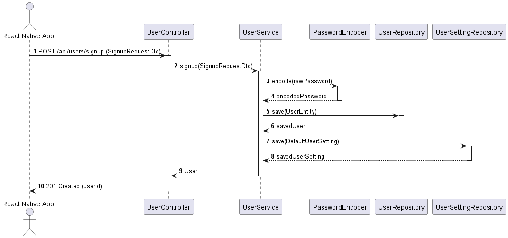

* **설명**: 사용자가 앱에서 회원가입 정보를 입력하고 전송하면 시작되는 흐름입니다.
  1. **정보 전달**: 앱이 사용자의 가입 정보를 백엔드 컨트롤러(`UserController`)로 전달합니다.
  2. **비밀번호 암호화**: 회원가입 서비스(`UserService`)에서 보안을 위해 입력된 비밀번호를 안전하게 해시 암호화(`PasswordEncoder`)합니다.
  3. **유저 정보 저장**: 암호화된 비밀번호를 포함한 최종 회원 정보를 데이터베이스(`UserRepository`)에 등록합니다.
  4. **기본 설정 생성**: 가입 완료와 동시에 사용자가 받을 질문 알림 시간이나 주기 설정을 관리할 기본 설정 정보(`UserSettingRepository`)를 생성하여 등록을 마친 후 성공 결과를 반환합니다.

---

### 3-2. U.C 2 - Login (로그인)

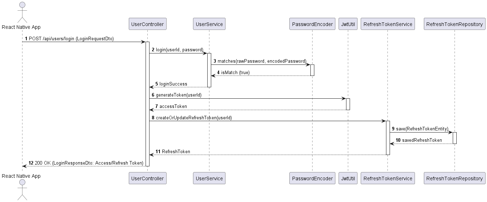

* **설명**: 사용자가 로그인 아이디와 비밀번호를 입력하고 접속을 인증하는 흐름입니다.
  1. **비밀번호 검증**: 입력받은 비밀번호를 로그인 서비스(`UserService`)가 데이터베이스의 암호화된 비밀번호와 대조(`PasswordEncoder.matches`)하여 본인 확인을 수행합니다.
  2. **인증 토큰 발급**: 검증이 완료되면, 인증 토큰 유틸(`JwtUtil`)을 통해 단기 로그인 유지 및 요청 처리를 담당할 `Access Token`을 발행합니다.
  3. **갱신용 토큰 저장**: 이어서 장기 세션 인증 유지를 도와주는 `Refresh Token`을 새로 생성하여 데이터베이스(`RefreshTokenRepository`)에 안전하게 저장 및 갱신합니다.
  4. **응답 완료**: 발급이 끝난 두 가지 보안 토큰 세트를 앱에 회신하여 로그인을 최종 완료합니다.

---

### 3-3. U.C 3 - Refresh Token (토큰 갱신)

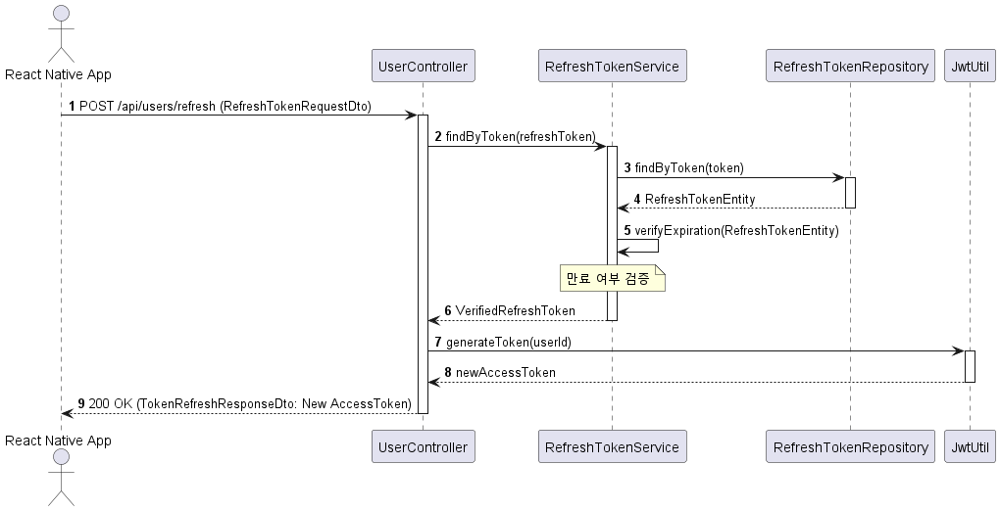

* **설명**: 사용자가 사용 중인 로그인 유지 토큰이 만료되어 자동으로 로그인 세션을 연장하는 흐름입니다.
  1. **갱신 요청**: 앱이 보안 저장소에 가지고 있던 갱신용 `Refresh Token`을 백엔드 컨트롤러로 전송하며 재발급을 요청합니다.
  2. **토큰 검사**: 토큰 서비스(`RefreshTokenService`)가 데이터베이스(`RefreshTokenRepository`)를 대조 조회하여 조작되지 않고 유효한 만료일 내의 토큰인지 체크합니다.
  3. **새 토큰 생성**: 검증이 완료되면 토큰 생성 유틸(`JwtUtil`)이 해당 사용자 정보를 바탕으로 새로운 단기 `Access Token`을 발행합니다.
  4. **응답**: 새로 발행된 인증 토큰 정보를 앱에 회신하여, 사용자가 로그아웃으로 튕겨나가지 않고 서비스를 계속 매끄럽게 이용할 수 있도록 보장합니다.

---

### 3-4. U.C 4 - Logout (로그아웃)

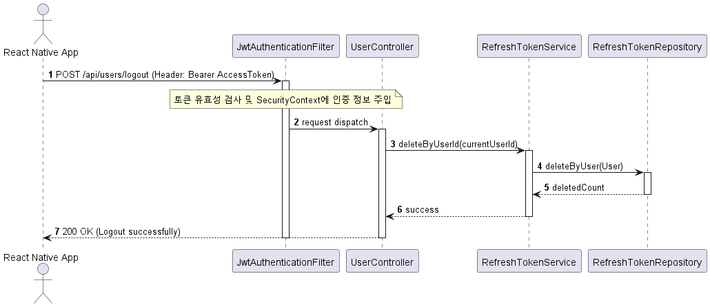

* **설명**: 사용자가 앱의 설정 메뉴에서 로그아웃 버튼을 눌러 안전하게 보안 접속 세션을 종료하는 흐름입니다.
  1. **인증 필터 확인**: 로그아웃 요청 시, 시큐리티 인증 필터(`JwtAuthenticationFilter`)에서 현재 사용자의 토큰 정보와 로그인 상태가 정상인지 파악합니다.
  2. **보안 세션 파기**: 인증 확인 후 컨트롤러가 서비스(`RefreshTokenService`)를 호출해 해당 사용자 명의로 저장되어 있던 갱신용 `Refresh Token`을 데이터베이스에서 찾아 완전 삭제 처리합니다.
  3. **완료**: 기존 토큰을 재사용할 수 없도록 무효화한 뒤 로그아웃 성공 상태 코드를 전송하여 접속을 끝마칩니다.

---

### 3-5. U.C 5 - Find Login ID (아이디 찾기)

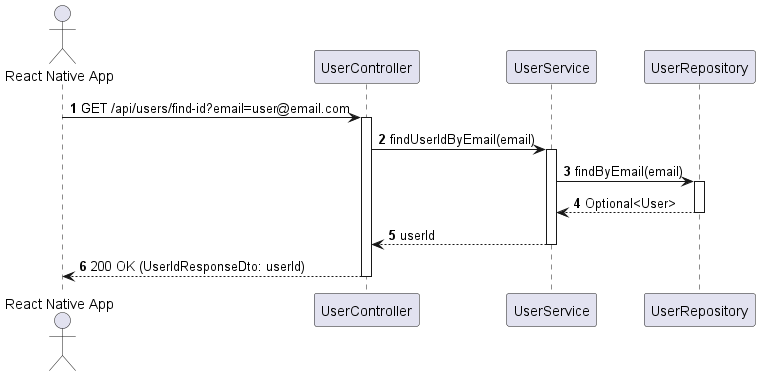

* **설명**: 사용자가 가입 당시 등록한 이메일을 사용하여 분실한 자신의 로그인 아이디를 찾는 흐름입니다.
  1. **조회 요청**: 사용자가 본인의 이메일 주소를 입력해 아이디 찾기를 누릅니다.
  2. **이메일 대조**: 서비스(`UserService`)에서 회원 정보 저장소(`UserRepository`)를 조회하여 입력한 이메일과 매칭되는 회원 레코드가 있는지 검사합니다.
  3. **결과 리턴**: 해당하는 가입 정보가 존재하면 감추어둔 유저의 아이디 정보를 화면에 출력해 반환하고, 이메일 정보가 없다면 404 에러로 등록되지 않은 이메일임을 고지합니다.

---

## Module 2. 프로필 및 환경 설정 (U.C 6 ~ 9)

### 3-6. U.C 6 - View Profile (프로필 조회)

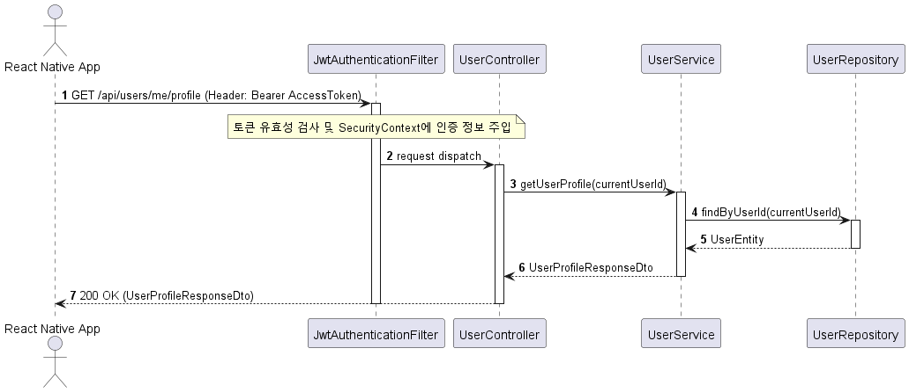

* **설명**: 사용자가 프로필 화면에 접속했을 때 개인 상세 데이터 및 동반자 아바타의 성장 현황을 보여주는 흐름입니다.
  1. **인증 검증**: 유저 정보 요청이 들어오면 시큐리티 필터(`JwtAuthenticationFilter`)를 거쳐 유효하게 로그인된 유저 세션 정보가 빌드됩니다.
  2. **회원 데이터 조회**: 회원 서비스(`UserService`)가 데이터베이스에서 해당 회원의 세부 레코드(닉네임, 성별, MBTI 등) 및 캐릭터 레벨, 획득 경험치, 코인 보유 수량, 인벤토리 장식 아이템 정보를 가져옵니다.
  3. **프로필 응답**: 취합한 모든 유저 상세 현황을 묶어 모바일 앱 프로필 화면에 출력할 수 있게 전송해줍니다.

---

### 3-7. U.C 7 - Update Profile (프로필 수정)

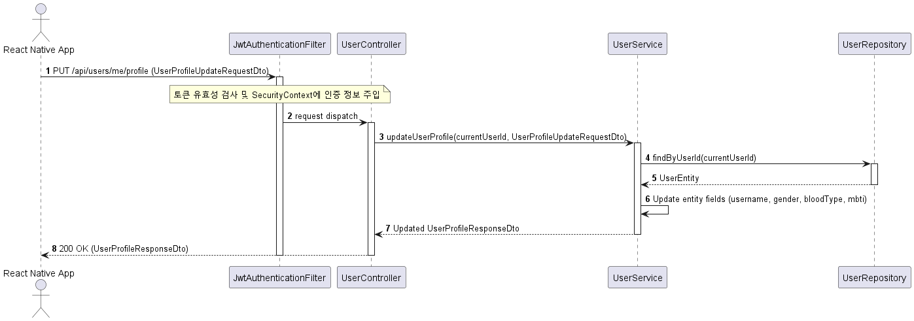

* **설명**: 사용자가 닉네임, 성별, 혈액형, MBTI 등 자신의 대표 프로필 항목을 편집하는 흐름입니다.
  1. **수정안 입력**: 사용자가 변경을 원하는 프로필 데이터 패키지를 앱 내 화면에 작성하고 수정 확정을 누릅니다.
  2. **대상 조회**: 서비스(`UserService`)가 데이터베이스에서 요청자의 고유 유저 데이터를 쿼리하여 준비합니다.
  3. **데이터 동기화**: 영속성 컨텍스트(DB 연동 영역) 하에 세팅된 유저 엔티티 필드들의 닉네임, 성별, 혈액형, MBTI 속성들을 즉시 갱신하고 커밋합니다.
  4. **반영 리턴**: 수정이 완수된 최종 프로필 정보를 앱 화면에 리턴하여 실시간으로 갱신 내역을 렌더링시킵니다.

---

### 3-8. U.C 8 - Update Security (보안 정보 수정 - 이메일, 비밀번호 변경)

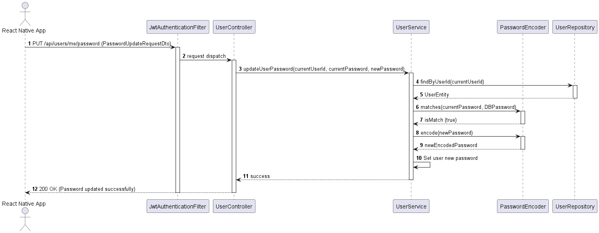

* **설명**: 비밀번호나 이메일 주소 등 유저의 계정 보안과 관련된 핵심 인증 정보를 교체할 때 작동하는 흐름입니다.
  1. **패스워드 변경 요청**: 사용자가 기존 비밀번호와 바꾸고자 하는 새 비밀번호를 입력해 수정 처리를 호출합니다.
  2. **비밀번호 검증**: 서비스가 현재 비밀번호가 해시화되어 저장되어 있던 데이터베이스 정보와 호환되는지 `PasswordEncoder`를 활용해 일치 여부를 판독합니다.
  3. **신규 패스워드 암호화**: 대조 검사가 무사히 완료되면 새로 입력받은 새 비밀번호 텍스트를 인코딩하여 새로운 해시 암호문으로 변형합니다.
  4. **저장 및 확정**: 사용자 계정의 패스워드 정보를 신규 암호문으로 치환하여 최종 커밋하고 처리 성공 알림을 송신합니다.

---

### 3-9. U.C 9 - Manage Settings (환경설정 변경)

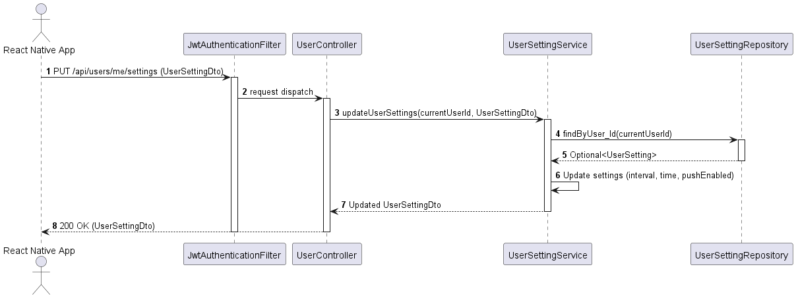

* **설명**: 정기 마음 질문 푸시 알림의 발송 주기, 선호 발송 시각 및 푸시 알림 사용 유무를 변경하는 흐름입니다.
  1. **설정 세팅**: 사용자가 알림 발송 시간대, 작동 토글, 원하는 알림 수신 주기(분/시간 단위 등)를 수정하여 저장 버튼을 클릭합니다.
  2. **기본 레코드 대입**: 환경 설정 서비스(`UserSettingService`)에서 로그인 계정에 부여된 고유 설정 데이터(`UserSetting`) 레코드를 데이터베이스에서 읽어옵니다.
  3. **설정값 동기화**: 유저가 수정한 알림 수신 시간, 허용 상태 플래그, 수신 간격 값을 매칭하여 데이터베이스 설정을 업데이트합니다.
  4. **화면 갱신**: 최종 세팅 완료를 회신하여 모바일 알림 시스템에 반영되도록 제어합니다.

---

## Module 3. 질문 발급 및 답변 기록 (U.C 10 ~ 13)

### 3-10. U.C 10 - Scheduled Question (정기 질문 발송 및 조회)

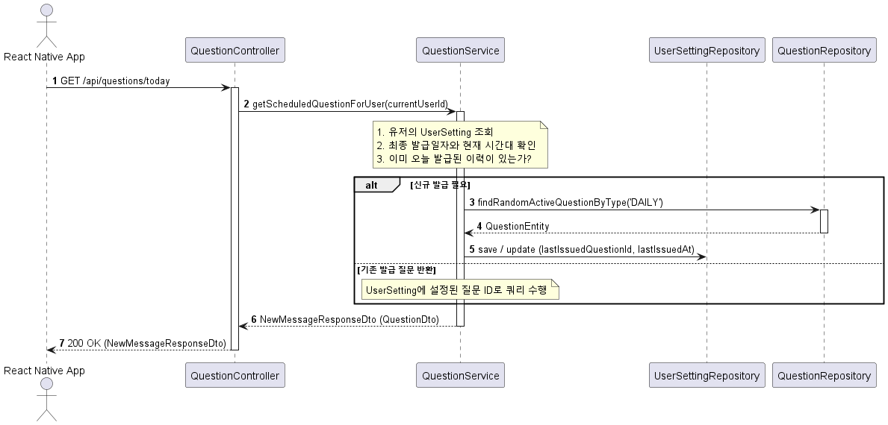

* **설명**: 사용자의 규칙적인 감정 기록 습관을 돕기 위해 미리 약속된 시간에 맞춰 정기 일기 질문을 매칭 및 전달하는 흐름입니다.
  1. **질문 조회 요청**: 클라이언트가 오늘 받아볼 약속된 감정 질문을 로드하기 위해 백엔드 API를 호출합니다.
  2. **오늘 날짜 이력 판별**: 질문 서비스(`QuestionService`)가 회원의 설정 테이블 정보를 조회하여 오늘 이미 발령된 정기 질문이 존재하는지 조회합니다.
  3. **신규 질문 랜덤 배정**: 만약 오늘 날짜로 발급받은 정기 질문이 없다면, 질문 리포지토리(`QuestionRepository`)의 무작위 쿼리를 통해 정기(DAILY) 유형 질문 중 한 개를 선정해 배정하고 발송 내역 타임스탬프를 갱신합니다.
  4. **전송**: 오늘 이미 발급된 질문이 기록되어 있다면 기존에 잡혀 있던 질문 정보를 화면에 그대로 송신해 일관된 일기 작성을 돕습니다.

---

### 3-11. U.C 11 - On-Demand Question (온디맨드 추가 질문 발급)

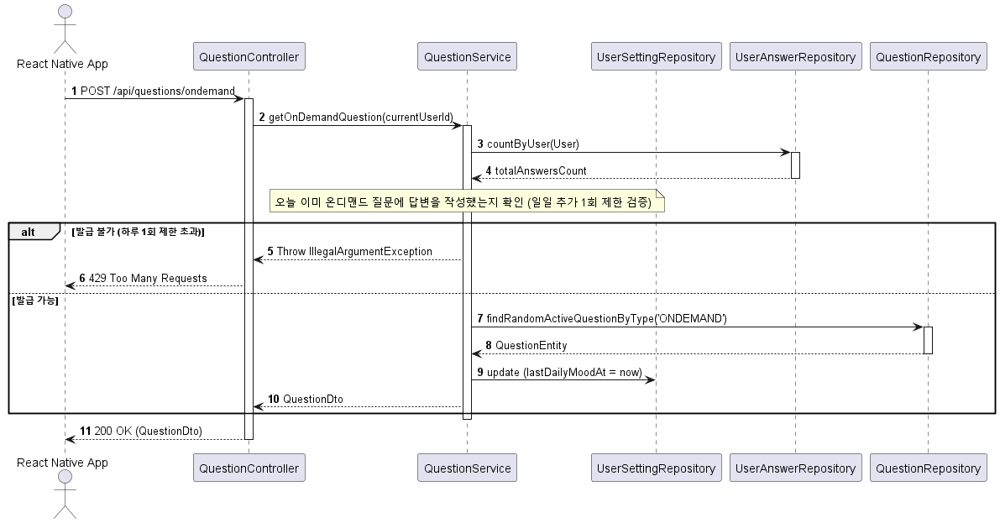

* **설명**: 정기 질문을 넘어서, 유저가 스스로 필요를 느껴 즉석에서 감정 일기 추가 질문 발급을 요청하는 흐름입니다.
  1. **추가 질문 호출**: 사용자가 앱의 메인 피드 등에서 '추가 질문 생성' 버튼을 직접 클릭합니다.
  2. **일일 제한 검사**: 지나친 작성을 차단하기 위해 유저가 오늘 추가 일기 작성을 완료한 기록(`UserAnswerRepository`)이 이미 존재하는지 체크하여 하루 1회 초과 발급 제한 정책을 체크합니다.
  3. **무작위 쿼리**: 발급 조건이 성립된 경우에만 추가 전용(ONDEMAND) 질문 목록에서 임의의 질문 레코드 1건을 조회하여 배정하고, 당일 발급 시각을 업데이트합니다.
  4. **완료**: 배정된 추가 성찰 질문 데이터를 사용자 단으로 내려줍니다.

---

### 3-12. U.C 12 - Submit Answer (답변 등록 및 게이머 보상 처리)

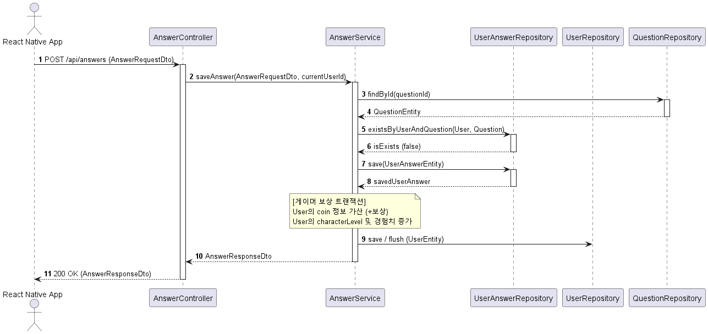

* **설명**: 성찰 질문에 대한 정성스러운 일기 답변 내용을 서버에 기록하고, 동반자 아바타의 레벨 성장 및 보상 재화를 한 번에 획득하는 핵심 흐름입니다.
  1. **답변 데이터 전송**: 사용자가 적은 일기 텍스트 본문과 선택한 감정 점수/태그 정보를 담아 답변 등록 API로 보냅니다.
  2. **중복 입력 방지**: 사용자가 해당 질문에 대해 이미 답변을 처리했는지 중복 등록 방지 로직을 가동하여 검사합니다.
  3. **답변 영속 저장**: 무결함이 확인되면 제출된 일기 내용을 데이터베이스(`UserAnswerRepository`)에 저장합니다.
  4. **보상 지급 트랜잭션**: 답변 저장이 완료되는 즉시, 유저 계정의 코인 잔액을 가산해주고 경험치 수치를 합산해 레벨을 갱신합니다. 이 일련의 답변 기록과 보상 갱신 과정은 하나의 단일 트랜잭션(Transaction)으로 묶여 실패 시 자동 복구(Rollback)되도록 구성되었습니다.

---

### 3-13. U.C 13 - View Answer History (답변 이력 조회)

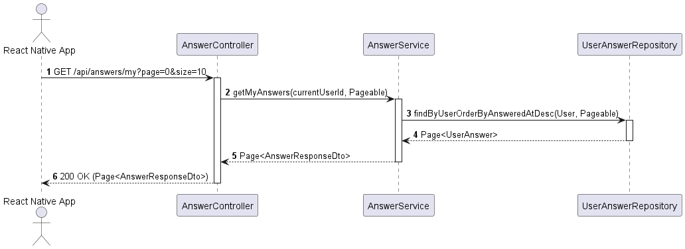

* **설명**: 유저가 지난 한 달간 혹은 과거에 꾹꾹 눌러 적어왔던 감정 답변 내역을 앱 타임라인에 보여주는 흐름입니다.
  1. **페이징 매개변수 전송**: 사용자가 스크롤을 내릴 때 특정 페이지(ex. 첫 페이지 10개) 단위의 감정 이력 호출 요청이 들어갑니다.
  2. **최신순 정렬 쿼리**: 답변 서비스(`AnswerService`)에서 해당 사용자의 답변 리포지토리를 뒤져, 가장 최근에 작성된 날짜의 역순(내림차순) 정렬 조건에 만족하는 데이터 세트를 호출합니다.
  3. **타임라인 피드백**: 조회된 답변 리스트를 모바일 타임라인 목록에 렌더링되도록 반환합니다.

---

## Module 4. 상점 및 아바타 장착 (U.C 14 ~ 15)

### 3-14. U.C 14 - Purchase Item (아이템 구매)

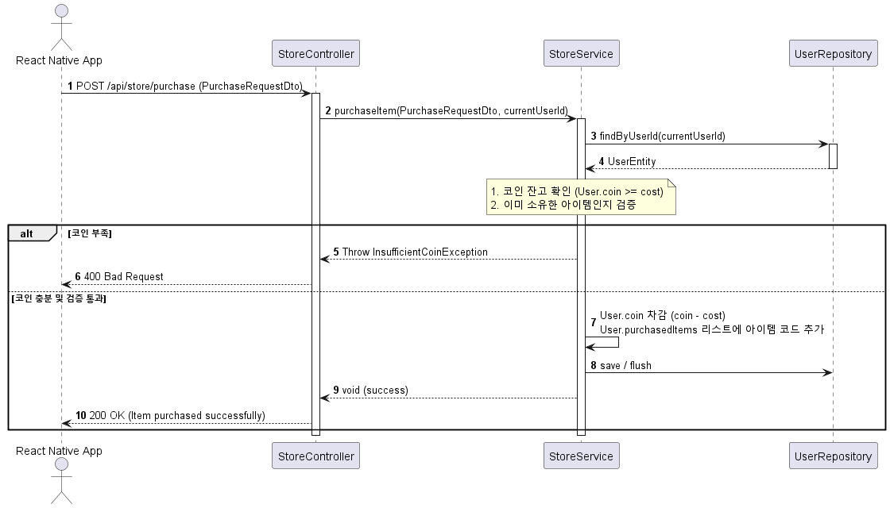

* **설명**: 감정 성찰 리워드로 부지런히 저금한 마음 코인을 활용하여 아바타 꾸미기용 스킨 아이템을 구매하는 상점 흐름입니다.
  1. **아이템 선택**: 사용자가 구매를 희망하는 장식 아이템 정보를 지정하여 구매 확정을 지시합니다.
  2. **코인 잔액 검사**: 상점 서비스(`StoreService`)가 회원 데이터베이스를 로드하여 보유 코인 잔량이 타깃 아이템의 구매 원가 이상인지 조회하고, 이미 해당 아이템을 소유한 이력이 있는지 검증합니다.
  3. **코인 차감 및 획득 목록 추가**: 정상 통과된 경우, 사용자의 보유 코인을 소모가만큼 차감한 뒤 획득 아이템 목록(`purchasedItems`)에 새 아이템 코드를 저장해줍니다.
  4. **결과 피드백**: 데이터 반영 처리를 마치고 성공 응답을 전송하여 상점 보관함 화면을 갱신합니다.

---

### 3-15. U.C 15 - Equip Items (아이템 장착)

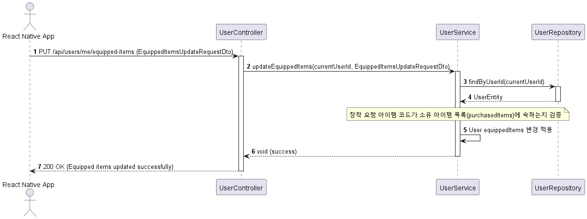

* **설명**: 구입하여 소지 중인 아바타 옷과 장신구 코드를 옷장에서 직접 동반자 고양이 캐릭터에게 입혀 꾸며주는 흐름입니다.
  1. **아이템 장착 지시**: 사용자가 입히고 싶은 모자, 옷 등의 장식 리스트를 체크해 캐릭터 장착 변경을 전송합니다.
  2. **소유권 대조**: 서비스가 회원의 구매 획득 이력 리스트(`purchasedItems`)를 스캔하여 유저가 실제로 해당 스킨 아이템 소유 권한을 가졌는지 체크합니다.
  3. **장착 정보 업데이트**: 검증이 완료되면 유저의 아바타 장착 세팅 정보(`equippedItems`)를 갱신 적용하여 데이터베이스에 플러시(Flush)합니다.
  4. **갱신 완료**: 동반자 캐릭터 아바타 외형의 실시간 갱신 결과를 앱 화면에 바로 표현해줍니다.

---

## Module 5. 익명 커뮤니티 및 댓글 (U.C 16 ~ 20)

### 3-16. U.C 16 - View Posts (게시글 목록 및 상세 조회)

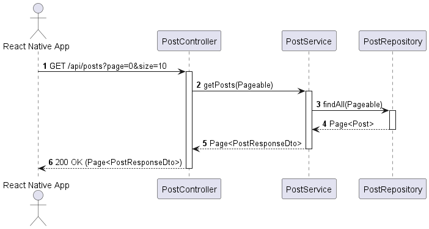

* **설명**: 익명 마음 소통 게시판에 업로드되어 있는 여러 긍정적인 이야기 글들을 목록으로 정렬하여 열람하는 흐름입니다.
  1. **페이지 호출**: 사용자가 익명 커뮤니티 탭에 진입하면 페이징 설정값을 들고 게시글 정보 요청을 전달합니다.
  2. **최근 글 검색**: 게시판 서비스(`PostService`)가 작성 역순 기준에 따른 최신 글 목록 리스트를 게시판 데이터베이스(`PostRepository`)에서 가져옵니다.
  3. **익명 마스킹 가공**: 글을 적은 실제 작성자의 내부 민감 ID 대신, 표시용 닉네임과 DTO 구성으로 변경하여 보안을 보강합니다.
  4. **리스트 출력**: 익명 마스킹이 깔끔하게 입혀진 글 페이지 목록을 앱 피드에 뿌려줍니다.

---

### 3-17. U.C 17 - Create Post (게시글 작성 - FastAPI 검증 연동 포함)

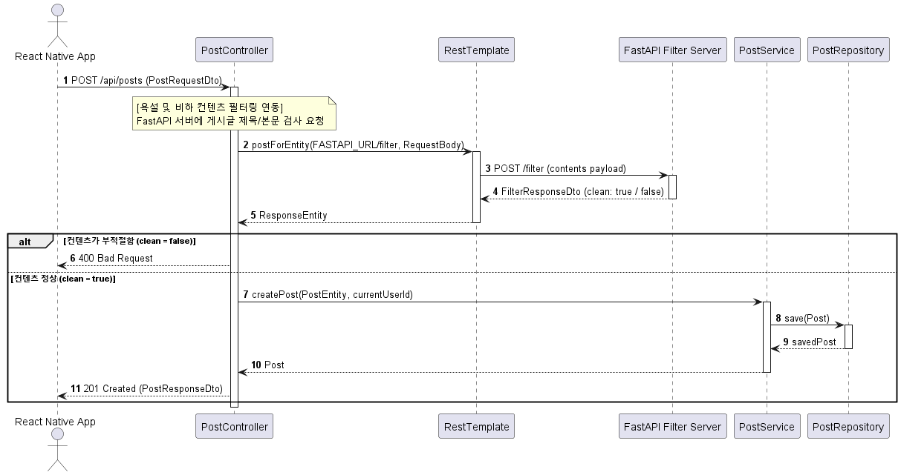

* **설명**: 따뜻하고 평온한 익명 소통방을 유지하기 위해 작성한 글에 비속어가 있는지 외부 서버와 교차 검사하고 올리는 글 등록 흐름입니다.
  1. **필터링 점검 요청**: 사용자가 글 작성을 완료하면 백엔드 컨트롤러가 먼저 텍스트 본문을 들고 외부 FastAPI 문장 분석 서버로 검사 전송을 보냅니다.
  2. **부적절 단어 판별**: 분석 서버가 전송받은 제목/본문 문장에서 공격적인 어조나 비속어가 검출되었다는 결과(`clean = false`)를 보낼 시, 등록을 차단하고 400 에러를 띄웁니다.
  3. **익명 글 등록**: 검열을 통과한 건강한 글인 경우에만 게시판 서비스(`PostService`)를 통해 게시판 데이터 저장소에 안전하게 작성 글을 적재합니다.
  4. **작성 완료**: 최종 완료된 게시글 정보를 반환하여 게시판 화면에 반영시킵니다.

---

### 3-18. U.C 18 - Edit/Delete Post (게시글 수정/삭제)

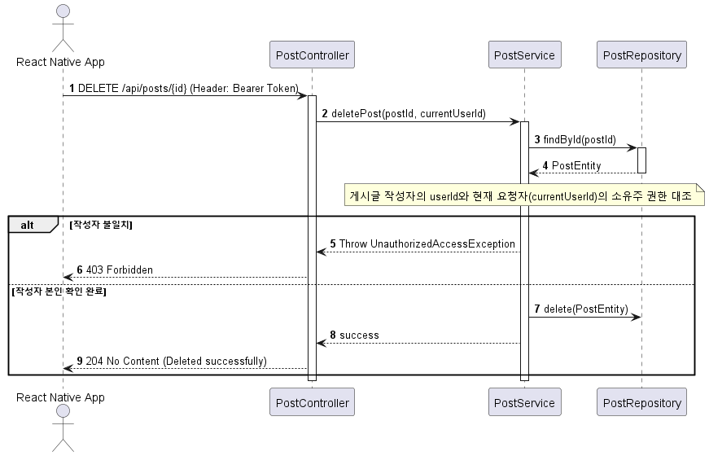

* **설명**: 자신이 등록했던 익명 커뮤니티 게시글을 더 이상 공유하지 않고 원천적으로 삭제 처리하는 흐름입니다.
  1. **삭제 요청**: 사용자가 본인이 쓴 게시글 정보에서 삭제 아이콘을 클릭합니다.
  2. **작성자 소유주 판별**: 서비스(`PostService`)가 지우고자 하는 글의 DB 원천 레코드를 대입하여, 글을 작성한 회원 번호가 현재 로그인된 사용자와 같은 사람인지 크로스 체크합니다.
  3. **강제 삭제**: 작성자 소유 본인이 확실하다고 증명되면 해당 게시글 레코드 정보를 데이터베이스에서 완전히 삭제합니다.
  4. **응답 성공**: 삭제 작업 완료를 피드백하여 화면에 해당 글이 보이지 않도록 제어합니다.

---

### 3-19. U.C 19 - View Comments (댓글 조회)

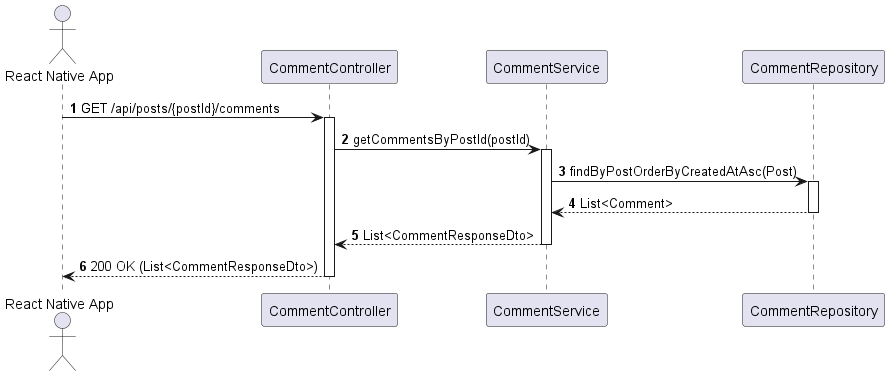

* **설명**: 게시판 글 본문에 접속했을 때 하부에 누적되어 작성되어 있는 익명 댓글들을 등록순으로 읽어오는 흐름입니다.
  1. **글 상세 진입**: 사용자가 특정 게시판 글 카드를 선택해 상세 페이지로 진입합니다.
  2. **시간순 정렬 조회**: 댓글 서비스(`CommentService`)가 선택된 상위 게시글 고유 키값을 기준으로 삼아 댓글 데이터베이스를 쿼리하고, 등록 시간 오름차순(과거에 먼저 쓴 순)으로 데이터 셋을 정렬해 읽어옵니다.
  3. **댓글 화면 출력**: 읽어온 익명 댓글 목록을 DTO 객체로 가공해 글 상세 화면 하단의 댓글 목록 창에 전송합니다.

---

### 3-20. U.C 20 - Manage Comment (댓글 작성/수정/삭제 - FastAPI 검증 연동 포함)

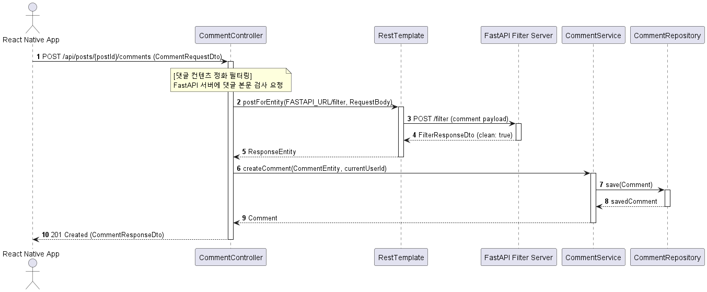

* **설명**: 다른 이의 글에 익명 댓글을 작성하고, 역시 건전한 텍스트인지 필터링한 후 등록을 처리하는 흐름입니다.
  1. **댓글 텍스트 검증**: 사용자가 댓글 작성을 누르면 백엔드 컨트롤러가 먼저 댓글 본문 텍스트를 외부 FastAPI 필터 서버에 검사 요청으로 보냅니다.
  2. **비속어 유무 검열**: 비하 발언이나 욕설, 모욕적인 발언이 검출되지 않는 유의미하고 올바른 내용의 글인지 체크합니다.
  3. **댓글 저장**: 검열 결과가 깨끗하다고 판명되면 서비스(`CommentService`)가 동작하여 댓글 데이터베이스(`CommentRepository`)에 유저 키와 댓글을 적재하고 가공된 결과를 화면에 회신합니다.

---

## Module 6. AI 공감 대화 (U.C 21)

### 3-21. U.C 21 - AI Empathy Chat (AI 공감 대화)

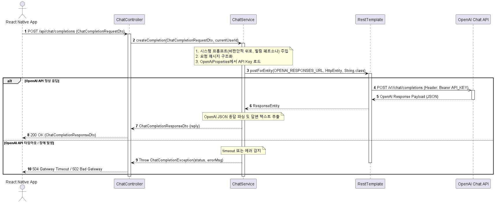

* **설명**: 사용자가 속상하거나 힘든 고민이 있을 때, AI 동반자 고양이와 1:1로 실시간 비판단적이고 따뜻한 경청 상담을 나누는 흐름입니다.
  1. **메시지 전송**: 사용자가 하고 싶은 일상 고민이나 힘든 마음의 이야기를 대화창에 작성해 송출합니다.
  2. **힐링 시스템 설정 주입**: 백엔드 챗 서비스(`ChatService`)가 대화를 비난하지 않고 상대방의 감정에 깊이 공감하고 어루만지도록 훈련하는 힐링 상담용 시스템 지침(System Prompt)을 작성 대화에 감싸 준비합니다.
  3. **OpenAI API 전송**: 빌드된 대화 컨텍스트에 보안 헤더(OpenAI API Key)를 실어 OpenAI의 Chat Completion 서버로 비동기식 분석 전송을 보냅니다.
  4. **안내 및 에러 통제**: 분석이 올바르게 완료되면 생성된 위로 문장을 반환하고, 혹여나 API 시간초과나 호출 횟수 한도 초과 오류 등이 발생하면 친절한 에러 문구(502/504)로 감싸 정중히 안내해 앱 튕김을 미리 차단합니다.
