# Sequence Diagram (PlantUML Source Code)

[⬅️ Back to Contents](./Design.md)

---

이 문서는 `Sequence_diagram.md`에서 정의한 21개 유스케이스(U.C)의 Mermaid 시퀀스 다이어그램을 **PlantUML 문법**으로 변환하여 정리한 소스 코드 보관 문서입니다. 
각 유스케이스의 `@startuml`부터 `@endum`까지의 블록을 그대로 복사하여 PlantUML 에디터 혹은 도구에 붙여넣어 활용하실 수 있습니다.

---

## 목차
1. [Module 1. 회원 및 인증 관리 (U.C 1 ~ 5)](#module-1-회원-및-인증-관리-uc-1--5)
2. [Module 2. 프로필 및 환경 설정 (U.C 6 ~ 9)](#module-2-프로필-및-환경-설정-uc-6--9)
3. [Module 3. 질문 발급 및 답변 기록 (U.C 10 ~ 13)](#module-3-질문-발급-및-답변-기록-uc-10--13)
4. [Module 4. 상점 및 아바타 장착 (U.C 14 ~ 15)](#module-4-상점-및-아바타-장착-uc-14--15)
5. [Module 5. 익명 커뮤니티 및 댓글 (U.C 16 ~ 20)](#module-5-익명-커뮤니티-및-댓글-uc-16--20)
6. [Module 6. AI 공감 대화 (U.C 21)](#module-6-ai-공감-대화-uc-21)

---

## Module 1. 회원 및 인증 관리 (U.C 1 ~ 5)

### U.C 1 - Sign Up (회원가입)
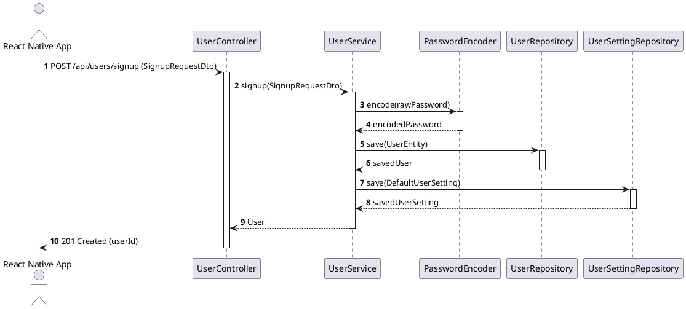

### U.C 2 - Login (로그인)
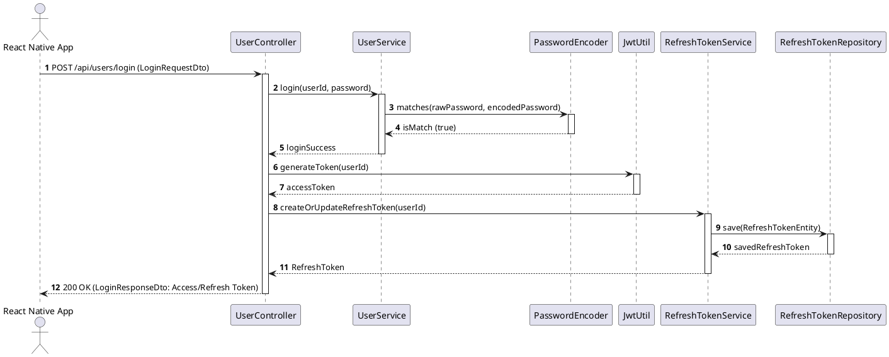

### U.C 3 - Refresh Token (토큰 갱신)
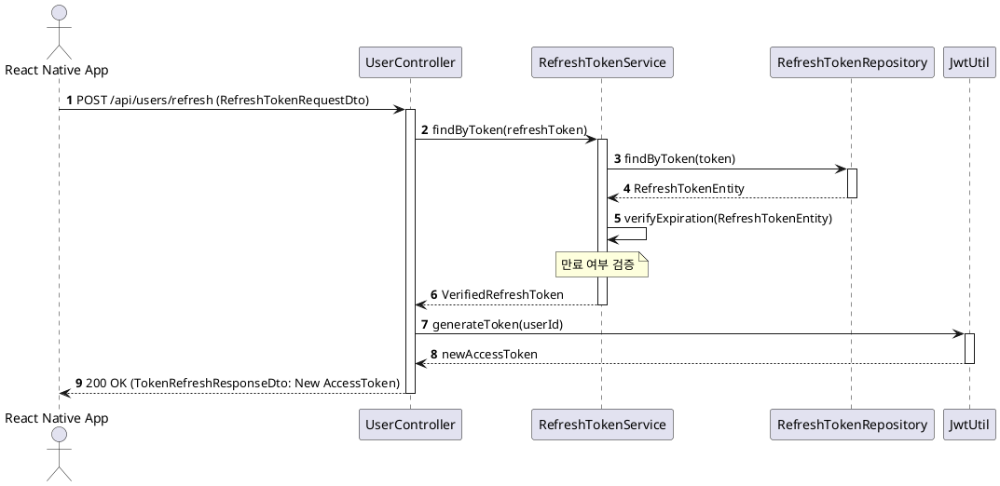

### U.C 4 - Logout (로그아웃)
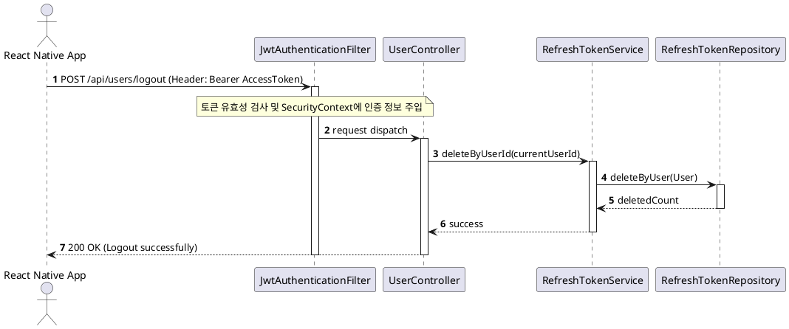

### U.C 5 - Find Login ID (아이디 찾기)
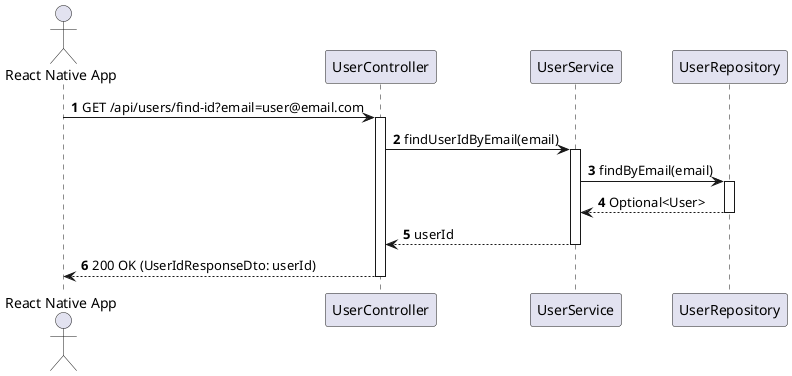

---

## Module 2. 프로필 및 환경 설정 (U.C 6 ~ 9)

### U.C 6 - View Profile (프로필 조회)
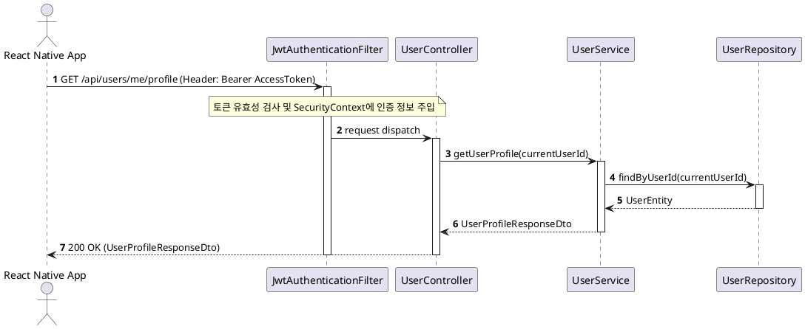

### U.C 7 - Update Profile (프로필 수정)
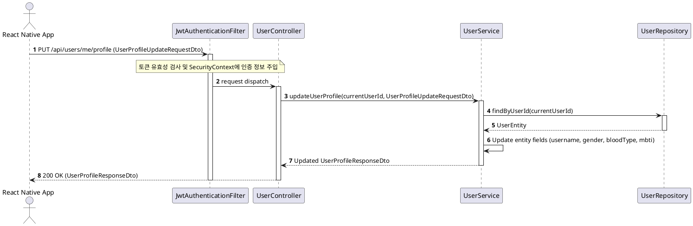

### U.C 8 - Update Security (보안 정보 수정 - 비밀번호 변경)
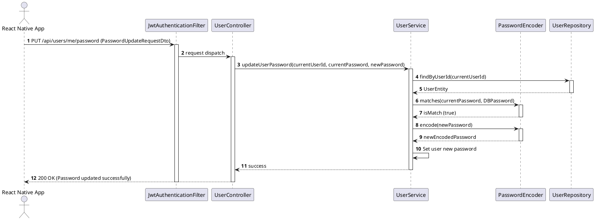

### U.C 9 - Manage Settings (환경설정 변경)
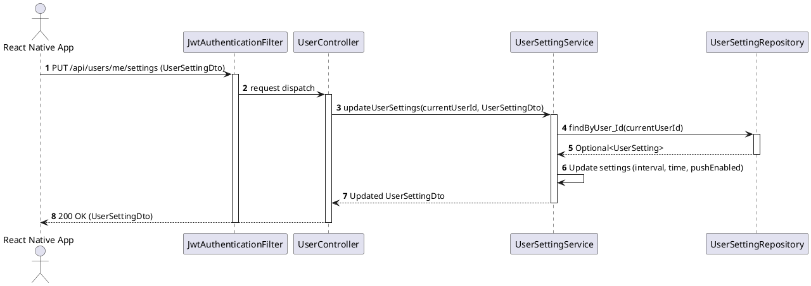

---

## Module 3. 질문 발급 및 답변 기록 (U.C 10 ~ 13)

### U.C 10 - Scheduled Question (정기 질문 발송 및 조회)
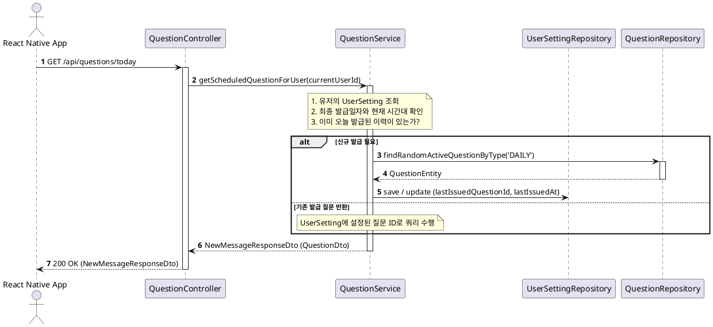

### U.C 11 - On-Demand Question (온디맨드 추가 질문 발급)
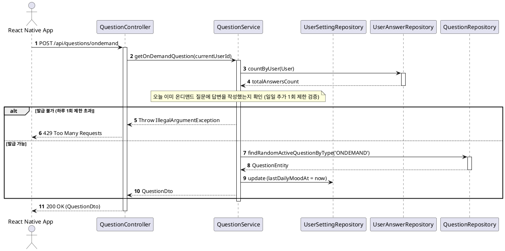

### U.C 12 - Submit Answer (답변 등록 및 게이머 보상 처리)
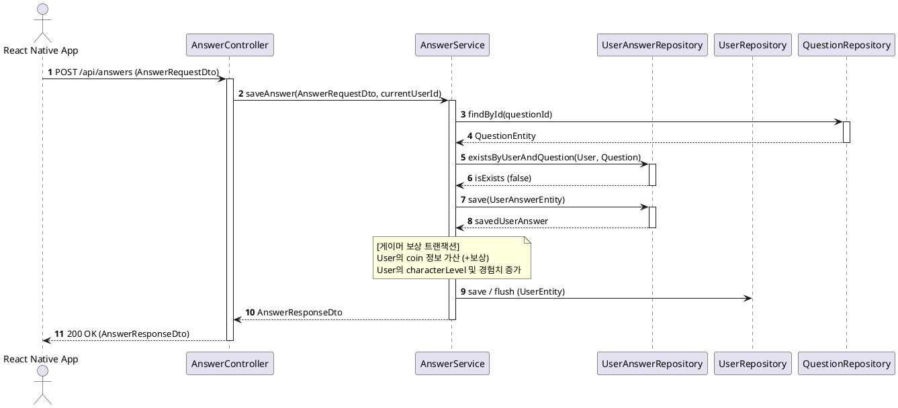

### U.C 13 - View Answer History (답변 이력 조회)
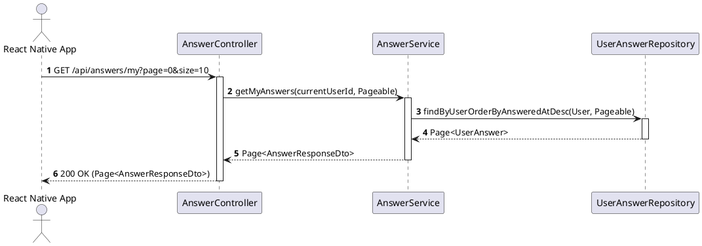

---

## Module 4. 상점 및 아바타 장착 (U.C 14 ~ 15)

### U.C 14 - Purchase Item (아이템 구매)
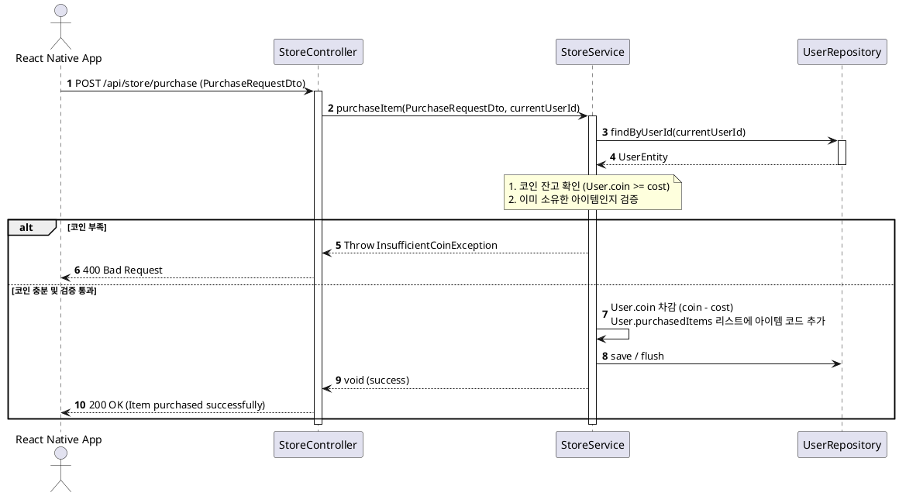

### U.C 15 - Equip Items (아이템 장착)
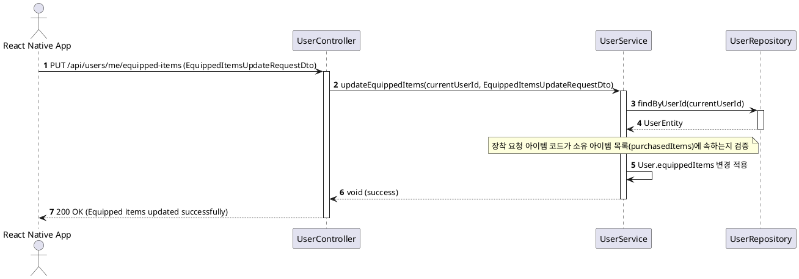

---

## Module 5. 익명 커뮤니티 및 댓글 (U.C 16 ~ 20)

### U.C 16 - View Posts (게시글 목록 및 상세 조회)
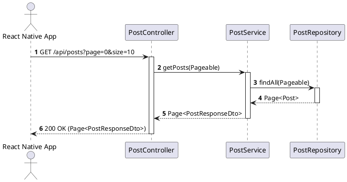

### U.C 17 - Create Post (게시글 작성 - FastAPI 검증 연동 포함)
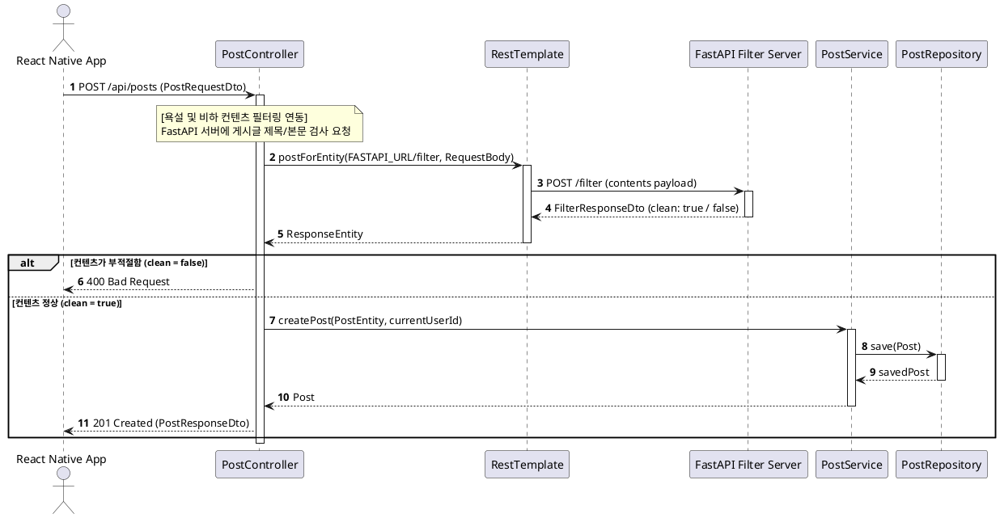

### U.C 18 - Edit/Delete Post (게시글 수정/삭제)
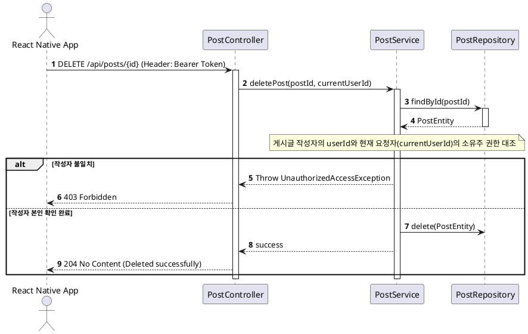

### U.C 19 - View Comments (댓글 조회)
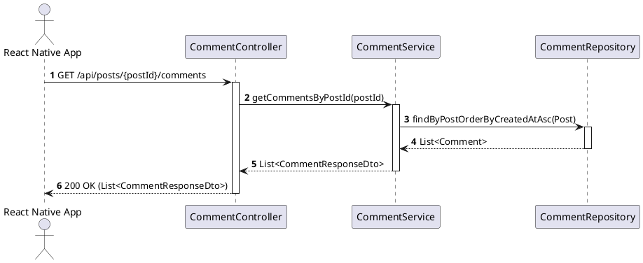

### U.C 20 - Manage Comment (댓글 작성/수정/삭제 - FastAPI 검증 연동 포함)
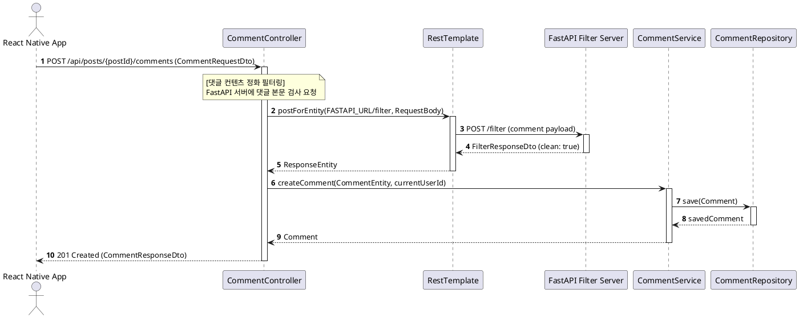

---

## Module 6. AI 공감 대화 (U.C 21)

### U.C 21 - AI Empathy Chat (AI 공감 대화)
```plantuml
@startuml
autonumber
actor "React Native App" as Client
participant CC as "ChatController"
participant CS as "ChatService"
participant RT as "RestTemplate"
participant OpenAI as "OpenAI Chat API"

Client -> CC : POST /api/chat/completions (ChatCompletionRequestDto)
activate CC
CC -> CS : createCompletion(ChatCompletionRequestDto, currentUserId)
activate CS

note over CS : 1. 시스템 프롬프트(비판단적 위로, 힐링 페르소나) 주입\n2. 요청 메시지 구조화\n3. OpenAiProperties에서 API Key 로드

CS -> RT : postForEntity(OPENAI_RESPONSES_URL, HttpEntity, String.class)
activate RT

alt OpenAI API 정상 응답
    RT -> OpenAI : POST /v1/chat/completions (Header: Bearer API_KEY)
    activate OpenAI
    OpenAI --> RT : OpenAI Response Payload (JSON)
    deactivate OpenAI
    RT --> CS : ResponseEntity
    note over CS : OpenAI JSON 응답 파싱 및 답변 텍스트 추출
    CS --> CC : ChatCompletionResponseDto (reply)
    CC --> Client : 200 OK (ChatCompletionResponseDto)
else OpenAI API 타임아웃 / 장애 발생
    note over CS : timeout 또는 에러 감지
    CS --> CC : Throw ChatCompletionException(status, errorMsg)
    deactivate RT
    CC --> Client : 504 Gateway Timeout / 502 Bad Gateway
end
deactivate CS
deactivate CC
@endum
```
