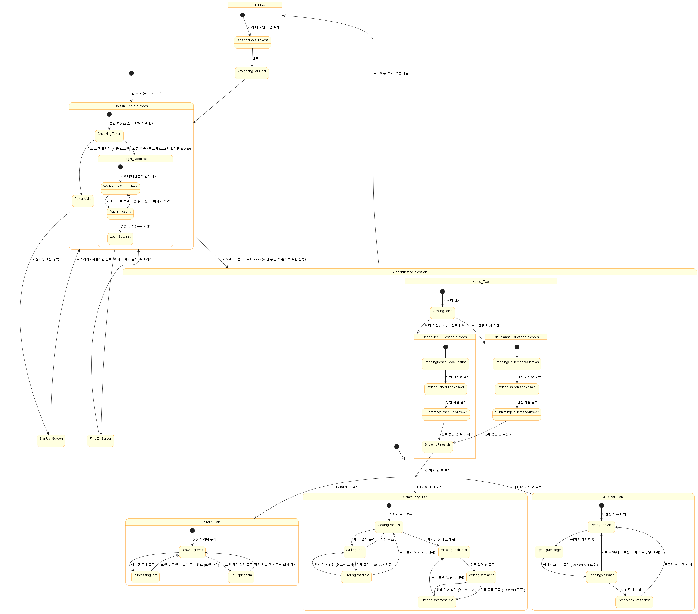
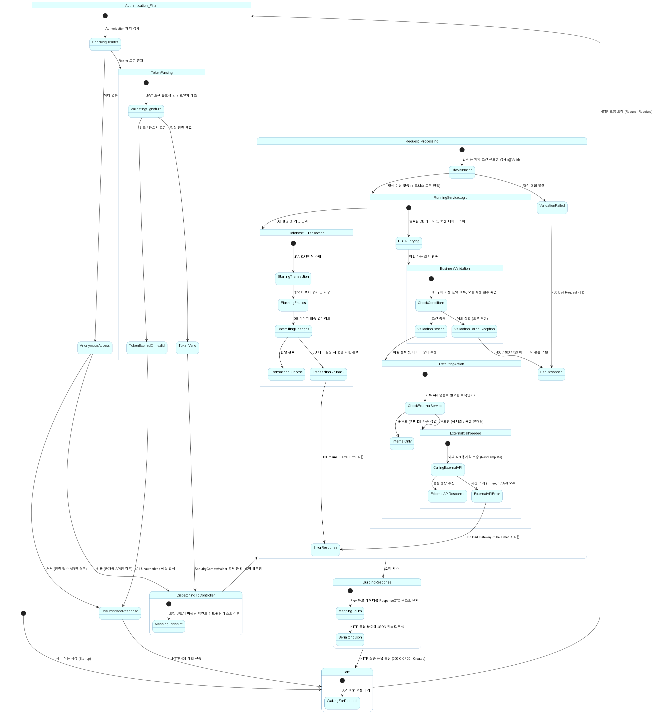

# 4. State Machine Diagram

[Back to Contents](./Design.md)

---

이 문서는 Lumia 시스템의 클라이언트(React Native 모바일 애플리케이션)와 서버(Spring Boot 백엔드 애플리케이션)에서 발생하는 핵심 상태 변화와 흐름을 기술한 상태 다이어그램(State Machine Diagram) 문서입니다.

각 다이어그램은 시스템이 동작할 때 생기는 생명주기 및 요청 처리 프로세스를 시각화하며, 하단에 각 상태와 전이 과정을 알기 쉽게 서술하였습니다.

---

## 목차
1. [클라이언트 시스템 상태 다이어그램 (Client State Machine)](#1-클라이언트-시스템-상태-다이어그램-client-state-machine)
2. [서버 시스템 상태 다이어그램 (Server State Machine)](#2-서버-시스템-상태-다이어그램-server-state-machine)

---

## 1. 클라이언트 시스템 상태 다이어그램 (Client State Machine)

사용자가 모바일 앱(React Native)을 기동한 순간부터 로그인 전후의 화면 흐름, 주요 탭 내 활동, 그리고 로그아웃에 이르기까지 클라이언트 앱이 가질 수 있는 화면 및 내비게이션 상태를 설계한 다이어그램입니다.

### 1-1. 주요 상태 설명
* **Splash_Login_Screen (스플래시 및 로그인 화면)**: 앱 구동 시 가장 먼저 마주하는 화면이자, 기본적인 로그인 입력 화면 상태입니다.
  * 내부적으로 기기 로컬 보안 저장소에 기존에 사용하던 세션 인증 토큰이 존재하는지 검증합니다.
  * 유효한 기존 세션 토큰이 감출되어 있을 시, 별도의 과정 없이 **자동 로그인** 처리가 완료되어 바로 **인증 세션(Authenticated_Session)** 상태로 통과 진입합니다.
  * 토큰이 존재하지 않거나 만료된 상태라면, 해당 스플래시 화면 위에서 유저가 로그인 정보를 입력할 수 있는 입력폼 대기 상태(`Login_Required`)로 변형됩니다.
  * 사용자가 정보를 올바르게 기입해 로그인을 최종 완료하면 세션 토큰을 로컬에 저장하고 **홈 화면(Authenticated_Session)**으로 다이렉트 전이됩니다.
  * 이 화면 진입단에서 회원가입(`SignUp_Screen`) 및 아이디 찾기(`FindID_Screen`) 화면으로 넘어갈 수 있습니다.
* **Authenticated_Session (인증 세션 상태)**: 로그인 세션을 안전하게 잡은 회원이 앱 홈 화면을 활발하게 제어하는 주 상태입니다. 네비게이션 동작을 통해 아래 세부 탭들을 교차 이동합니다.
  * **Home_Tab (홈 탭)**: 오늘의 질문 카드를 조회하는 대기 상태입니다. 알림이나 질문 클릭 시 정기 질문 작성(`Scheduled_Question_Screen`) 또는 온디맨드 질문 작성(`OnDemand_Question_Screen`) 상태로 진입합니다.
    * 질문 작성 과정은 `질문 읽기 ➔ 답변 작성 중 ➔ 답변 전송 중 ➔ 보상 애니메이션 노출 ➔ 홈 복귀` 순서로 상태가 순차 전이됩니다.
  * **Store_Tab (상점 탭)**: 아바타 스킨을 구경하고 구매(`PurchasingItem`)하거나, 보유 중인 장식품을 적용(`EquippingItem`)하여 외형을 실시간 갱신하는 상태입니다.
  * **Community_Tab (커뮤니티 탭)**: 익명 글 목록 조회, 게시글 작성(`WritingPost`), 상세 보기, 댓글 작성(`WritingComment`) 등의 행동을 수행하는 상태입니다. 게시글이나 댓글을 등록할 때 부적절한 단어 유무를 필터링하는 검증 상태를 거칩니다.
  * **AI_Chat_Tab (AI 채팅 탭)**: AI 동반자 캐릭터와 실시간 대화를 나누는 대기 및 전송 상태입니다.
* **Logout_Flow (로그아웃 처리)**: 설정 메뉴에서 로그아웃을 실행하여 기기 내 인증 토큰을 안전하게 파기하고 다시 최초 스플래시 겸 로그인 화면(`Splash_Login_Screen`)으로 되돌아가는 전환 상태입니다.

---

## 2. 서버 시스템 상태 다이어그램 (Server State Machine)

사용자의 HTTP 요청이 백엔드 서버(Spring Boot)에 접수된 순간부터 인증 검증, 비즈니스 로직 처리, 외부 시스템(FastAPI, OpenAI) 연동, 데이터베이스 트랜잭션 처리 및 최종 JSON 응답 송신에 이르기까지 서버 내부의 요청 처리 수명주기(Request Lifecycle)를 설계한 다이어그램입니다.

### 2-1. 주요 상태 설명
* **Idle (대기 상태)**: 서버가 기동되어 외부 클라이언트로부터 API 요청이 들어오기를 대기하는 상태입니다.
* **Authentication_Filter (인증 필터 상태)**: 요청이 접수되면 가장 먼저 WAS 진입단의 JWT 보안 필터가 가동되는 상태입니다.
  * HTTP Authorization 헤더를 해부하여 Bearer 토큰의 서명 무결성 및 만료 시간 초과 여부를 대조 검증합니다.
  * 비정상적이거나 만료된 토큰인 경우 즉시 **401 Unauthorized 에러 응답** 상태로 전이되어 요청 처리를 중단하고 대기 상태로 복귀합니다.
  * 정상 인증이 완료되면 다음 라우팅 단계로 전이됩니다.
* **DispatchingToController (컨트롤러 매핑)**: 인증 필터를 성공적으로 통과한 안전한 요청에 대해 Spring의 DispatcherServlet이 목적지 컨트롤러 메소드를 찾아 경로를 배정하는 상태입니다.
* **Request_Processing (요청 처리 상태)**: 배정된 컨트롤러가 구동되어 비즈니스 로직을 본격적으로 수행하는 상태입니다.
  * **DtoValidation**: 입력 폼에 약속된 데이터 형식(제약 조건)에 위반 사항이 없는지 검사합니다. 형식 위반 시 즉시 400 Bad Request 에러 응답을 구성합니다.
  * **RunningServiceLogic**: 서비스 계층에서 DB 쿼리를 수행하고 비즈니스 조건 규칙(예: 잔액 체크, 일일 작성 횟수 한도 등)을 체크합니다.
    * 외부 API 연동이 필요할 경우 `RestTemplate`을 통해 외부 AI API(OpenAI) 또는 텍스트 필터 서버(FastAPI)와 통신하는 동기 대기 상태를 거칩니다.
  * **Database_Transaction (DB 트랜잭션)**: 로직 수행 결과를 영속화하는 데이터베이스 반영 단계입니다. 답변 저장과 리워드 지급 등이 완전히 일치하여 원자적으로 반영되도록 보장합니다. 오류 발생 시 모든 수정을 즉각 취소(Rollback)하는 복구 상태를 가집니다.
* **BuildingResponse (응답 구축)**: 모든 처리가 완료된 도메인 엔티티를 클라이언트가 요구하는 ResponseDTO 구조로 변환하고, JSON 형태로 HTTP 응답 바디에 시리얼라이즈하여 응답을 송신하는 최종 마무리 상태입니다. 응답을 보낸 후 서버는 다시 **Idle** 상태로 돌아가 새로운 요청을 대기합니다.
