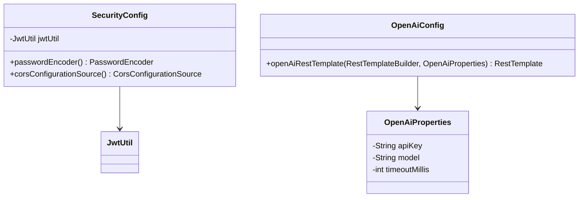

# Config Package Class Diagram Description

이 문서는 `com.ch4.lumia_backend.config` 패키지의 설정 클래스들을 정리한 문서입니다.

## 1. Config Package Class Diagram

---

## 2. Class Descriptions

### 2.1 SecurityConfig
애플리케이션의 인증 및 인가(Spring Security) 제어 설정을 구성하고 비밀번호 암호화 인코더 및 CORS 정책을 구성합니다.

* **패키지:** `com.ch4.lumia_backend.config`
* **주요 어노테이션:** `@Configuration`, `@EnableWebSecurity`

#### [주요 메서드 및 기능]
| 메서드 명 | 설명 및 기능 | 반환 타입 |
| :--- | :--- | :--- |
| `passwordEncoder()` | 비밀번호를 단방향 암호화하기 위한 BCryptPasswordEncoder 빈(Bean) 등록 | `PasswordEncoder` |
| `corsConfigurationSource()` | 외부 프론트엔드 호스트(React Native 앱 등)와의 통신 허용을 위한 CORS 화이트리스트 구성 | `CorsConfigurationSource` |
| `securityFilterChain(HttpSecurity)` | 특정 엔드포인트에 대한 인증 통과 허용(로그인, 회원가입 등) 및 그 외 자원의 JWT 검증 통과 요구 설정 | `SecurityFilterChain` |

#### [연결 관계 및 의존성]
| 연결 대상 클래스 | 관계 유형 | 연결 목적 및 수행 기능 |
| :--- | :--- | :--- |
| `JwtUtil` | 의존 (uses) | API 필터 체인 통과 시 JWT 토큰 분석을 위한 유틸리티 주입 |
| `JwtAuthenticationFilter` | 의존 (uses) | 시큐리티 필터 체인 흐름에 JWT 인증 필터를 추가하여 선처리하도록 설계 |

### 2.2 OpenAiConfig
외부 OpenAI API 서버와의 통신을 관리하기 위한 Spring RestTemplate 객체를 설정합니다.

* **패키지:** `com.ch4.lumia_backend.config`
* **주요 어노테이션:** `@Configuration`

#### [주요 메서드 및 기능]
| 메서드 명 | 설명 및 기능 | 반환 타입 |
| :--- | :--- | :--- |
| `openAiRestTemplate(...)` | OpenAI API 규격(Bearer Token 헤더 주입 등) 및 지정된 타임아웃에 부합하는 HTTP 요청 객체를 생성 및 빈 등록 | `RestTemplate` |

#### [연결 관계 및 의존성]
| 연결 대상 클래스 | 관계 유형 | 연결 목적 및 수행 기능 |
| :--- | :--- | :--- |
| `OpenAiProperties` | 의존 (uses) | 설정된 API Key 및 타임아웃 설정을 획득해 통신 템플릿에 탑재 |

### 2.3 OpenAiProperties
`application.yml`의 `openai` 설정 그룹 정보들(apiKey, model명, timeout)을 Java의 프로퍼티 클래스에 바인딩합니다.

* **패키지:** `com.ch4.lumia_backend.config`
* **주요 어노테이션:** `@Component`, `@ConfigurationProperties(prefix = "openai")`, `@Getter`, `@Setter`

#### [속성 및 필드 설명]
| 필드 명 | 타입 | 설명 |
| :--- | :--- | :--- |
| `apiKey` | `String` | OpenAI API 인증용 비공개 키 토큰 문자열 |
| `model` | `String` | 챗봇 연결 대상 GPT 모델 명 (예: "gpt-4o-mini" 등) |
| `timeoutMillis` | `int` | 네트워크 지연 대기 최대 제한 시간 (밀리초 단위) |
