# Controller Class Diagram Description

이 문서는 `com.ch4.lumia_backend.controller` 패키지의 컨트롤러 계층을 기준으로 작성한 클래스 다이어그램 및 클래스별 설명이다.

## 1. Controller Class Diagram

```mermaid
classDiagram
    class UserController {
        -Logger logger
        -UserService userService
        -JwtUtil jwtUtil
        -UserSettingService userSettingService
        -RefreshTokenService refreshTokenService
        +login(LoginRequestDto) ResponseEntity
        +signup(SignupRequestDto) ResponseEntity
        +refreshToken(RefreshTokenRequestDto) ResponseEntity
        +logoutUser() ResponseEntity
        +getUserSettings() ResponseEntity
        +updateUserSettings(UserSettingDto) ResponseEntity
        +getUserProfile() ResponseEntity
        +updateUserProfile(UserProfileUpdateRequestDto) ResponseEntity
        +updateUserEmail(EmailUpdateRequestDto) ResponseEntity
        +updateUserPassword(PasswordUpdateRequestDto) ResponseEntity
        +findIdByEmail(String) ResponseEntity
        +updateUserEquippedItems(EquippedItemsUpdateRequestDto) ResponseEntity
        +updateUserCoins(CoinUpdateRequestDto) ResponseEntity
    }

    class PostController {
        -Logger logger
        -PostService postService
        -UserService userService
        -RestTemplate restTemplate
        -String FASTAPI_URL
        +getPosts(int, int) ResponseEntity
        +createPost(PostRequestDto) ResponseEntity
        +getPostDetail(Long) ResponseEntity
        +updatePost(Long, PostRequestDto) ResponseEntity
        +deletePost(Long) ResponseEntity
    }

    class CommentController {
        -Logger logger
        -RestTemplate restTemplate
        -String FASTAPI_URL
        -CommentService commentService
        +getComments(Long) ResponseEntity
        +createComment(Long, CommentRequestDto) ResponseEntity
        +updateComment(Long, CommentRequestDto) ResponseEntity
        +deleteComment(Long) ResponseEntity
    }

    class AnswerController {
        -Logger logger
        -AnswerService answerService
        -getCurrentUserId() String
        +saveAnswer(AnswerRequestDto) ResponseEntity
        +getMyRecords(Pageable) ResponseEntity
    }

    class QuestionController {
        -Logger logger
        -QuestionService questionService
        -getCurrentUserId() String
        +getQuestionForCurrentUser() ResponseEntity
        +getOnDemandQuestion() ResponseEntity
    }

    class ChatController {
        -Logger logger
        -ChatService chatService
        +createCompletion(ChatCompletionRequestDto) ResponseEntity
        -getCurrentUserId() String
    }

    class StoreController {
        -StoreService storeService
        +purchaseItem(PurchaseRequestDto) ResponseEntity
    }

    class UserService
    class UserSettingService
    class RefreshTokenService
    class JwtUtil
    class PostService
    class CommentService
    class AnswerService
    class QuestionService
    class ChatService
    class StoreService
    class RestTemplate
    class SecurityContextHolder

    UserController --> UserService : uses
    UserController --> JwtUtil : creates access token
    UserController --> UserSettingService : manages settings
    UserController --> RefreshTokenService : manages refresh token
    UserController ..> SecurityContextHolder : reads authentication

    PostController --> PostService : uses
    PostController --> UserService : finds current user
    PostController --> RestTemplate : calls content filter API
    PostController ..> SecurityContextHolder : reads authentication

    CommentController --> CommentService : uses
    CommentController --> RestTemplate : calls content filter API
    CommentController ..> SecurityContextHolder : reads authentication

    AnswerController --> AnswerService : uses
    AnswerController ..> SecurityContextHolder : reads authentication

    QuestionController --> QuestionService : uses
    QuestionController ..> SecurityContextHolder : reads authentication

    ChatController --> ChatService : uses
    ChatController ..> SecurityContextHolder : reads authentication

    StoreController --> StoreService : uses
    StoreController ..> SecurityContextHolder : reads authentication
```

## 2. Class Descriptions

### 2.1 UserController
사용자 인증(로그인, 회원가입, 로그아웃, 토큰 재발급) 및 사용자 개인 정보(프로필, 비밀번호, 이메일, 환경 설정, 장착 중인 스킨/아이템, 보유 코인)를 처리하는 핵심 컨트롤러입니다.

* **패키지:** `com.ch4.lumia_backend.controller`
* **기본 URL:** `/api/users`
* **주요 어노테이션:** `@RestController`, `@RequestMapping("/api/users")`, `@RequiredArgsConstructor`

#### [주요 메서드 및 기능]
| HTTP 메서드 | URI | 메서드 명 | 기능 및 설명 | 반환 타입 |
| :--- | :--- | :--- | :--- | :--- |
| `POST` | `/login` | `login` | 아이디/비밀번호를 검증하고 Access 및 Refresh Token 발급 | `ResponseEntity` |
| `POST` | `/signup` | `signup` | 회원가입 요청을 처리하고 생성된 사용자 ID 반환 | `ResponseEntity` |
| `POST` | `/refresh` | `refreshToken` | 만료된 Access Token을 갱신하기 위해 Refresh Token을 검증하고 재발급 | `ResponseEntity` |
| `POST` | `/logout` | `logoutUser` | 인증 정보를 제거하고 데이터베이스에 등록된 Refresh Token 삭제 | `ResponseEntity` |
| `GET` | `/me/settings` | `getUserSettings` | 로그인 상태인 현재 사용자의 푸시 알림 등 환경 설정 정보 조회 | `ResponseEntity` |
| `PUT` | `/me/settings` | `updateUserSettings` | 로그인 상태인 현재 사용자의 환경 설정 정보 수정 | `ResponseEntity` |
| `GET` | `/me/profile` | `getUserProfile` | 로그인 상태인 현재 사용자의 프로필(닉네임, 캐릭터 종류 등) 조회 | `ResponseEntity` |
| `PUT` | `/me/profile` | `updateUserProfile` | 로그인 상태인 현재 사용자의 프로필 정보 업데이트 | `ResponseEntity` |
| `PUT` | `/me/email` | `updateUserEmail` | 로그인 상태인 현재 사용자의 이메일 주소 수정 | `ResponseEntity` |
| `PUT` | `/me/password` | `updateUserPassword` | 로그인 상태인 현재 사용자의 비밀번호 변경 | `ResponseEntity` |
| `GET` | `/find-id` | `findIdByEmail` | 이메일 정보를 기반으로 가입된 사용자 아이디 찾기 | `ResponseEntity` |
| `PUT` | `/me/equipped-items` | `updateUserEquippedItems` | 사용자가 현재 장착/적용하고 있는 아이템 스킨 정보 변경 | `ResponseEntity` |
| `PUT` | `/me/coins` | `updateUserCoins` | 감정 회고 및 상점 거래를 통한 사용자 잔여 코인 수량 변경 | `ResponseEntity` |

#### [연결 관계 및 의존성]
| 연결 대상 클래스 | 관계 유형 | 연결 목적 및 수행 기능 |
| :--- | :--- | :--- |
| `UserService` | 의존 (uses) | 로그인/회원가입 비즈니스 로직, 프로필 및 코인 정보 업데이트 처리 |
| `JwtUtil` | 의존 (uses) | 사용자 인증 성공 시 Access Token 토큰 문자열 생성 |
| `UserSettingService` | 의존 (uses) | 사용자 환경설정 엔티티의 조회 및 수정을 처리하는 서비스 |
| `RefreshTokenService` | 의존 (uses) | Refresh Token의 DB 저장, 갱신 유효성 검사 및 로그아웃 시 삭제 처리 |
| `SecurityContextHolder` | 참조 (reads) | `/me` 로 시작하는 엔드포인트에서 호출자의 인증 세션에서 사용자 ID 식별 |

### 2.2 PostController
자유 게시판의 게시글 CRUD(생성, 목록 조회, 상세 조회, 수정, 삭제)를 담당하는 컨트롤러입니다. 안전한 커뮤니티 조성을 위해 게시글 작성 및 수정 시 외부 필터링 API를 호출합니다.

* **패키지:** `com.ch4.lumia_backend.controller`
* **기본 URL:** `/api/posts`
* **주요 어노테이션:** `@RestController`, `@RequestMapping("/api/posts")`, `@RequiredArgsConstructor`

#### [주요 메서드 및 기능]
| HTTP 메서드 | URI | 메서드 명 | 기능 및 설명 | 반환 타입 |
| :--- | :--- | :--- | :--- | :--- |
| `GET` | `/` | `getPosts` | 게시글 목록을 페이지네이션 및 최신순 정렬에 맞춰 조회 | `ResponseEntity` |
| `POST` | `/` | `createPost` | 로그인한 사용자 정보로 게시글을 등록함 (FastAPI API로 욕설/비하 검사 수행) | `ResponseEntity` |
| `GET` | `/{id}` | `getPostDetail` | 특정 게시글 ID를 통해 상세한 본문 및 작성자 정보 조회 | `ResponseEntity` |
| `PUT` | `/{id}` | `updatePost` | 게시글 작성자 권한을 체크한 뒤 본문 내용을 수정 (FastAPI 필터링 수행) | `ResponseEntity` |
| `DELETE` | `/{id}` | `deletePost` | 게시글 작성자 권한 확인 후 해당 게시글 삭제 | `ResponseEntity` |

#### [연결 관계 및 의존성]
| 연결 대상 클래스 | 관계 유형 | 연결 목적 및 수행 기능 |
| :--- | :--- | :--- |
| `PostService` | 의존 (uses) | 게시글 데이터를 DB에 조회, 저장, 수정, 삭제하는 로직 위임 |
| `UserService` | 의존 (uses) | 게시글 작성자가 현재 유효한 회원인지 검증하고 회원 엔티티 조회 |
| `RestTemplate` | 의존 (uses) | 외부 FastAPI 서버의 컨텐츠 검사 경로(`FASTAPI_URL`)로 HTTP 요청 전송 |
| `SecurityContextHolder` | 참조 (reads) | 글 쓰기, 고치기, 지우기 권한을 부여하기 위해 현재 접속자 정보 파악 |

### 2.3 CommentController
게시글 하위에 등록되는 댓글의 CRUD(생성, 목록 조회, 수정, 삭제)를 처리하는 컨트롤러입니다. 게시글과 마찬가지로 등록/수정 시 외부 API 필터링을 통해 비하 발언을 모니터링합니다.

* **패키지:** `com.ch4.lumia_backend.controller`
* **기본 URL:** 없음 (메서드 레벨에 개별 매핑 적용)
* **주요 어노테이션:** `@RestController`, `@RequiredArgsConstructor`

#### [주요 메서드 및 기능]
| HTTP 메서드 | URI | 메서드 명 | 기능 및 설명 | 반환 타입 |
| :--- | :--- | :--- | :--- | :--- |
| `GET` | `/api/posts/{postId}/comments` | `getComments` | 대상 게시글에 달린 모든 댓글 리스트 조회 | `ResponseEntity` |
| `POST` | `/api/posts/{postId}/comments` | `createComment` | 해당 게시글에 새로운 댓글 작성 (FastAPI 컨텐츠 필터링 검증 후 저장) | `ResponseEntity` |
| `PUT` | `/api/comments/{commentId}` | `updateComment` | 본인이 작성한 댓글에 한하여 내용을 수정 (FastAPI 컨텐츠 필터링 검증 수행) | `ResponseEntity` |
| `DELETE` | `/api/comments/{commentId}` | `deleteComment` | 본인이 작성한 댓글을 삭제 처리 | `ResponseEntity` |

#### [연결 관계 및 의존성]
| 연결 대상 클래스 | 관계 유형 | 연결 목적 및 수행 기능 |
| :--- | :--- | :--- |
| `CommentService` | 의존 (uses) | 댓글 엔티티의 CRUD 저장과 권한 검증에 대한 핵심 로직 호출 |
| `RestTemplate` | 의존 (uses) | 외부 FastAPI 컨텐츠 필터링 API 서버 호출 |
| `SecurityContextHolder` | 참조 (reads) | 댓글 생성, 변경, 삭제 요청 시 호출자 본인 확인을 위해 세션 ID 리드 |

### 2.4 AnswerController
사용자가 매일 주어지는 감정 성찰 질문에 대해 입력한 답변을 저장하고, 자신이 작성했던 답변 내역들을 확인하는 컨트롤러입니다.

* **패키지:** `com.ch4.lumia_backend.controller`
* **기본 URL:** `/api/answers`
* **주요 어노테이션:** `@RestController`, `@RequestMapping("/api/answers")`, `@RequiredArgsConstructor`

#### [주요 메서드 및 기능]
| HTTP 메서드 | URI | 메서드 명 | 기능 및 설명 | 반환 타입 |
| :--- | :--- | :--- | :--- | :--- |
| `POST` | `/` | `saveAnswer` | 사용자가 작성한 감정 회고 답변을 유효성 검사 후 저장 및 보상 지급 | `ResponseEntity` |
| `GET` | `/my` | `getMyRecords` | 현재 로그인된 사용자의 누적된 답변 히스토리를 페이지 단위로 역순 조회 | `ResponseEntity` |
| `private` | `-` | `getCurrentUserId` | 현재 요청 세션에서 고유 유저 ID를 안전하게 파악하기 위한 헬퍼 메서드 | `String` |

#### [연결 관계 및 의존성]
| 연결 대상 클래스 | 관계 유형 | 연결 목적 및 수행 기능 |
| :--- | :--- | :--- |
| `AnswerService` | 의존 (uses) | 감정 일기 데이터 유효성 검사, 답변 이력 영속화 및 보상 로직 호출 |
| `SecurityContextHolder` | 참조 (reads) | 답변 저장 및 목록 조회 시 타인의 데이터에 접근하지 못하도록 본인 검증 |

### 2.5 QuestionController
사용자의 자아 성찰을 유도하기 위해 일 단위 예약 질문을 제공하거나 사용자의 필요에 따라 실시간 온디맨드 질문을 조회하는 컨트롤러입니다.

* **패키지:** `com.ch4.lumia_backend.controller`
* **기본 URL:** `/api/questions`
* **주요 어노테이션:** `@RestController`, `@RequestMapping("/api/questions")`, `@RequiredArgsConstructor`

#### [주요 메서드 및 기능]
| HTTP 메서드 | URI | 메서드 명 | 기능 및 설명 | 반환 타입 |
| :--- | :--- | :--- | :--- | :--- |
| `GET` | `/today` | `getQuestionForCurrentUser` | 오늘 날짜 기준으로 해당 사용자에게 스케줄링되어 노출될 질문 내용 반환 | `ResponseEntity` |
| `POST` | `/ondemand` | `getOnDemandQuestion` | 정해진 일일 한도 내에서 사용자가 추가 질문을 원할 때 임의의 성찰 질문 생성 및 반환 | `ResponseEntity` |
| `private` | `-` | `getCurrentUserId` | 세션에서 호출자의 사용자 고유 아이디를 확인하는 헬퍼 메서드 | `String` |

#### [연결 관계 및 의존성]
| 연결 대상 클래스 | 관계 유형 | 연결 목적 및 수행 기능 |
| :--- | :--- | :--- |
| `QuestionService` | 의존 (uses) | 스케줄 질문 조회 및 온디맨드 질문 추출 로직 위임 |
| `SecurityContextHolder` | 참조 (reads) | 사용자별 오늘의 질문 매핑 및 온디맨드 한도 검사를 위해 현재 ID 확인 |

### 2.6 ChatController
비판단적인 AI 상담 챗봇과의 소통을 지원하는 컨트롤러입니다. 사용자의 채팅 입력을 받아 OpenAI GPT 등 외부 인공지능 완성(Completion) 처리를 거친 공감 답변을 전송합니다.

* **패키지:** `com.ch4.lumia_backend.controller`
* **기본 URL:** `/api/chat`
* **주요 어노테이션:** `@RestController`, `@RequestMapping("/api/chat")`, `@RequiredArgsConstructor`

#### [주요 메서드 및 기능]
| HTTP 메서드 | URI | 메서드 명 | 기능 및 설명 | 반환 타입 |
| :--- | :--- | :--- | :--- | :--- |
| `POST` | `/completions` | `createCompletion` | 사용자의 메시지 DTO를 전달받아 생성형 AI의 가이드라인에 따른 답변을 반환 | `ResponseEntity` |
| `private` | `-` | `getCurrentUserId` | 인증 사용자 정보를 획득하는 헬퍼 (로그인 상태가 아닐 경우 null 반환하여 익명 지원) | `String` |

#### [연결 관계 및 의존성]
| 연결 대상 클래스 | 관계 유형 | 연결 목적 및 수행 기능 |
| :--- | :--- | :--- |
| `ChatService` | 의존 (uses) | OpenAI API와 연동하여 시스템 프롬프트 주입 및 비동기/동기 AI 답변 생성 |
| `SecurityContextHolder` | 참조 (reads) | 사용자가 로그인된 상태인지 단순 게스트 상태인지 구분하기 위해 세션 조회 |

### 2.7 StoreController
사용자가 감정 성찰 리워드로 획득한 코인을 사용해 아이템 상점에서 스킨 및 아바타 커스텀 꾸미기 아이템을 구매할 수 있게 돕는 컨트롤러입니다.

* **패키지:** `com.ch4.lumia_backend.controller`
* **기본 URL:** `/api/store`
* **주요 어노테이션:** `@RestController`, `@RequestMapping("/api/store")`, `@RequiredArgsConstructor`

#### [주요 메서드 및 기능]
| HTTP 메서드 | URI | 메서드 명 | 기능 및 설명 | 반환 타입 |
| :--- | :--- | :--- | :--- | :--- |
| `POST` | `/purchase` | `purchaseItem` | 상점 아이템 구매 로직 실행 (사용자 재화 보유 상황 검증 및 아이템 획득 영속화) | `ResponseEntity` |

#### [연결 관계 및 의존성]
| 연결 대상 클래스 | 관계 유형 | 연결 목적 및 수행 기능 |
| :--- | :--- | :--- |
| `StoreService` | 의존 (uses) | 아이템 가격과 소유 여부 검증, 코인 보유고 차감 및 유저 인벤토리 갱신 로직 위임 |
| `SecurityContextHolder` | 참조 (reads) | 상점을 이용하여 재화를 차감하고 인벤토리를 변경할 호출자 ID 식별 |

---

## 3. Controller Relationship Summary

| Controller | 연결 대상 | 관계 내용 |
| :--- | :--- | :--- |
| `UserController` | `UserService` | 로그인, 회원가입, 프로필, 이메일, 비밀번호, 코인, 장착 아이템 처리 위임 |
| `UserController` | `JwtUtil` | access token 생성 |
| `UserController` | `RefreshTokenService` | refresh token 생성, 검증, 삭제 |
| `UserController` | `UserSettingService` | 사용자 설정 조회 및 수정 |
| `PostController` | `PostService` | 게시글 CRUD 처리 위임 |
| `PostController` | `UserService` | 게시글 작성/수정/삭제 시 현재 사용자 엔티티 조회 |
| `PostController` | `RestTemplate` | 외부 FastAPI 컨텐츠 필터링 API 호출 |
| `CommentController` | `CommentService` | 댓글 CRUD 처리 위임 |
| `CommentController` | `RestTemplate` | 외부 FastAPI 컨텐츠 필터링 API 호출 |
| `AnswerController` | `AnswerService` | 답변 저장 및 내 답변 기록 조회 |
| `QuestionController` | `QuestionService` | 예약 질문 및 즉시 질문 조회 |
| `ChatController` | `ChatService` | 채팅 completion 응답 생성 |
| `StoreController` | `StoreService` | 아이템 구매 처리 |
| 모든 인증 필요 Controller | `SecurityContextHolder` | 현재 로그인 사용자 ID 조회 |
