# DTO Package Class Diagram Description

이 문서는 `com.ch4.lumia_backend.dto` 패키지의 데이터 전송 객체(DTO)를 정리한 문서입니다. API 입출력 스펙을 명확하게 파악할 수 있도록 표 형태로 제공합니다.

## 1. DTO Package Diagram

```mermaid
classDiagram
    class AnswerRequestDto
    class AnswerResponseDto
    class ChatCompletionRequestDto
    class ChatCompletionResponseDto
    class CoinUpdateRequestDto
    class CommentRequestDto
    class CommentResponseDto
    class EmailUpdateRequestDto
    class EquippedItemsUpdateRequestDto
    class LoginRequestDto
    class LoginResponseDto
    class NewMessageResponseDto
    class PasswordUpdateRequestDto
    class PostRequestDto
    class PostResponseDto
    class PurchaseRequestDto
    class QuestionDto
    class RefreshTokenRequestDto
    class SignupRequestDto
    class TokenRefreshResponseDto
    class UserIdResponseDto
    class UserProfileResponseDto
    class UserProfileUpdateRequestDto
    class UserSettingDto

    AnswerResponseDto ..> UserAnswer : fromEntity
    CommentResponseDto ..> Comment : constructor
    PostResponseDto ..> Post : constructor
    QuestionDto ..> Question : fromEntity
    UserProfileResponseDto ..> User : fromEntity
    UserSettingDto ..> UserSetting : fromEntity
    NewMessageResponseDto --> QuestionDto
```

---

## 2. DTO Specifications

Lumia Backend의 모든 DTO는 직렬화 및 역직렬화를 지원하며, 주로 Controller와 Service 계층 간의 데이터 전달용으로 사용됩니다.

| DTO 명 | 주요 필드 (속성) | 목적 및 상세 기능 | 관련 엔드포인트 / 서비스 |
| :--- | :--- | :--- | :--- |
| `AnswerRequestDto` | `Long questionId` `String content` `String emotionTag` | 사용자가 성찰 질문에 대해 답한 내용을 서버로 전달하는 요청 DTO | `POST /api/answers` (답변 등록 요청) |
| `AnswerResponseDto` | `Long answerId` `Long questionId` `String questionText` `String answerText` `String emotionTag` `LocalDateTime answeredAt` | 사용자의 질문 답변 상세 내역을 조회할 때 반환되는 응답 DTO | `GET /api/answers/my` (내 답변 조회 목록) |
| `ChatCompletionRequestDto` | `String message` | 인공지능 공감 챗봇과 대화 시 사용자가 작성한 대화 텍스트 전달 | `POST /api/chat/completions` (챗봇 입력 요청) |
| `ChatCompletionResponseDto` | `String reply` | OpenAI API 연동을 통해 얻어낸 챗봇의 공감 답변 문자열 전달 | `POST /api/chat/completions` (AI 응답 반환) |
| `CoinUpdateRequestDto` | `int amount` | 사용자의 코인 잔여 수량을 증감할 금액 정보를 전달 | `PUT /api/users/me/coins` (코인 변경 요청) |
| `CommentRequestDto` | `String content` | 게시글 댓글을 생성하거나 기존 댓글을 수정할 때 내용 전달 | `POST /api/posts/{postId}/comments` `PUT /api/comments/{commentId}` |
| `CommentResponseDto` | `Long id` `String content` `LocalDateTime createdAt` `String userId` | 특정 게시글에 달린 댓글 상세 정보를 반환할 때 사용하는 응답 DTO | `GET /api/posts/{postId}/comments` |
| `EmailUpdateRequestDto` | `String newEmail` | 사용자가 마이페이지에서 이메일 주소를 변경하기 위한 요청 DTO | `PUT /api/users/me/email` (이메일 변경 요청) |
| `EquippedItemsUpdateRequestDto` | `List<String> equippedItems` | 사용자가 아바타에 새로 장착 설정한 스킨 아이템 코드 리스트 전달 | `PUT /api/users/me/equipped-items` |
| `LoginRequestDto` | `String userId` `String password` | 로그인 요청 시 사용자가 입력한 아이디와 비밀번호 정보 전달 | `POST /api/users/login` (로그인 검증 요청) |
| `LoginResponseDto` | `String token` `String refreshToken` `String userId` `String message` | 로그인 성공 시 발급되는 JWT Access/Refresh Token 및 환영 메시지 반환 | `POST /api/users/login` (인증 토큰 응답) |
| `NewMessageResponseDto` | `boolean hasNewMessage` `QuestionDto newMessage` | 금일 유저에게 새로 할당된 예약 성찰 질문이 존재하는지 여부 및 질문 정보 반환 | `GET /api/questions/today` (오늘의 질문 조회) |
| `PasswordUpdateRequestDto` | `String currentPassword` `String newPassword` | 마이페이지 비밀번호 변경 시 기존 비밀번호 검증 및 새 비밀번호 전달 | `PUT /api/users/me/password` |
| `PostRequestDto` | `String category` `String title` `String content` | 자유 게시판에 게시글을 새로 등록하거나 내용을 수정하기 위한 DTO | `POST /api/posts` `PUT /api/posts/{id}` |
| `PostResponseDto` | `Long id` `String category` `String title` `String content` `LocalDateTime createdAt` `String userId` | 자유 게시판 글 목록 및 상세 본문을 반환하는 응답 DTO | `GET /api/posts` `GET /api/posts/{id}` |
| `PurchaseRequestDto` | `String itemId` `String itemName` `int cost` | 상점에서 아이템을 구매할 때 대상 정보 및 결제 코인 수량 전달 | `POST /api/store/purchase` (아이템 구매 요청) |
| `QuestionDto` | `Long questionId` `String questionText` `String questionType` | 성찰 질문(Question) 엔티티 정보를 클라이언트에 알리는 DTO | `QuestionService` 내부 로직 전반 |
| `RefreshTokenRequestDto` | `String refreshToken` | Access Token 만료 시 Refresh Token을 사용해 갱신을 시도하는 DTO | `POST /api/users/refresh` (토큰 갱신 요청) |
| `SignupRequestDto` | `String userId` `String password` `String username` `String email` | 신규 회원가입을 신청할 때 필수적인 유저 정보 데이터를 전달 | `POST /api/users/signup` (회원가입 요청) |
| `TokenRefreshResponseDto` | `String accessToken` `String refreshToken` | 토큰 갱신 처리가 성공적으로 이루어졌을 때 반환되는 신규 토큰 DTO | `POST /api/users/refresh` (재발급 토큰 응답) |
| `UserIdResponseDto` | `String userId` | 이메일로 가입된 아이디 조회를 완료했을 때 사용자 아이디를 반환 | `GET /api/users/find-id` (아이디 찾기 응답) |
| `UserProfileResponseDto` | `String loginId` `String email` `String username` `String gender` `String bloodType` `String mbti` `int coin` `List<String> equippedItems` `List<String> purchasedItems` `int characterLevel` | 사용자의 개인 정보, 보유 재화, 인벤토리 목록, 캐릭터 레벨 등을 반환 | `GET /api/users/me/profile` (내 프로필 조회 응답) |
| `UserProfileUpdateRequestDto` | `String username` `String gender` `String bloodType` `String mbti` | 사용자의 프로필 중 닉네임, 성별, 혈액형, MBTI를 변경 요청할 때 전달 | `PUT /api/users/me/profile` (프로필 수정 요청) |
| `UserSettingDto` | `int notificationInterval` `String notificationTime` `boolean pushNotificationEnabled` `LocalDateTime lastIssuedAt` | 사용자의 개별 푸시 알림 및 감정 체크 스케줄 설정을 주고받기 위한 DTO | `GET /api/users/me/settings` `PUT /api/users/me/settings` |
