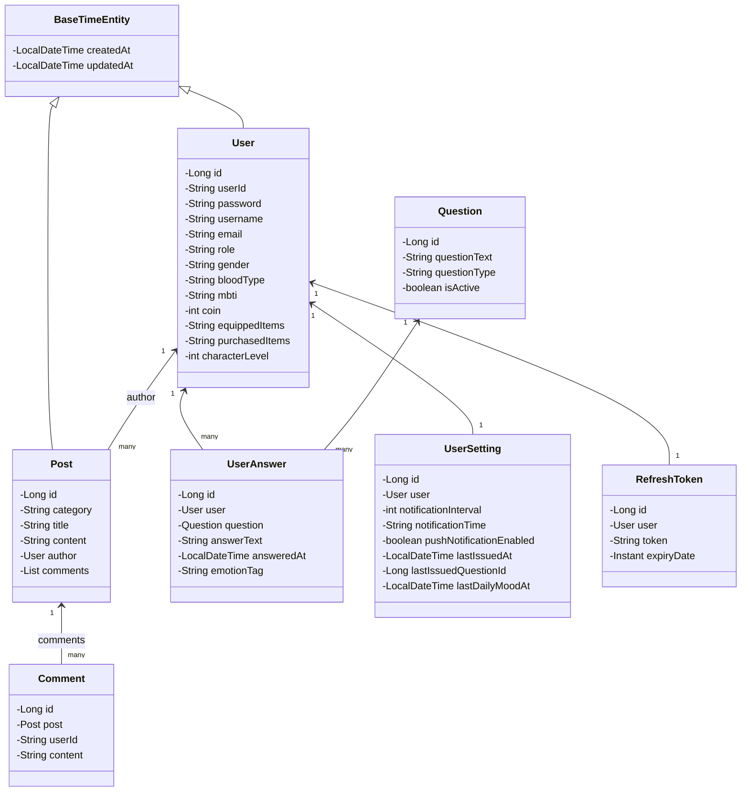

# Entity Package Class Diagram Description

이 문서는 `com.ch4.lumia_backend.entity` 패키지의 데이터베이스 도메인 모델(Entity) 계층을 기준으로 작성한 클래스 다이어그램 및 설명입니다.

## 1. Entity Package Class Diagram

---

## 2. Class Descriptions

### 2.1 BaseTimeEntity
모든 주요 엔티티의 생성 시간 및 수정 시간을 자동으로 관리하고 매핑하기 위한 추상 엔티티 클래스입니다.

* **주요 어노테이션:** `@MappedSuperclass`, `@EntityListeners(AuditingEntityListener.class)`

#### [속성 및 필드 설명]
| 필드 명 | 타입 | 매핑 컬럼 설명 |
| :--- | :--- | :--- |
| `createdAt` | `LocalDateTime` | 레코드가 최초 등록된 시각 (변경 불가능) |
| `updatedAt` | `LocalDateTime` | 레코드가 마지막으로 수정된 시각 |

### 2.2 User
플랫폼을 이용하는 회원 정보를 표현하는 엔티티입니다. `BaseTimeEntity`를 상속합니다.

* **주요 어노테이션:** `@Entity`, `@Table(name = "users")`, `@Getter`, `@Setter`, `@Builder`

#### [속성 및 필드 설명]
| 필드 명 | 타입 | 매핑 컬럼 설명 |
| :--- | :--- | :--- |
| `id` | `Long` | 기본키 (Primary Key, Auto Increment) |
| `userId` | `String` | 사용자 로그인 아이디 (Unique) |
| `password` | `String` | 암호화된 비밀번호 해시값 |
| `username` | `String` | 사용자 닉네임 / 성명 |
| `email` | `String` | 사용자 이메일 (Unique) |
| `role` | `String` | 회원 권한 역할 (ROLE_USER, ROLE_ADMIN 등) |
| `gender` | `String` | 성별 (선택사항) |
| `bloodType` | `String` | 혈액형 (선택사항) |
| `mbti` | `String` | MBTI 유형 (선택사항) |
| `coin` | `int` | 사용자가 보유하고 있는 마음 성장 코인 잔액 |
| `equippedItems` | `String` | 사용자가 현재 아바타에 장착 중인 스킨 아이템 코드 목록 (JSON 또는 구분자 포맷) |
| `purchasedItems` | `String` | 상점에서 획득한 소유 스킨 아이템 전체 목록 |
| `characterLevel` | `int` | 감정 성찰 빈도에 비례해 상승하는 동반자 캐릭터의 현재 레벨 |

#### [연결 관계 및 연관 관계]
| 대상 엔티티 | 관계 유형 | 관계 목적 및 방향 |
| :--- | :--- | :--- |
| `Post` | 1:N (일대다) | 작성자가 작성한 자유 게시판 글 목록 매핑 |
| `UserAnswer` | 1:N (일대다) | 사용자가 그동안 제출한 질문 답변 목록 매핑 |
| `UserSetting` | 1:1 (일대일) | 사용자의 알림 주기 및 이력 설정을 나타내는 1:1 결합 |
| `RefreshToken` | 1:1 (일대일) | 로그인 시 세션 연장 관리를 위한 토큰 매핑 |

### 2.3 Post
자유 게시판에 사용자가 등록하는 게시글 정보입니다. `BaseTimeEntity`를 상속합니다.

* **주요 어노테이션:** `@Entity`, `@Table(name = "posts")`, `@Getter`, `@Builder`

#### [속성 및 필드 설명]
| 필드 명 | 타입 | 매핑 컬럼 설명 |
| :--- | :--- | :--- |
| `id` | `Long` | 기본키 (Primary Key) |
| `category` | `String` | 게시판 카테고리 (자유, 공감 등) |
| `title` | `String` | 게시글 제목 |
| `content` | `String` | 게시글 본문 텍스트 |
| `author` | `User` | 게시글을 작성한 회원 객체 (N:1 연관) |
| `comments` | `List<Comment>` | 게시글 하위에 달린 댓글 리스트 (1:N 연관) |

#### [연결 관계 및 연관 관계]
| 대상 엔티티 | 관계 유형 | 관계 목적 및 방향 |
| :--- | :--- | :--- |
| `User` (author) | N:1 (다대일) | 게시글 작성자 참조 (FK: `user_id`, 지연 로딩) |
| `Comment` | 1:N (일대다) | 댓글 종속 매핑 (`mappedBy = "post"`, Cascade 및 고 orphanRemoval 설정) |

### 2.4 Comment
게시글에 달리는 댓글 엔티티입니다.

* **주요 어노테이션:** `@Entity`, `@Table(name = "comments")`, `@Getter`

#### [속성 및 필드 설명]
| 필드 명 | 타입 | 매핑 컬럼 설명 |
| :--- | :--- | :--- |
| `id` | `Long` | 기본키 (Primary Key) |
| `post` | `Post` | 댓글이 달린 소속 게시글 객체 (N:1 연관) |
| `userId` | `String` | 댓글을 작성한 사용자의 아이디 문자열 |
| `content` | `String` | 댓글 본문 내용 |
| `createdAt` | `LocalDateTime` | 댓글 작성 시각 |

#### [연결 관계 및 연관 관계]
| 대상 엔티티 | 관계 유형 | 관계 목적 및 방향 |
| :--- | :--- | :--- |
| `Post` | N:1 (다대일) | 상위 게시글과의 다대일 결합 (FK: `post_id`) |

### 2.5 Question
시스템에서 사용자에게 제공하는 자아 성찰용 질문 정의 엔티티입니다.

* **주요 어노테이션:** `@Entity`, `@Table(name = "questions")`, `@Getter`

#### [속성 및 필드 설명]
| 필드 명 | 타입 | 매핑 컬럼 설명 |
| :--- | :--- | :--- |
| `id` | `Long` | 기본키 (Primary Key) |
| `questionText` | `String` | 사용자에게 보여줄 질문 문구 본문 |
| `questionType` | `String` | 질문 구분 타입 (DAILY: 정기 질문, ONDEMAND: 추가 발급 질문) |
| `isActive` | `boolean` | 질문의 활성화 여부 (사용자 배정 대상 포함 여부) |

### 2.6 UserAnswer
특정 사용자가 지정된 성찰 질문에 응답해 작성한 답변 기록입니다.

* **주요 어노테이션:** `@Entity`, `@Table(name = "user_answers")`, `@Getter`

#### [속성 및 필드 설명]
| 필드 명 | 타입 | 매핑 컬럼 설명 |
| :--- | :--- | :--- |
| `id` | `Long` | 기본키 (Primary Key) |
| `user` | `User` | 답변을 작성한 사용자 객체 (N:1 연관) |
| `question` | `Question` | 답변을 입력한 원천 질문 객체 (N:1 연관) |
| `answerText` | `String` | 사용자가 작성한 성찰 답변 내용 |
| `answeredAt` | `LocalDateTime` | 답변 제출 및 생성 완료 시각 |
| `emotionTag` | `String` | 답변 텍스트 분석 혹은 자가 선택을 거친 핵심 감정 키워드 |

#### [연결 관계 및 연관 관계]
| 대상 엔티티 | 관계 유형 | 관계 목적 및 방향 |
| :--- | :--- | :--- |
| `User` | N:1 (다대일) | 답변 기록의 소유 유저 참조 (FK: `user_id`) |
| `Question` | N:1 (다대일) | 어떤 질문에 대한 대답인지 참조 (FK: `question_id`) |

### 2.7 UserSetting
사용자의 푸시 알림 수신 상태 및 질문 발송 스케줄과 관련된 상태를 관리합니다.

* **주요 어노테이션:** `@Entity`, `@Table(name = "user_settings")`, `@Getter`, `@Setter`

#### [속성 및 필드 설명]
| 필드 명 | 타입 | 매핑 컬럼 설명 |
| :--- | :--- | :--- |
| `id` | `Long` | 기본키 (Primary Key) |
| `user` | `User` | 대상 사용자 객체 (1:1 연관) |
| `notificationInterval` | `int` | 알림 주기 시간 간격 (시간 단위) |
| `notificationTime` | `String` | 알림을 받기로 예약한 타겟 기준 시각 (예: "09:00") |
| `pushNotificationEnabled` | `boolean` | 알림 수신을 활성화했는지 여부 |
| `lastIssuedAt` | `LocalDateTime` | 사용자에게 가장 마지막으로 질문이 발급된 일시 |
| `lastIssuedQuestionId` | `Long` | 가장 마지막으로 발급된 질문의 고유 ID |
| `lastDailyMoodAt` | `LocalDateTime` | 당일 데일리 감정 체크를 마지막으로 수행한 일시 |

#### [연결 관계 및 연관 관계]
| 대상 엔티티 | 관계 유형 | 관계 목적 및 방향 |
| :--- | :--- | :--- |
| `User` | 1:1 (일대일) | 소유 유저 엔티티와 일대일 양방향 또는 단방향 결합 |

### 2.8 RefreshToken
로그인 성공 시 클라이언트에 발급되는 만료 갱신용 JWT Refresh Token 정보입니다.

* **주요 어노테이션:** `@Entity`, `@Table(name = "refresh_tokens")`, `@Getter`, `@Setter`

#### [속성 및 필드 설명]
| 필드 명 | 타입 | 매핑 컬럼 설명 |
| :--- | :--- | :--- |
| `id` | `Long` | 기본키 (Primary Key) |
| `user` | `User` | 토큰이 배정된 유저 객체 (1:1 연관) |
| `token` | `String` | 데이터베이스와 유효성을 대조할 토큰 해시 키 값 (Unique) |
| `expiryDate` | `Instant` | 토큰이 완전히 만료되어 사용할 수 없게 되는 일시 |

#### [연결 관계 및 연관 관계]
| 대상 엔티티 | 관계 유형 | 관계 목적 및 방향 |
| :--- | :--- | :--- |
| `User` | 1:1 (일대일) | 발급 대상 사용자 식별용 1:1 매핑 |
