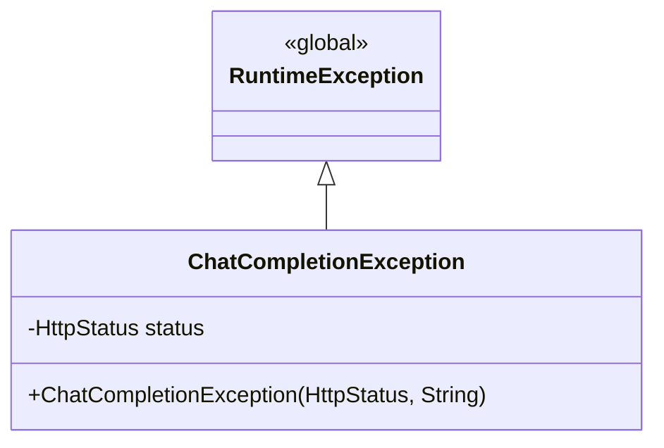

# Exception Package Class Diagram Description

이 문서는 `com.ch4.lumia_backend.exception` 패키지의 예외 처리 클래스를 정리한 문서입니다.

## 1. Exception Package Class Diagram

---

## 2. Class Descriptions

### 2.1 ChatCompletionException
생성형 AI 대화 처리 과정 중 OpenAI 서버와의 통신 지연(Timeout), 잘못된 API Key 설정, 호출한도 도달 등의 문제 상황이 벌어졌을 때 이를 캡처하여 HTTP 상태 코드와 에러 사유를 담아 상위 컨트롤러 및 Global Exception Handler로 전파하기 위해 사용되는 커스텀 런타임 예외 클래스입니다.

* **패키지:** `com.ch4.lumia_backend.exception`
* **상속 관계:** `RuntimeException` (런타임 시에 트랜잭션 롤백 및 에러 핸들러 통제 가능)

#### [속성 및 필드 설명]
| 필드 명 | 타입 | 설명 |
| :--- | :--- | :--- |
| `status` | `HttpStatus` | OpenAI 응답 혹은 백엔드 자체 판단에 기인한 적합한 HTTP 오류 상태 코드 (예: `429 TOO_MANY_REQUESTS`, `504 GATEWAY_TIMEOUT`) |

#### [주요 메서드 및 기능]
| 메서드 명 | 설명 및 기능 | 반환 타입 |
| :--- | :--- | :--- |
| `ChatCompletionException(HttpStatus, String)` | HTTP 상태 정보 및 자세한 에러 본문 문구를 주입받아 예외 객체를 생성하는 생성자 | `생성자` |
| `getStatus()` | 예외 핸들러에서 에러 HTTP 응답 응수 시 올바른 StatusCode를 매핑하기 위한 게터 메서드 | `HttpStatus` |

#### [연결 관계 및 의존성]
| 연결 대상 클래스 | 관계 유형 | 연결 목적 및 수행 기능 |
| :--- | :--- | :--- |
| `ChatService` | 던짐 (throws) | 대화 생성 도중 상류 에러 발견 시 이 예외를 빌드하여 위로 전파함 |
| `ChatController` | 처리 (handles) | 컨트롤러 단에서 해당 Exception 발생을 캐치하여 클라이언트에 올바른 ResponseEntity(상태 코드 포함) 반환 처리 |
