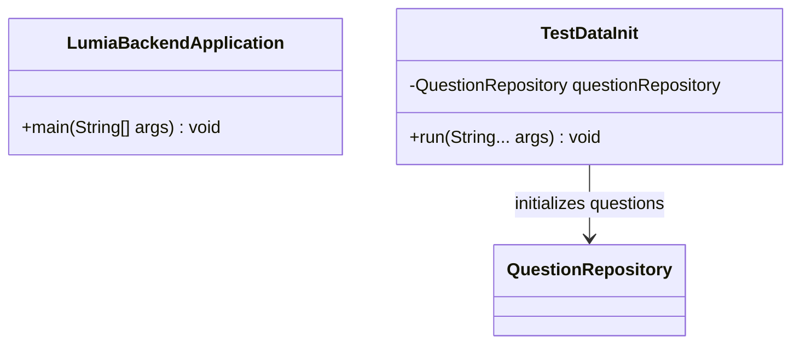
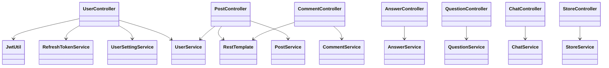
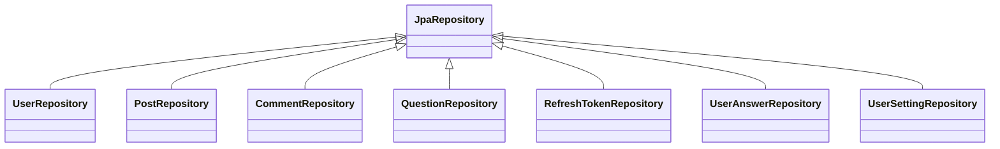
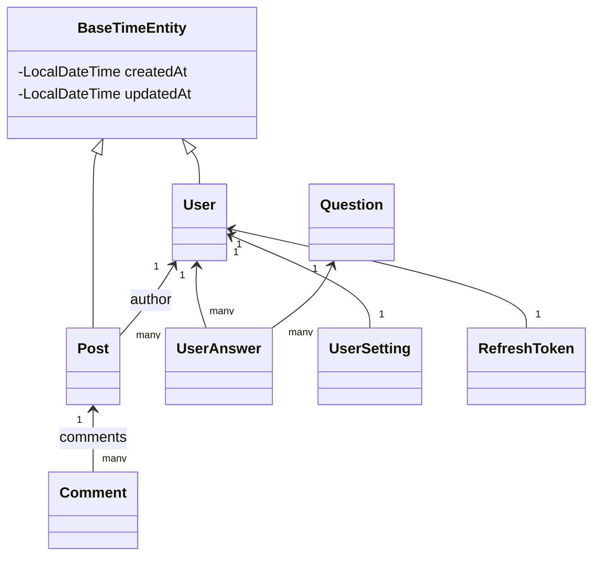
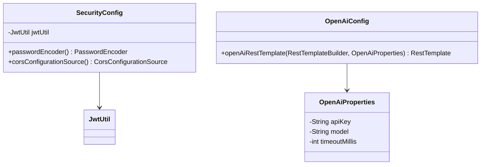
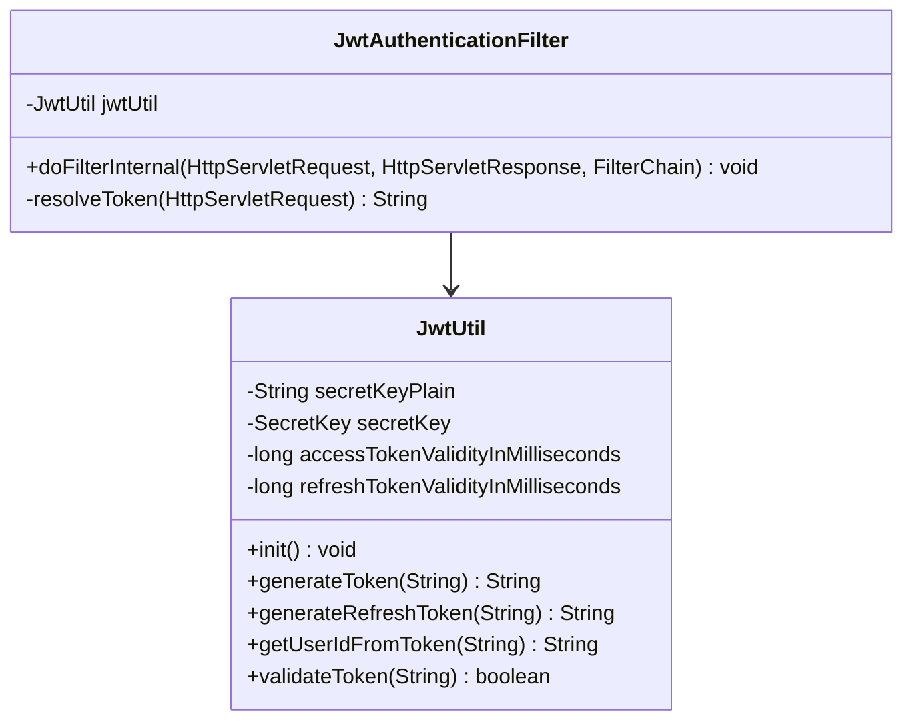
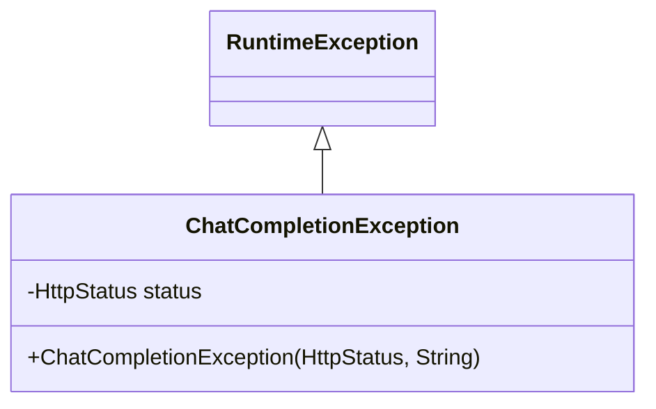

# Lumia Backend Class Diagram Description

이 문서는 `src/main/java/com/ch4/lumia_backend` 아래의 주요 클래스 파일을 패키지별로 정리한 클래스 다이어그램 및 클래스 설명 문서이다.

## 1. Root Package

| Class | Attributes | Methods | Others / Relationships |
|---|---|---|---|
| `LumiaBackendApplication` | 없음 | `main(String[] args)`: Spring Boot 애플리케이션 실행 | `@SpringBootApplication`, `@EnableJpaAuditing` 기반 진입점 |
| `TestDataInit` | `QuestionRepository questionRepository` | `run(String... args)`: 초기 질문 데이터 삽입 | `@Component`, `CommandLineRunner` 구현, `QuestionRepository` 사용 |

## 2. Controller Package

| Class | Attributes | Methods | Others / Relationships |
|---|---|---|---|
| `UserController` | `Logger logger`, `UserService userService`, `JwtUtil jwtUtil`, `UserSettingService userSettingService`, `RefreshTokenService refreshTokenService` | `login`, `signup`, `refreshToken`, `logoutUser`, `getUserSettings`, `updateUserSettings`, `getUserProfile`, `updateUserProfile`, `updateUserEmail`, `updateUserPassword`, `findIdByEmail`, `updateUserEquippedItems`, `updateUserCoins` | `/api/users` 담당. 인증, 사용자 정보, 설정, 코인, 아이템 API 처리 |
| `PostController` | `Logger logger`, `PostService postService`, `UserService userService`, `RestTemplate restTemplate`, `String FASTAPI_URL` | `getPosts`, `createPost`, `getPostDetail`, `updatePost`, `deletePost` | `/api/posts` 담당. 게시글 CRUD, 외부 FastAPI 필터링 API 호출 |
| `CommentController` | `Logger logger`, `RestTemplate restTemplate`, `String FASTAPI_URL`, `CommentService commentService` | `getComments`, `createComment`, `updateComment`, `deleteComment` | 게시글 댓글 API 담당. 댓글 작성/수정 전 외부 필터링 API 호출 |
| `AnswerController` | `Logger logger`, `AnswerService answerService` | `getCurrentUserId`, `saveAnswer`, `getMyRecords` | `/api/answers` 담당. 답변 저장 및 내 답변 기록 조회 |
| `QuestionController` | `Logger logger`, `QuestionService questionService` | `getCurrentUserId`, `getQuestionForCurrentUser`, `getOnDemandQuestion` | `/api/questions` 담당. 예약 질문 및 추가 질문 조회 |
| `ChatController` | `Logger logger`, `ChatService chatService` | `createCompletion`, `getCurrentUserId` | `/api/chat` 담당. AI 채팅 응답 생성 요청 |
| `StoreController` | `StoreService storeService` | `purchaseItem` | `/api/store` 담당. 상점 아이템 구매 처리 |

## 3. Service Package

```mermaid
classDiagram
    class UserService
    class UserSettingService
    class RefreshTokenService
    class PostService
    class CommentService
    class AnswerService
    class QuestionService
    class ChatService
    class StoreService

    UserService --> UserRepository
    UserService --> UserSettingRepository
    UserService --> PasswordEncoder
    UserSettingService --> UserSettingRepository
    UserSettingService --> UserRepository
    RefreshTokenService --> RefreshTokenRepository
    RefreshTokenService --> UserRepository
    RefreshTokenService --> JwtUtil
    PostService --> PostRepository
    CommentService --> CommentRepository
    CommentService --> PostRepository
    AnswerService --> UserAnswerRepository
    AnswerService --> UserRepository
    AnswerService --> QuestionRepository
    QuestionService --> QuestionRepository
    QuestionService --> UserRepository
    QuestionService --> UserSettingRepository
    QuestionService --> UserAnswerRepository
    ChatService --> RestTemplate
    ChatService --> ObjectMapper
    ChatService --> OpenAiProperties
    StoreService --> UserRepository
```

| Class | Attributes | Methods | Others / Relationships |
|---|---|---|---|
| `UserService` | `Logger logger`, `UserRepository userRepository`, `PasswordEncoder passwordEncoder`, `UserSettingRepository userSettingRepository` | `findByUserId`, `login`, `signup`, `getUserProfile`, `updateUserProfile`, `updateUserEmail`, `updateUserPassword`, `findUserIdByEmail`, `updateEquippedItems`, `updateUserCoins` | 사용자 계정/프로필/재화 로직 담당. 비밀번호 암호화와 사용자 설정 기본 생성 처리 |
| `UserSettingService` | `UserSettingRepository userSettingRepository`, `UserRepository userRepository` | `getUserSettings`, `updateUserSettings` | 사용자 알림 설정 조회 및 변경 담당 |
| `RefreshTokenService` | `Logger logger`, `RefreshTokenRepository refreshTokenRepository`, `UserRepository userRepository`, `JwtUtil jwtUtil`, `Long refreshTokenDurationMs` | `createOrUpdateRefreshToken`, `findByToken`, `verifyExpiration`, `deleteByUserId` | refresh token 생성/저장/만료 검증/삭제 담당 |
| `PostService` | `Logger logger`, `PostRepository postRepository` | `getPosts`, `createPost`, `getPostById`, `updatePost`, `deletePost` | 게시글 CRUD 비즈니스 로직 담당 |
| `CommentService` | `Logger logger`, `CommentRepository commentRepository`, `PostRepository postRepository` | `getCommentsByPostId`, `createComment`, `updateComment`, `deleteComment` | 댓글 CRUD 및 작성자 권한 확인 담당 |
| `AnswerService` | `Logger logger`, `UserAnswerRepository userAnswerRepository`, `UserRepository userRepository`, `QuestionRepository questionRepository` | `saveAnswer`, `getMyAnswers` | 사용자 답변 저장, 중복 답변 검증, 답변 기록 조회 담당 |
| `QuestionService` | `Logger logger`, `QuestionRepository questionRepository`, `UserRepository userRepository`, `UserSettingRepository userSettingRepository`, `UserAnswerRepository userAnswerRepository` | `getScheduledQuestionForUser`, `getOnDemandQuestion`, `issueNewQuestion`, `findUserByLoginId`, `findOrCreateUserSetting` | 예약 질문/추가 질문 발급, 발급 이력 및 제한 로직 담당 |
| `ChatService` | `Logger logger`, `OPENAI_RESPONSES_URL`, `RestTemplate openAiRestTemplate`, `ObjectMapper objectMapper`, `OpenAiProperties openAiProperties` | `createCompletion`, `buildUpstreamErrorMessage`, `extractErrorMessage`, `isTimeoutException`, `abbreviate` | OpenAI Responses API 호출 및 오류 메시지 가공 담당 |
| `StoreService` | `UserRepository userRepository` | `purchaseItem` | 아이템 구매, 코인 차감, 구매 목록 갱신 담당 |

## 4. Repository Package

| Class | Attributes | Methods | Others / Relationships |
|---|---|---|---|
| `UserRepository` | 없음 | `findByUserId(String)`, `findByEmail(String)` | `JpaRepository<User, Long>` 상속. 사용자 조회 쿼리 메서드 제공 |
| `PostRepository` | 없음 | 기본 JPA CRUD 메서드 | `JpaRepository<Post, Long>` 상속. 게시글 저장소 |
| `CommentRepository` | 없음 | `findByPostOrderByCreatedAtAsc(Post)` | `JpaRepository<Comment, Long>` 상속. 게시글별 댓글 오름차순 조회 |
| `QuestionRepository` | 없음 | `findRandomActiveQuestionByType`, `findByQuestionTypeAndIsActiveTrue`, `findFirstByIsActiveTrueOrderByIdDesc` | `JpaRepository<Question, Long>` 상속. 활성 질문 조회 |
| `RefreshTokenRepository` | 없음 | `findByToken`, `findByUser`, `deleteByUser` | `JpaRepository<RefreshToken, Long>` 상속. refresh token 조회/삭제 |
| `UserAnswerRepository` | 없음 | `findByUserOrderByAnsweredAtDesc`, `existsByUserAndQuestion`, `countByUser` | `JpaRepository<UserAnswer, Long>` 상속. 사용자 답변 조회/중복 확인 |
| `UserSettingRepository` | 없음 | `findByUser`, `findByUser_Id` | `JpaRepository<UserSetting, Long>` 상속. 사용자 설정 조회 |

## 5. Entity Package

| Class | Attributes | Methods | Others / Relationships |
|---|---|---|---|
| `BaseTimeEntity` | `LocalDateTime createdAt`, `LocalDateTime updatedAt` | Lombok `getters` | `@MappedSuperclass`. 생성/수정 시간 공통 필드 제공 |
| `User` | `id`, `userId`, `password`, `username`, `email`, `role`, `gender`, `bloodType`, `mbti`, `coin`, `equippedItems`, `purchasedItems`, `characterLevel` | protected 기본 생성자, builder 생성자, Lombok getter/setter | `users` 테이블. `Post`, `UserAnswer`, `UserSetting`, `RefreshToken`과 연결 |
| `Post` | `id`, `category`, `title`, `content`, `User author`, `List<Comment> comments` | builder 생성자, `fromId`, `update` | `posts` 테이블. `BaseTimeEntity` 상속, `User`와 N:1, `Comment`와 1:N |
| `Comment` | `id`, `Post post`, `userId`, `content`, `createdAt` | builder 생성자, `updateContent` | `comments` 테이블. `Post`와 N:1 관계 |
| `Question` | `id`, `questionText`, `questionType`, `isActive` | builder 생성자, Lombok getter | `questions` 테이블. `UserAnswer`와 1:N 관계 |
| `UserAnswer` | `id`, `User user`, `Question question`, `answerText`, `answeredAt`, `emotionTag` | `onPersist`, builder 생성자, Lombok getter | `user_answers` 테이블. 사용자와 질문의 답변 기록 |
| `UserSetting` | `id`, `User user`, `notificationInterval`, `notificationTime`, `pushNotificationEnabled`, `lastIssuedAt`, `lastIssuedQuestionId`, `lastDailyMoodAt`, `updatedAt` | `onUpdate`, builder 생성자, Lombok getter/setter | `user_settings` 테이블. `User`와 1:1 관계 |
| `RefreshToken` | `id`, `User user`, `token`, `expiryDate` | 기본 생성자, `RefreshToken(User, String, Instant)`, Lombok getter/setter | `refresh_tokens` 테이블. `User`와 1:1 관계 |

## 6. DTO Package

```mermaid
classDiagram
    class AnswerRequestDto
    class AnswerResponseDto
    class ChatCompletionRequestDto
    class ChatCompletionResponseDto
    class CoinUpdateRequestDto
    class CommentRequestDto
    class CommentResponseDto
    class EmailUpdateRequestDto
    class EquippedItemsUpdateRequestDto
    class LoginRequestDto
    class LoginResponseDto
    class NewMessageResponseDto
    class PasswordUpdateRequestDto
    class PostRequestDto
    class PostResponseDto
    class PurchaseRequestDto
    class QuestionDto
    class RefreshTokenRequestDto
    class SignupRequestDto
    class TokenRefreshResponseDto
    class UserIdResponseDto
    class UserProfileResponseDto
    class UserProfileUpdateRequestDto
    class UserSettingDto

    AnswerResponseDto ..> UserAnswer : fromEntity
    CommentResponseDto ..> Comment : constructor
    PostResponseDto ..> Post : constructor
    QuestionDto ..> Question : fromEntity
    UserProfileResponseDto ..> User : fromEntity
    UserSettingDto ..> UserSetting : fromEntity
    NewMessageResponseDto --> QuestionDto
```

| Class | Attributes | Methods | Others / Relationships |
|---|---|---|---|
| `AnswerRequestDto` | `questionId`, `content`, `emotionTag` | Lombok getter/setter | 답변 저장 요청 DTO |
| `AnswerResponseDto` | `answerId`, `questionId`, `questionText`, `answerText`, `emotionTag`, `answeredAt` | `fromEntity(UserAnswer)`, Lombok getter/setter/builder | 답변 조회 응답 DTO |
| `ChatCompletionRequestDto` | `message` | Lombok getter/setter | 채팅 completion 요청 DTO |
| `ChatCompletionResponseDto` | `reply` | Lombok getter/setter/all-args constructor | 채팅 completion 응답 DTO |
| `CoinUpdateRequestDto` | `amount` | Lombok getter/setter | 코인 증감 요청 DTO |
| `CommentRequestDto` | `content` | Lombok getter/setter | 댓글 작성/수정 요청 DTO |
| `CommentResponseDto` | `id`, `content`, `createdAt`, `userId` | `CommentResponseDto(Comment)`, Lombok getter | 댓글 응답 DTO |
| `EmailUpdateRequestDto` | `newEmail` | Lombok getter/setter | 이메일 변경 요청 DTO |
| `EquippedItemsUpdateRequestDto` | `equippedItems` | Lombok getter/setter | 장착 아이템 변경 요청 DTO |
| `LoginRequestDto` | `userId`, `password` | Lombok getter/setter | 로그인 요청 DTO |
| `LoginResponseDto` | `token`, `refreshToken`, `userId`, `message` | Lombok getter/setter/all-args constructor | 로그인 성공 응답 DTO |
| `NewMessageResponseDto` | `hasNewMessage`, `newMessage` | Lombok getter/setter/all-args constructor | 새 질문 메시지 응답 DTO |
| `PasswordUpdateRequestDto` | `currentPassword`, `newPassword` | Lombok getter/setter | 비밀번호 변경 요청 DTO |
| `PostRequestDto` | `category`, `title`, `content` | Lombok getter/setter | 게시글 작성/수정 요청 DTO |
| `PostResponseDto` | `id`, `category`, `title`, `content`, `createdAt`, `userId` | `PostResponseDto(Post)`, Lombok getter | 게시글 응답 DTO |
| `PurchaseRequestDto` | `itemId`, `itemName`, `cost` | Lombok getter/setter | 상점 구매 요청 DTO |
| `QuestionDto` | `questionId`, `questionText`, `questionType` | `fromEntity(Question)`, Lombok getter/setter/builder | 질문 응답 DTO |
| `RefreshTokenRequestDto` | `refreshToken` | Lombok getter/setter | access token 재발급 요청 DTO |
| `SignupRequestDto` | `userId`, `password`, `username`, `email` | Lombok getter/setter | 회원가입 요청 DTO |
| `TokenRefreshResponseDto` | `accessToken`, `refreshToken` | Lombok getter/setter/all-args constructor | token 재발급 응답 DTO |
| `UserIdResponseDto` | `userId` | Lombok getter/setter/all-args constructor | 아이디 찾기 응답 DTO |
| `UserProfileResponseDto` | `loginId`, `email`, `username`, `gender`, `bloodType`, `mbti`, `coin`, `equippedItems`, `purchasedItems`, `characterLevel` | `fromEntity(User)`, Lombok getter/setter/builder | 사용자 프로필 응답 DTO |
| `UserProfileUpdateRequestDto` | `username`, `gender`, `bloodType`, `mbti` | Lombok getter/setter | 사용자 프로필 수정 요청 DTO |
| `UserSettingDto` | `notificationInterval`, `notificationTime`, `pushNotificationEnabled`, `lastIssuedAt` | `fromEntity(UserSetting)`, Lombok getter/setter/builder | 사용자 설정 DTO |

## 7. Config Package

| Class | Attributes | Methods | Others / Relationships |
|---|---|---|---|
| `SecurityConfig` | `JwtUtil jwtUtil` | `passwordEncoder`, `corsConfigurationSource` | Spring Security 관련 Bean 설정. JWT 유틸과 연동 |
| `OpenAiConfig` | 없음 | `openAiRestTemplate(RestTemplateBuilder, OpenAiProperties)` | OpenAI API 호출용 `RestTemplate` Bean 생성 |
| `OpenAiProperties` | `apiKey`, `model`, `timeoutMillis` | Lombok getter/setter | `openai.*` 설정값을 바인딩하는 설정 클래스 |

## 8. Security Package

| Class | Attributes | Methods | Others / Relationships |
|---|---|---|---|
| `JwtUtil` | `Logger logger`, `secretKeyPlain`, `secretKey`, `accessTokenValidityInMilliseconds`, `refreshTokenValidityInMilliseconds`, `BASE64_PATTERN` | `isBase64`, `init`, `generateToken`, `generateRefreshToken`, `getUserIdFromToken`, `validateToken` | JWT 생성, 파싱, 검증 담당. `@Component` |
| `JwtAuthenticationFilter` | `Logger logger`, `JwtUtil jwtUtil` | `doFilterInternal`, `resolveToken` | 요청의 Bearer token을 검증하고 Spring Security 인증 객체를 설정 |

## 9. Exception Package

| Class | Attributes | Methods | Others / Relationships |
|---|---|---|---|
| `ChatCompletionException` | `HttpStatus status` | `ChatCompletionException(HttpStatus, String)`, Lombok getter | 채팅 completion 처리 중 발생한 HTTP 상태 기반 예외 |

## 10. Layer Relationship Summary

| Layer | Main Responsibility | Connected Layer |
|---|---|---|
| `controller` | HTTP 요청/응답, 인증 사용자 확인, DTO 입출력 | `service`, `security`, 외부 FastAPI |
| `service` | 핵심 비즈니스 로직, 트랜잭션, 권한/검증 처리 | `repository`, `entity`, 외부 OpenAI API |
| `repository` | JPA 기반 DB 접근 | `entity` |
| `entity` | DB 테이블 매핑 및 도메인 상태 표현 | JPA, repository |
| `dto` | API 요청/응답 데이터 전달 | controller, service, entity 변환 |
| `config` | Spring Security, CORS, OpenAI API 클라이언트 설정 | security, service |
| `security` | JWT 생성/검증 및 인증 필터링 | config, controller/service 인증 흐름 |
| `exception` | 특정 도메인 예외 표현 | controller, service |
