# Repository Package Class Diagram Description

이 문서는 `com.ch4.lumia_backend.repository` 패키지의 데이터 액세스 계층을 기준으로 작성한 클래스 다이어그램 및 설명입니다.

## 1. Repository Package Class Diagram

```mermaid
classDiagram
    class JpaRepository {
        <<interface>>
    }
    class UserRepository {
        <<interface>>
        +findByUserId(String) Optional
        +findByEmail(String) Optional
    }
    class PostRepository {
        <<interface>>
    }
    class CommentRepository {
        <<interface>>
        +findByPostOrderByCreatedAtAsc(Post) List
    }
    class QuestionRepository {
        <<interface>>
        +findRandomActiveQuestionByType(String) Optional
        +findByQuestionTypeAndIsActiveTrue(String) List
        +findFirstByIsActiveTrueOrderByIdDesc() Optional
    }
    class RefreshTokenRepository {
        <<interface>>
        +findByToken(String) Optional
        +findByUser(User) Optional
        +deleteByUser(User) int
    }
    class UserAnswerRepository {
        <<interface>>
        +findByUserOrderByAnsweredAtDesc(User, Pageable) Page
        +existsByUserAndQuestion(User, Question) boolean
        +countByUser(User) int
    }
    class UserSettingRepository {
        <<interface>>
        +findByUser(User) Optional
        +findByUser_Id(Long) Optional
    }

    JpaRepository <|-- UserRepository
    JpaRepository <|-- PostRepository
    JpaRepository <|-- CommentRepository
    JpaRepository <|-- QuestionRepository
    JpaRepository <|-- RefreshTokenRepository
    JpaRepository <|-- UserAnswerRepository
    JpaRepository <|-- UserSettingRepository
```

---

## 2. Class Descriptions

Lumia Backend의 모든 Repository는 Spring Data JPA의 `JpaRepository` 인터페이스를 상속받아 기본적인 CRUD 및 페이징 기능을 기본적으로 제공합니다. 아래는 각 도메인별 리포지토리에 선언된 전용 쿼리 메서드 목록입니다.

### 2.1 UserRepository
사용자(`User`) 엔티티에 대한 데이터베이스 액세스를 제공합니다.

* **상속 관계:** `JpaRepository<User, Long>`

#### [주요 쿼리 메서드 및 기능]
| 메서드 명 | 설명 및 기능 | 반환 타입 |
| :--- | :--- | :--- |
| `findByUserId(String)` | 사용자 ID(로그인 계정)로 회원 조회 | `Optional<User>` |
| `findByEmail(String)` | 사용자 이메일 주소로 회원 조회 (아이디 찾기 등에 활용) | `Optional<User>` |

### 2.2 PostRepository
자유게시판 게시글(`Post`) 엔티티에 대한 데이터베이스 액세스를 제공합니다.

* **상속 관계:** `JpaRepository<Post, Long>`

#### [주요 쿼리 메서드 및 기능]
| 메서드 명 | 설명 및 기능 | 반환 타입 |
| :--- | :--- | :--- |
| *(기본 메서드)* | `JpaRepository`가 제공하는 기본 페이징 조회(`findAll(Pageable)`) 및 CRUD 사용 | `-` |

### 2.3 CommentRepository
게시글 댓글(`Comment`) 엔티티에 대한 데이터베이스 액세스를 제공합니다.

* **상속 관계:** `JpaRepository<Comment, Long>`

#### [주요 쿼리 메서드 및 기능]
| 메서드 명 | 설명 및 기능 | 반환 타입 |
| :--- | :--- | :--- |
| `findByPostOrderByCreatedAtAsc(Post)` | 특정 게시글에 달린 댓글들을 오래된 순(생성 오름차순)으로 전체 조회 | `List<Comment>` |

### 2.4 QuestionRepository
자가 성찰 질문(`Question`) 엔티티에 대한 데이터베이스 액세스를 제공합니다.

* **상속 관계:** `JpaRepository<Question, Long>`

#### [주요 쿼리 메서드 및 기능]
| 메서드 명 | 설명 및 기능 | 반환 타입 |
| :--- | :--- | :--- |
| `findRandomActiveQuestionByType(String)` | 특정 타입(DAILY, ONDEMAND 등)의 활성화된 질문 중 임의로 1개를 무작위 쿼리 (Native Query 활용) | `Optional<Question>` |
| `findByQuestionTypeAndIsActiveTrue(String)` | 특정 타입의 활성화된 모든 질문 목록 조회 | `List<Question>` |
| `findFirstByIsActiveTrueOrderByIdDesc()` | 활성화 상태인 질문 중 가장 최근에 등록된 질문 1개 조회 | `Optional<Question>` |

### 2.5 RefreshTokenRepository
사용자 세션 검증용 Refresh Token(`RefreshToken`) 엔티티에 대한 데이터베이스 액세스를 제공합니다.

* **상속 관계:** `JpaRepository<RefreshToken, Long>`

#### [주요 쿼리 메서드 및 기능]
| 메서드 명 | 설명 및 기능 | 반환 타입 |
| :--- | :--- | :--- |
| `findByToken(String)` | 토큰 키 문자열 값으로 Refresh Token 조회 | `Optional<RefreshToken>` |
| `findByUser(User)` | 대상 사용자 객체에 발급되어 있는 Refresh Token 조회 | `Optional<RefreshToken>` |
| `deleteByUser(User)` | 로그아웃 처리 시 대상 사용자의 Refresh Token 레코드 제거 | `int` (삭제 건수) |

### 2.6 UserAnswerRepository
사용자가 성찰 질문에 답한 답변 기록(`UserAnswer`) 엔티티에 대한 데이터베이스 액세스를 제공합니다.

* **상속 관계:** `JpaRepository<UserAnswer, Long>`

#### [주요 쿼리 메서드 및 기능]
| 메서드 명 | 설명 및 기능 | 반환 타입 |
| :--- | :--- | :--- |
| `findByUserOrderByAnsweredAtDesc(User, Pageable)` | 특정 사용자의 답변 이력을 최신 작성일 기준 내림차순 페이징 조회 | `Page<UserAnswer>` |
| `existsByUserAndQuestion(User, Question)` | 사용자가 특정 질문에 이미 응답했는지 여부 대조 (중복 작성 방지) | `boolean` |
| `countByUser(User)` | 사용자가 지금까지 제출한 총 답변 개수 카운트 (경험치나 통계에 활용) | `int` |

### 2.7 UserSettingRepository
사용자의 알림 및 질문 스케줄 등 환경 설정(`UserSetting`) 엔티티에 대한 데이터베이스 액세스를 제공합니다.

* **상속 관계:** `JpaRepository<UserSetting, Long>`

#### [주요 쿼리 메서드 및 기능]
| 메서드 명 | 설명 및 기능 | 반환 타입 |
| :--- | :--- | :--- |
| `findByUser(User)` | 대상 사용자 객체의 환경 설정 레코드 조회 | `Optional<UserSetting>` |
| `findByUser_Id(Long)` | 사용자의 Primary Key ID 번호를 활용해 설정 조회 | `Optional<UserSetting>` |
