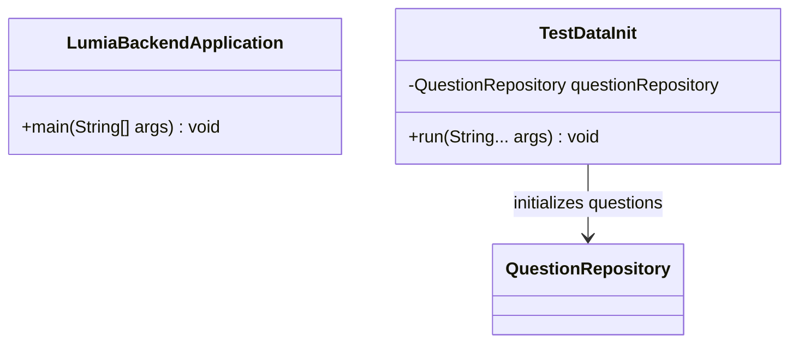

# Root Package Class Diagram Description

이 문서는 `com.ch4.lumia_backend` 루트 패키지의 클래스 설계 및 상호관계를 보여줍니다.

## 1. Root Package Class Diagram

---

## 2. Class Descriptions

### 2.1 LumiaBackendApplication
Spring Boot 애플리케이션의 시작점(Entry Point)이 되는 클래스입니다.

* **패키지:** `com.ch4.lumia_backend`
* **주요 어노테이션:** `@SpringBootApplication`, `@EnableJpaAuditing`

#### [주요 메서드 및 기능]
| 메서드 명 | 설명 | 반환 타입 |
| :--- | :--- | :--- |
| `main(String[] args)` | Spring Boot 애플리케이션을 구동하여 서버를 실행시킵니다. | `void` |

#### [연결 관계 및 의존성]
| 연결 대상 클래스 | 관계 유형 | 연결 목적 및 수행 기능 |
| :--- | :--- | :--- |
| `SpringApplication` | 의존 (uses) | Spring Boot 구동을 위한 내장 메서드 호출 |

### 2.2 TestDataInit
애플리케이션 기동 시 테스트 및 초기 구동에 필요한 감정 성찰 질문(Question) 데이터를 데이터베이스에 자동으로 삽입해주는 초기화 클래스입니다.

* **패키지:** `com.ch4.lumia_backend`
* **주요 어노테이션:** `@Component`, `@RequiredArgsConstructor`

#### [주요 메서드 및 기능]
| 메서드 명 | 설명 | 반환 타입 |
| :--- | :--- | :--- |
| `run(String... args)` | `CommandLineRunner` 구현체로, 앱 실행 시 자동으로 구동되어 초기 질문 데이터를 삽입합니다. | `void` |

#### [연결 관계 및 의존성]
| 연결 대상 클래스 | 관계 유형 | 연결 목적 및 수행 기능 |
| :--- | :--- | :--- |
| `QuestionRepository` | 의존 (uses) | 데이터베이스에 초기 질문 데이터를 삽입하기 위한 리포지토리 인터페이스 사용 |
