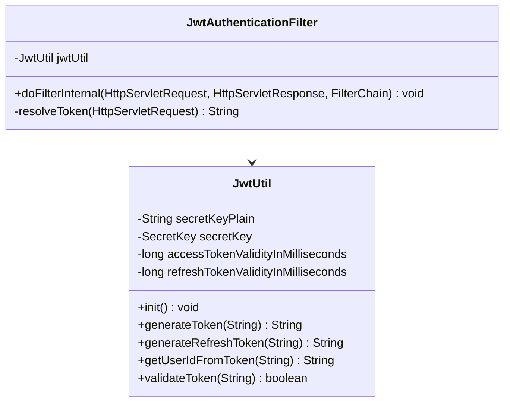

# Security Package Class Diagram Description

이 문서는 `com.ch4.lumia_backend.security` 패키지의 보안 통제 및 JWT 유틸리티 관련 클래스들을 정리한 문서입니다.

## 1. Security Package Class Diagram

---

## 2. Class Descriptions

### 2.1 JwtUtil
JSON Web Token(JWT)의 인코딩, 디코딩, 만료 검사, 암호화 대조 처리를 핵심적으로 전담하는 유틸리티 컴포넌트입니다.

* **패키지:** `com.ch4.lumia_backend.security`
* **주요 어노테이션:** `@Component`

#### [주요 메서드 및 기능]
| 메서드 명 | 설명 및 기능 | 반환 타입 |
| :--- | :--- | :--- |
| `init()` | `@PostConstruct` 라이프사이클을 통해 설정 파일에서 읽어온 평문 Key 문자열을 HMAC SHA 알고리즘 규격에 적합한 암호키 객체(`SecretKey`)로 빌드 | `void` |
| `generateToken(String)` | 사용자 ID를 주체(Subject)로 기입하고 만료 시간(Access Token)을 가미해 최종 JWT 토큰 생성 | `String` |
| `generateRefreshToken(String)` | 장기 유효기간이 설정된 갱신 전용 Refresh Token 생성 | `String` |
| `getUserIdFromToken(String)` | 토큰 문자열 내부 Claims를 파싱하여 사용자 로그인 ID 추출 | `String` |
| `validateToken(String)` | 토큰 유효 기간 및 위변조 여부 검사 | `boolean` |

#### [연결 관계 및 의존성]
| 연결 대상 클래스 | 관계 유형 | 연결 목적 및 수행 기능 |
| :--- | :--- | :--- |
| `Keys.hmacShaKeyFor` | 의존 (uses) | 서명용 SecretKey 생성을 위한 외부 라이브러리 연동 |

### 2.2 JwtAuthenticationFilter
HTTP 요청이 올 때마다 헤더에 포함된 JWT 토큰을 추출하여 인증 여부를 판별하고 Spring Security 컨텍스트에 사용자 정보를 보관해주는 게이트웨이 필터 클래스입니다.

* **패키지:** `com.ch4.lumia_backend.security`
* **주요 어노테이션:** `@Component` (또는 SecurityConfig 내 등록)

#### [주요 메서드 및 기능]
| 메서드 명 | 설명 및 기능 | 반환 타입 |
| :--- | :--- | :--- |
| `doFilterInternal(...)` | HTTP 요청 시 가장 먼저 가로채어 헤더 토큰을 추출하고, 토큰이 유효할 경우 SecurityContext에 해당 사용자 인증 주체 등록 | `void` |
| `resolveToken(HttpServletRequest)` | HTTP Request Header(`Authorization`)로부터 "Bearer " 접두사를 제거한 실제 JWT 문자열 추출 헬퍼 | `String` |

#### [연결 관계 및 의존성]
| 연결 대상 클래스 | 관계 유형 | 연결 목적 및 수행 기능 |
| :--- | :--- | :--- |
| `JwtUtil` | 의존 (uses) | 추출된 토큰의 위변조 검사 및 사용자 고유 ID 디코딩 수행 |
| `UsernamePasswordAuthenticationToken` | 의존 (uses) | 스프링 시큐리티에서 식별 가능한 토큰 객체를 만들어 컨텍스트에 설정 |
