# Service Package Class Diagram Description

이 문서는 `com.ch4.lumia_backend.service` 패키지의 비즈니스 로직 계층을 기준으로 작성한 클래스 다이어그램 및 설명입니다.

## 1. Service Package Class Diagram

```mermaid
classDiagram
    class UserService {
        -Logger logger
        -UserRepository userRepository
        -PasswordEncoder passwordEncoder
        -UserSettingRepository userSettingRepository
        +findByUserId(String) User
        +login(String, String) String
        +signup(SignupRequestDto) User
        +getUserProfile(String) UserProfileResponseDto
        +updateUserProfile(String, UserProfileUpdateRequestDto) UserProfileResponseDto
        +updateUserEmail(String, String) void
        +updateUserPassword(String, String, String) void
        +findUserIdByEmail(String) String
        +updateEquippedItems(String, List) void
        +updateUserCoins(String, int) int
    }

    class UserSettingService {
        -UserSettingRepository userSettingRepository
        -UserRepository userRepository
        +getUserSettings(String) UserSettingDto
        +updateUserSettings(String, UserSettingDto) UserSettingDto
    }

    class RefreshTokenService {
        -Logger logger
        -RefreshTokenRepository refreshTokenRepository
        -UserRepository userRepository
        -JwtUtil jwtUtil
        -Long refreshTokenDurationMs
        +createOrUpdateRefreshToken(String) RefreshToken
        +findByToken(String) Optional
        +verifyExpiration(RefreshToken) RefreshToken
        +deleteByUserId(String) int
    }

    class PostService {
        -Logger logger
        -PostRepository postRepository
        +getPosts(Pageable) Page
        +createPost(Post, String) Post
        +getPostById(Long) Post
        +updatePost(Long, PostRequestDto, String) Post
        +deletePost(Long, String) void
    }

    class CommentService {
        -Logger logger
        -CommentRepository commentRepository
        -PostRepository postRepository
        +getCommentsByPostId(Long) List
        +createComment(Comment, String) Comment
        +updateComment(Long, String, String) Comment
        +deleteComment(Long, String) void
    }

    class AnswerService {
        -Logger logger
        -UserAnswerRepository userAnswerRepository
        -UserRepository userRepository
        -QuestionRepository questionRepository
        +saveAnswer(AnswerRequestDto, String) AnswerResponseDto
        +getMyAnswers(String, Pageable) Page
    }

    class QuestionService {
        -Logger logger
        -QuestionRepository questionRepository
        -UserRepository userRepository
        -UserSettingRepository userSettingRepository
        -UserAnswerRepository userAnswerRepository
        +getScheduledQuestionForUser(String) QuestionDto
        +getOnDemandQuestion(String) QuestionDto
        -issueNewQuestion(User, UserSetting, QuestionType) Question
        -findUserByLoginId(String) User
        -findOrCreateUserSetting(User) UserSetting
    }

    class ChatService {
        -Logger logger
        -String OPENAI_RESPONSES_URL
        -RestTemplate openAiRestTemplate
        -ObjectMapper objectMapper
        -OpenAiProperties openAiProperties
        +createCompletion(ChatCompletionRequestDto, String) ChatCompletionResponseDto
        -buildUpstreamErrorMessage(String) String
        -extractErrorMessage(String) String
        -isTimeoutException(Exception) boolean
        -abbreviate(String, int) String
    }

    class StoreService {
        -UserRepository userRepository
        +purchaseItem(PurchaseRequestDto, String) void
    }

    UserService --> UserRepository
    UserService --> UserSettingRepository
    UserSettingService --> UserSettingRepository
    RefreshTokenService --> RefreshTokenRepository
    PostService --> PostRepository
    CommentService --> CommentRepository
    AnswerService --> UserAnswerRepository
    QuestionService --> QuestionRepository
    ChatService --> OpenAiProperties
    StoreService --> UserRepository
```

---

## 2. Class Descriptions

### 2.1 UserService
사용자 가입, 로그인, 프로필 업데이트, 비밀번호 변경, 코인 변동, 아이템 장착 관리 등 회원 도메인의 코어 비즈니스 로직을 처리합니다.

* **주요 어노테이션:** `@Service`, `@Transactional`, `@RequiredArgsConstructor`

#### [주요 메서드 및 기능]
| 메서드 명 | 기능 및 설명 | 반환 타입 |
| :--- | :--- | :--- |
| `findByUserId(String)` | 사용자 ID(로그인 아이디)로 User 엔티티 조회 | `User` |
| `login(String, String)` | 비밀번호 검증 후 간이 로그인 상태 처리 | `String` |
| `signup(SignupRequestDto)` | 신규 회원 등록 및 기본 환경 설정 세팅 | `User` |
| `getUserProfile(String)` | 사용자 프로필 정보 조회 및 DTO 반환 | `UserProfileResponseDto` |
| `updateUserProfile(String, UserProfileUpdateRequestDto)` | 사용자 이름, 성별, 혈액형, MBTI 정보 수정 | `UserProfileResponseDto` |
| `updateUserEmail(String, String)` | 사용자 이메일 주소 변경 | `void` |
| `updateUserPassword(String, String, String)` | 현재 비밀번호 확인 후 새 비밀번호로 수정 | `void` |
| `findUserIdByEmail(String)` | 이메일 주소 매핑을 활용해 분실한 로그인 아이디 찾기 | `String` |
| `updateEquippedItems(String, List)` | 사용자가 스킨 상점에서 장착한 아이템 리스트 업데이트 | `void` |
| `updateUserCoins(String, int)` | 사용자의 잔여 재화(코인) 증감 처리 | `int` |

#### [연결 관계 및 의존성]
| 연결 대상 클래스 | 관계 유형 | 연결 목적 및 수행 기능 |
| :--- | :--- | :--- |
| `UserRepository` | 의존 (uses) | 사용자 엔티티 조회 및 상태 영속화 |
| `UserSettingRepository` | 의존 (uses) | 회원가입 시점에 해당 사용자의 기본 환경설정 레코드를 함께 생성 |
| `PasswordEncoder` | 의존 (uses) | 가입 시 비밀번호 암호화 및 로그인 시 해시 검증 |

### 2.2 UserSettingService
사용자의 개별 설정 정보(푸시 알림 사용 여부, 알림 발송 시간 설정 등)의 관리 처리를 전담합니다.

* **주요 어노테이션:** `@Service`, `@Transactional`, `@RequiredArgsConstructor`

#### [주요 메서드 및 기능]
| 메서드 명 | 기능 및 설명 | 반환 타입 |
| :--- | :--- | :--- |
| `getUserSettings(String)` | 특정 사용자의 현재 환경설정 조회 | `UserSettingDto` |
| `updateUserSettings(String, UserSettingDto)` | 사용자의 환경설정 정보 수정 및 갱신 시간 처리 | `UserSettingDto` |

#### [연결 관계 및 의존성]
| 연결 대상 클래스 | 관계 유형 | 연결 목적 및 수행 기능 |
| :--- | :--- | :--- |
| `UserSettingRepository` | 의존 (uses) | 설정 정보 영속성 제어 |
| `UserRepository` | 의존 (uses) | 설정 정보를 매핑할 대상 회원 객체 검증 및 획득 |

### 2.3 RefreshTokenService
사용자 로그인 세션을 검증하고 유지하는 데 사용하는 Refresh Token의 발급, 저장, 갱신 및 만료 시간 확인 로직을 처리합니다.

* **주요 어노테이션:** `@Service`, `@Transactional`, `@RequiredArgsConstructor`

#### [주요 메서드 및 기능]
| 메서드 명 | 기능 및 설명 | 반환 타입 |
| :--- | :--- | :--- |
| `createOrUpdateRefreshToken(String)` | 만료 시간을 계산하여 신규 Refresh Token을 발급하거나 기존 토큰 갱신 | `RefreshToken` |
| `findByToken(String)` | 토큰 문자열 값으로 RefreshToken 객체 조회 | `Optional<RefreshToken>` |
| `verifyExpiration(RefreshToken)` | 토큰의 만료 기한 도달 여부를 대조하고, 만료 시 예외 처리 및 삭제 | `RefreshToken` |
| `deleteByUserId(String)` | 로그아웃 또는 토큰 파기 시 사용자 ID 기준으로 토큰 제거 | `int` |

#### [연결 관계 및 의존성]
| 연결 대상 클래스 | 관계 유형 | 연결 목적 및 수행 기능 |
| :--- | :--- | :--- |
| `RefreshTokenRepository` | 의존 (uses) | 토큰 엔티티의 CRUD 수행 및 만료 토큰 삭제 |
| `UserRepository` | 의존 (uses) | 유저 식별을 위해 사용자 엔티티 결합 |
| `JwtUtil` | 의존 (uses) | 유니크한 토큰 키 문자열 생성 기능 보조 |

### 2.4 PostService
자유게시판에 등록되는 커뮤니티 게시글 관련 조회, 작성, 본인 인증을 동반한 수정 및 삭제를 처리합니다.

* **주요 어노테이션:** `@Service`, `@Transactional`, `@RequiredArgsConstructor`

#### [주요 메서드 및 기능]
| 메서드 명 | 기능 및 설명 | 반환 타입 |
| :--- | :--- | :--- |
| `getPosts(Pageable)` | 게시글 전체 목록을 페이징 조건에 맞게 데이터베이스에서 획득 | `Page<Post>` |
| `createPost(Post, String)` | 작성자 객체를 바인딩한 뒤 새 게시글 등록 | `Post` |
| `getPostById(Long)` | 게시글 단건의 상세 데이터 조회 (존재하지 않으면 예외 반환) | `Post` |
| `updatePost(Long, PostRequestDto, String)` | 작성자 확인 후 제목, 카테고리, 본문 내용 수정 | `Post` |
| `deletePost(Long, String)` | 작성자 확인 후 게시글 데이터 DB에서 삭제 | `void` |

#### [연결 관계 및 의존성]
| 연결 대상 클래스 | 관계 유형 | 연결 목적 및 수행 기능 |
| :--- | :--- | :--- |
| `PostRepository` | 의존 (uses) | 게시글 영속성 제어 및 최신순 페이징 쿼리 수행 |

### 2.5 CommentService
자유게시판 게시글에 종속되는 댓글의 생성, 목록 조회, 수정, 삭제 비즈니스 로직을 제공합니다.

* **주요 어노테이션:** `@Service`, `@Transactional`, `@RequiredArgsConstructor`

#### [주요 메서드 및 기능]
| 메서드 명 | 기능 및 설명 | 반환 타입 |
| :--- | :--- | :--- |
| `getCommentsByPostId(Long)` | 특정 게시글 아래 등록된 댓글 전체를 작성시간 오름차순으로 조회 | `List<Comment>` |
| `createComment(Comment, String)` | 게시글 및 작성자 식별자를 설정하여 신규 댓글 등록 | `Comment` |
| `updateComment(Long, String, String)` | 작성자 권한을 대조한 후 댓글 본문 내용 수정 | `Comment` |
| `deleteComment(Long, String)` | 작성자 권한 대조 후 댓글 데이터 삭제 | `void` |

#### [연결 관계 및 의존성]
| 연결 대상 클래스 | 관계 유형 | 연결 목적 및 수행 기능 |
| :--- | :--- | :--- |
| `CommentRepository` | 의존 (uses) | 댓글 정보 등록 및 삭제 |
| `PostRepository` | 의존 (uses) | 댓글 등록 대상 게시글 엔티티의 유효성 검사 및 획득 |

### 2.6 AnswerService
사용자가 제공된 질문에 대답한 감정 성찰 답변 데이터를 저장하고, 과거 답변 리스트를 조회합니다.

* **주요 어노테이션:** `@Service`, `@Transactional`, `@RequiredArgsConstructor`

#### [주요 메서드 및 기능]
| 메서드 명 | 기능 및 설명 | 반환 타입 |
| :--- | :--- | :--- |
| `saveAnswer(AnswerRequestDto, String)` | 사용자가 질문에 처음 답변한 것인지 중복 검사 후 저장하고, 보상(경험치, 코인) 부여 | `AnswerResponseDto` |
| `getMyAnswers(String, Pageable)` | 로그인한 현재 사용자의 과거 감정 일기 목록을 페이징 조회 | `Page<UserAnswer>` |

#### [연결 관계 및 의존성]
| 연결 대상 클래스 | 관계 유형 | 연결 목적 및 수행 기능 |
| :--- | :--- | :--- |
| `UserAnswerRepository` | 의존 (uses) | 감정 답변 데이터 등록 및 중복 답변 체크 쿼리 수행 |
| `UserRepository` | 의존 (uses) | 답변 작성자 조회 및 보상 지급에 따른 유저 재화/경험치 업데이트 반영 |
| `QuestionRepository` | 의존 (uses) | 답변 작성 대상 질문의 실존 여부 대조 및 질문 매핑 |

### 2.7 QuestionService
사용자의 설정 알림 주기에 따라 매일 예약 질문을 배정하거나, 사용자의 강제 발급 요청 시 신규 온디맨드 질문을 동적으로 매칭합니다.

* **주요 어노테이션:** `@Service`, `@Transactional`, `@RequiredArgsConstructor`

#### [주요 메서드 및 기능]
| 메서드 명 | 기능 및 설명 | 반환 타입 |
| :--- | :--- | :--- |
| `getScheduledQuestionForUser(String)` | 오늘 지급되어야 할 질문을 추출해 반환하며, 기지급 혹은 금일 답변 완료 여부 필터링 | `QuestionDto` |
| `getOnDemandQuestion(String)` | 온디맨드 질문 요청이 일일 제한을 초과하지 않았는지 확인 후 새 성찰 질문 발급 | `QuestionDto` |
| `issueNewQuestion(User, UserSetting, QuestionType)` | 지정 타입의 미사용 질문 중 무작위 질문을 선택하여 설정 정보에 발급 이력 업데이트 | `Question` |
| `findUserByLoginId(String)` | 로그인 ID로 사용자 엔티티 조회 헬퍼 | `User` |
| `findOrCreateUserSetting(User)` | 사용자의 환경설정이 없는 경우 생성해 반환하는 방어적 헬퍼 | `UserSetting` |

#### [연결 관계 및 의존성]
| 연결 대상 클래스 | 관계 유형 | 연결 목적 및 수행 기능 |
| :--- | :--- | :--- |
| `QuestionRepository` | 의존 (uses) | 사용 이력이 없는 활성화 상태의 무작위 질문 조회 |
| `UserRepository` | 의존 (uses) | 사용자 매핑 처리 |
| `UserSettingRepository` | 의존 (uses) | 질문 발급 이력(최종 발급 질문 ID, 최종 발급 일자) 정보 저장 |
| `UserAnswerRepository` | 의존 (uses) | 사용자가 해당 질문에 대해 이미 답변을 제출했는지 확인 |

### 2.8 ChatService
OpenAI의 챗봇 기능을 백엔드 측에서 안전하게 프록시 호출하여 마음을 위로하는 공감 대화 서비스를 제공합니다.

* **주요 어노테이션:** `@Service`, `@RequiredArgsConstructor`

#### [주요 메서드 및 기능]
| 메서드 명 | 기능 및 설명 | 반환 타입 |
| :--- | :--- | :--- |
| `createCompletion(ChatCompletionRequestDto, String)` | OpenAI API로 사용자의 감정 상담 텍스트를 전송하고 비판단적 위로 메시지 반환 | `ChatCompletionResponseDto` |
| `buildUpstreamErrorMessage(String)` | OpenAI에서 반환된 오류 원천 메시지를 규격에 맞춰 가공 | `String` |
| `extractErrorMessage(String)` | 예외 본문에서 상세 내용 추출 | `String` |
| `isTimeoutException(Exception)` | OpenAI API 타임아웃 발생 여부 파악 | `boolean` |

#### [연결 관계 및 의존성]
| 연결 대상 클래스 | 관계 유형 | 연결 목적 및 수행 기능 |
| :--- | :--- | :--- |
| `RestTemplate` | 의존 (uses) | OpenAI API 서버로 HTTP POST 네트워크 요청 전송 |
| `OpenAiProperties` | 의존 (uses) | `application.yml`에 기재된 암호 키 및 타임아웃 등 프로퍼티 연동 |

### 2.9 StoreService
상점에서 스킨 장식을 구매할 때 사용자의 코인 잔고 검증 및 아이템 획득 이력을 반영합니다.

* **주요 어노테이션:** `@Service`, `@Transactional`, `@RequiredArgsConstructor`

#### [주요 메서드 및 기능]
| 메서드 명 | 기능 및 설명 | 반환 타입 |
| :--- | :--- | :--- |
| `purchaseItem(PurchaseRequestDto, String)` | 보유 코인 잔고를 확인해 결제한 후 결제 금액 차감 및 인벤토리 추가 적용 | `void` |

#### [연결 관계 및 의존성]
| 연결 대상 클래스 | 관계 유형 | 연결 목적 및 수행 기능 |
| :--- | :--- | :--- |
| `UserRepository` | 의존 (uses) | 사용자 획득 목록(`purchasedItems`) 문자열 갱신 및 잔여 코인 영속화 |
